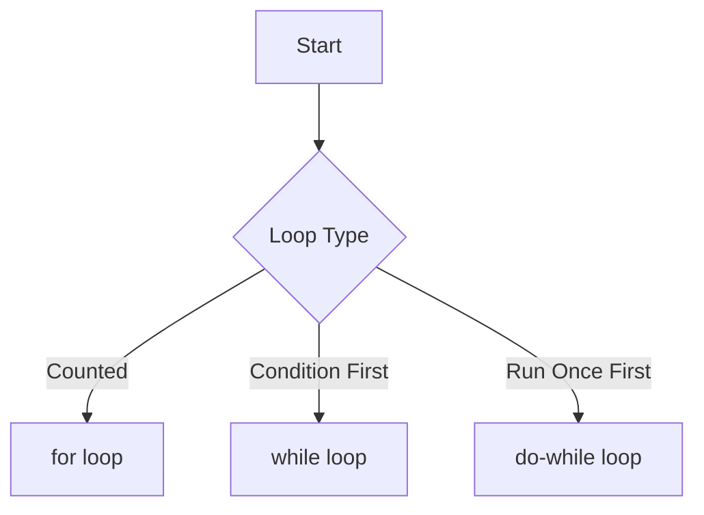

# 🚦 Topic 04: Traffic Lights & Circles (Control Flow)

Usually, our computer reads code from top to bottom, like reading a storybook. But sometimes, we want to skip pages, choose different paths, or read the same page over and over again. In Java, this is called **Control Flow**.

---

## 🏠 The Big Picture & Real-Life Example

### 🚦 The Amusement Park
Imagine you are walking through an amusement park.
1. **Decision (if-else)**: You see a giant roller coaster. You check: *"Am I tall enough?"* If yes, you get on the ride. If no, you go buy ice cream instead.
2. **Multiple Choices (switch)**: You see a signpost with arrows:
   * Left goes to the Dino ride.
   * Right goes to the Space ride.
   * Straight goes to the Water park.
3. **Repetition (loops)**: You get on a swing. You swing back and forth 10 times (a loop!).
4. **Stopping early (break)**: While swinging, you feel dizzy, so you press the red button to stop immediately.

Let's build these park elements in Java!

---

## 🔬 Let's Look Closer: Making Choices

### 1. 🚦 The `if`, `else if`, and `else` blocks
This is like checking conditions before taking action:
```java
if (height > 120) {
    System.out.println("Enjoy the roller coaster!");
} else if (height > 100) {
    System.out.println("You can ride the mini coaster.");
} else {
    System.out.println("Sorry, go buy an ice cream!");
}
```

### 2. 🔀 The `switch` statement
If you have a lot of options, `if-else` can get messy. `switch` is like a sorting machine.

* **Traditional Switch**: Uses `case` and requires a `break` at the end of each option, otherwise it falls through!
* **Modern Switch Expressions (Java 14+)**: Uses `->` arrows. It is cleaner, safer, and does not need `break`!

---

## 🔬 Let's Look Closer: Going in Circles (Loops)

When you want to run the same code multiple times, use a loop.



### 1. 🔁 The `while` loop (Check first, run later)
Like checking if there is water in the pool before jumping in. If there is no water (condition is false), you never jump!
```java
while (isHungry) {
    eatCookie();
}
```

### 2. 🦘 The `do-while` loop (Run first, check later)
Like taking a bite of a strange food *first*, then deciding if you want to keep eating. It **always runs at least once**!
```java
do {
    eatStrangeFood();
} while (isGood);
```

### 3. 🎯 The `for` loop (Counting loops)
Like doing jumping jacks. You know exactly how many times you want to do it before you start.
* Syntactical breakdown: `for (start; stop; step)`
```java
for (int jacks = 1; jacks <= 10; jacks++) {
    System.out.println("Jumping jack #" + jacks);
}
```

---

## 🚪 Escape Buttons: `break` and `continue`

* **`break`**: Instantly stops the loop and exits the room.
* **`continue`**: Skips the rest of the steps for *this round* and jumps straight to the next round of the loop.

---

## 📖 Key Definitions

* **Control Flow**: The order in which individual lines of code or instructions are read and executed by the computer.
* **Conditional Statements**: Control structures (like `if-else` and `switch`) that execute different blocks of code based on a true/false condition.
* **Switch Expression**: A modern version of the switch statement that can directly return a value and does not require a `break` statement.
* **Loop**: A control structure that repeatedly executes a block of code as long as a specified condition remains true.
* **Break Statement**: A command used to instantly exit a loop or switch block.
* **Continue Statement**: A command used to skip the rest of the current loop iteration and jump straight to the next cycle.

---

## 💻 Code Sandbox: Driving Through Control Flow

Copy, play, and run this code:

```java
public class ControlFlowDemo {
    public static void main(String[] args) {
        // --- 1. If-Else Decision ---
        int temperature = 32; // In Celsius
        if (temperature > 30) {
            System.out.println("It's too hot! Stay inside and eat ice cream.");
        } else {
            System.out.println("It's a nice day for a walk.");
        }

        // --- 2. Modern Switch Expression (Java 14+) ---
        String day = "Saturday";
        String activity = switch (day) {
            case "Monday", "Tuesday", "Wednesday" -> "School day!";
            case "Saturday", "Sunday" -> "Play time!";
            default -> "Homework day.";
        };
        System.out.println("Activity for " + day + ": " + activity);

        // --- 3. For Loop (Counting to 5) ---
        System.out.println("Counting hide-and-seek:");
        for (int i = 1; i <= 5; i++) {
            System.out.println("Ready or not, here I come... " + i);
        }

        // --- 4. While Loop with Break ---
        System.out.println("eating cookies until full:");
        int cookiesEaten = 0;
        while (true) {
            cookiesEaten++;
            System.out.println("Ate cookie #" + cookiesEaten);
            if (cookiesEaten >= 3) {
                System.out.println("Stomach is full! Stop eating!");
                break; // Break exits the infinite while(true) loop
            }
        }

        // --- 5. For Loop with Continue ---
        System.out.println("Counting odd numbers only:");
        for (int num = 1; num <= 5; num++) {
            if (num % 2 == 0) {
                continue; // Skip even numbers!
            }
            System.out.println("Odd number: " + num);
        }
    }
}
```

---

## 🧠 Points to Remember

> [!IMPORTANT]
> * Infinite loops happen when the loop condition is always `true` and there is no `break` (e.g. `while(true)`). Be careful, it will make your computer fans spin super fast!
> * In traditional switch, if you forget `break`, Java will execute all the cases below it.
> * Always update your counter inside a `while` loop (like `count++`), otherwise it will run forever!

---

## ❓ Interview Questions (Q1 - Q50)

### 🟢 Basic Questions (Q1 - Q20)
1. **What is control flow in Java?**
   * *Answer*: The order in which individual statements or instructions in a program are executed.
2. **What is an `if-else` statement?**
   * *Answer*: A conditional structure that executes one block of code if a condition is `true`, and another block (inside `else`) if the condition is `false`.
3. **What is the difference between `if` and `else if`?**
   * *Answer*: `if` starts a conditional check; `else if` performs subsequent checks only if all preceding `if` and `else if` conditions evaluated to `false`.
4. **Is the `else` block mandatory in an `if` structure?**
   * *Answer*: No, `else` is optional.
5. **What is a `switch` statement?**
   * *Answer*: A control structure that evaluates an expression and jumps to a matching `case` block of code.
6. **What types can be passed to a `switch` statement in Java?**
   * *Answer*: `byte`, `short`, `char`, `int`, their respective wrapper classes, `String`, and `enum` types.
7. **Can we pass float or double values to a `switch` statement?**
   * *Answer*: No, floating-point numbers are not allowed due to rounding precision issues.
8. **What does the `break` statement do inside a loop?**
   * *Answer*: It immediately terminates the execution of the loop, passing control to the code block following the loop.
9. **What does the `continue` statement do inside a loop?**
   * *Answer*: It skips the remaining code in the current iteration and jumps directly to the next iteration cycle.
10. **What is a loop?**
    * *Answer*: A control structure that repeatedly executes a block of code while a specified condition is `true`.
11. **What is the difference between `while` and `do-while` loops?**
    * *Answer*: `while` checks the condition *first* before running the body; `do-while` runs the body *first* and then checks the condition, guaranteeing it executes at least once.
12. **What are the three parts of a standard `for` loop declaration?**
    * *Answer*: Initialization (run once at start), Condition (checked before each loop), and Update/Iteration expression (run after each loop).
13. **What is an infinite loop?**
    * *Answer*: A loop whose termination condition is never met, causing it to run indefinitely (e.g., `while(true)`).
14. **What is the `default` case in a `switch` statement?**
    * *Answer*: A fallback case that executes if none of the explicit `case` expressions match the evaluated switch variable.
15. **What are nested loops?**
    * *Answer*: A loop placed inside the body of another loop.
16. **Can we use `break` outside a loop or switch in Java?**
    * *Answer*: No, using `break` outside a loop or `switch` block results in a compilation error.
17. **What happens if you omit curly braces `{}` in an `if` statement?**
    * *Answer*: Only the single statement immediately following the `if` check is treated as part of the conditional body.
18. **Can you write a `for` loop with no expressions inside the parentheses (e.g., `for(;;)` )?**
    * *Answer*: Yes, it creates a valid infinite loop.
19. **What is the result of `if (x = 5)` if `x` is an `int` variable?**
    * *Answer*: It causes a compilation error because `x = 5` is an assignment returning `5` (int), whereas Java conditions strictly require a `boolean` type.
20. **Can you use `continue` inside a `switch` statement?**
    * *Answer*: No, `continue` is only valid inside loop structures.

### 🟡 Intermediate Questions (Q21 - Q40)
21. **What is "switch fall-through" behavior?**
   * *Answer*: A situation in traditional switch blocks where omission of a `break` statement causes execution to fall through into subsequent cases, running their code even if they do not match.
22. **What is a modern Switch Expression?**
   * *Answer*: A feature introduced in Java 14 that allows `switch` to act as an expression returning a value, using `->` (arrow syntax) to execute cases without risking fall-through.
23. **What is a labeled `break` and `continue` statement?**
   * *Answer*: A mechanism to control outer nested loops from an inner loop by referencing a label prefixing the outer loop (e.g., `break outerLabel;`).
24. **Why does compilation fail for `while(false) { System.out.println("Test"); }`?**
   * *Answer*: The Java compiler detects that the code inside the loop is unreachable, resulting in an "unreachable statement" compiler error.
25. **Why does `if(false) { System.out.println("Test"); }` compile successfully?**
   * *Answer*: Unlike loops, the compiler allows unreachable branches in conditional `if` statements to support conditional compilation flags (e.g., debugging switches).
26. **What is the "dangling else" problem and how is it resolved?**
   * *Answer*: An ambiguity where an `else` block could match multiple nested `if` statements. In Java, an `else` is always matched with the nearest preceding unmatched `if`, unless nested within curly braces `{}`.
27. **What is numeric promotion in a `for` loop header (e.g., `for (float f = 0.1f; f < 1.0; f++)`)?**
   * *Answer*: The compiler promotes the float `f` to a `double` during the evaluation check `f < 1.0` (since `1.0` is a double literal), which can introduce precision errors.
28. **Can a `switch` variable evaluate to a `null` object reference?**
   * *Answer*: In traditional switch, passing a `null` value causes a `NullPointerException` at runtime. In Java 21+, pattern matching in switch supports a safe `case null ->` branch.
29. **What is the difference between `yield` and `return` in a modern switch expression?**
   * *Answer*: `yield` returns a value from a block within a `switch` expression to the enclosing block without returning from the method, whereas `return` exits the entire method.
30. **Explain how `do-while` evaluates block scope variables.**
   * *Answer*: Variables declared inside the `do` block are not in scope for the `while` condition check expression, as it resides outside the block boundary.
31. **What is the execution count of `for (int i = 0; i < 10; i += 2)`?**
   * *Answer*: Exactly 5 iterations (values: 0, 2, 4, 6, 8).
32. **Can you initialize multiple variables of different types in a `for` loop header?**
   * *Answer*: No, the initialization section of a `for` loop header only allows declaring variables of a single type (e.g., `for(int i = 0, j = 10; ...)` is valid; `for(int i = 0, double d = 0.5; ...)` is invalid).
33. **Does a `switch` statement evaluate cases sequentially?**
   * *Answer*: Yes, cases are evaluated sequentially from top to bottom, but compilation optimizations can restructure evaluations to execute cases out of order for performance.
34. **Does `continue` skip the update/iterator expression of a `for` loop?**
   * *Answer*: No. When `continue` is executed, control jumps directly to the update expression (e.g., `i++`) first, and then evaluates the condition check.
35. **What is the difference in performance between `for` loops and `while` loops?**
   * *Answer*: At the bytecode level, they compile to identical instruction patterns, meaning there is zero performance difference.
36. **Can a `default` case be placed at the top of a `switch` block?**
   * *Answer*: Yes, it can be placed anywhere. However, if fall-through is possible and it matches, it will fall through to cases below it unless a `break` is present.
37. **What is a loop invariant?**
   * *Answer*: A condition or property that is guaranteed to remain true before and after each iteration of a loop.
38. **How does the compiler handle empty loops?**
   * *Answer*: The compiler may optimize and remove empty loops entirely during compilation if they do not perform side-effects, a process known as dead code elimination.
39. **Is `switch` evaluation faster than nested `if-else` blocks?**
   * *Answer*: Yes, for a large number of options, `switch` uses jump tables or hash tables in bytecode, which runs in $O(1)$ time compared to the $O(N)$ sequential checks of `if-else`.
40. **Can you nested a `switch` statement inside another `switch` statement?**
    * *Answer*: Yes, nested switch blocks are fully supported.

### 🔴 Advanced Questions (Q41 - Q50)
41. **Explain the differences between `tableswitch` and `lookupswitch` in JVM bytecode.**
   * *Answer*: 
     * `tableswitch` is used when case values are contiguous or closely grouped, facilitating direct index lookup ($O(1)$ performance).
     * `lookupswitch` is used for sparse, non-contiguous case values, requiring binary search lookup ($O(\log N)$ performance).
42. **How does Branch Prediction in CPUs affect the performance of `if-else` loops?**
   * *Answer*: The CPU attempts to guess the outcome of a branch condition to preload instruction pipelines. If a loop condition is highly predictable, performance is high. If it is random, pipeline stalls occur, slowing execution.
43. **What is Loop Unrolling optimization performed by the JIT Compiler?**
   * *Answer*: An optimization where the compiler expands loop iterations to execute multiple operations per cycle, reducing the execution overhead of loop controls and jumps (e.g. replacing a loop of 4 items with 4 sequential statements).
44. **What are the exhaustiveness requirements for modern Switch Expressions?**
   * *Answer*: Unlike traditional switch, switch expressions must be **exhaustive**, meaning they must cover all possible input values (requiring a `default` branch, or covering all cases of a sealed class/enum).
45. **Explain the dangling else resolution at the bytecode level.**
   * *Answer*: The bytecode uses sequential jump offsets (`ifeq`, `goto`) that map the `else` branch directly to the nearest unresolved branch offset, enforcing the lexical nesting rules.
46. **What is the SSA (Static Single Assignment) form and how do compilers use it to optimize control flow?**
   * *Answer*: A representation of code where every variable is assigned exactly once. Compilers translate Java control flow into SSA form to trace variable lifecycles, enabling optimizations like constant propagation and dead code elimination.
47. **How does the JIT compiler optimize polymorphic call sites inside loops?**
   * *Answer*: Using **inline caching**. It remembers the receiver type of a method call in a loop; if it remains constant, it devirtualizes and inlines the method call, bypassing virtual table lookup.
48. **Can you write a recursive method that executes faster than an iterative loop?**
   * *Answer*: Generally no. Iterative loops do not incur the memory overhead of allocating new stack frames for method calls. However, JVM optimizations (like tail call elimination, though limited in standard Java) can mitigate some recursive costs.
49. **How does the JVM handle a switch expression returning incompatible types?**
   * *Answer*: It is rejected at compile-time. The compiler verifies that all return branches of the switch expression resolve to a common supertype (e.g., if branches return `Integer` and `Double`, the expression type resolves to `Number`).
50. **What is Loop-Invariant Code Motion (LICM)?**
    * *Answer*: A compiler optimization that identifies expressions inside a loop that do not change their value across iterations and moves them outside the loop to avoid redundant calculations.

