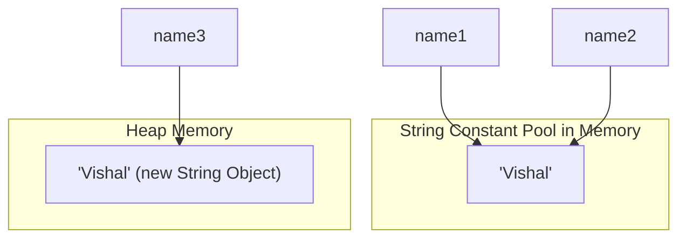

# 🗃️ Topic 05: Toy Racks & Word Chains (Arrays & Strings)

Sometimes we don't just have one toy box; we have a whole rack of boxes! And sometimes we want to play with words instead of numbers. Today we will learn about **Arrays** and **Strings**.

---

## 🏠 The Big Picture & Real-Life Example

### 🧸 The Toy Rack (Arrays)
Imagine you have a wooden rack with exactly **5 cubbies** built in. 
* Once the rack is built, you cannot add a 6th cubby. It's glued together!
* Each cubby has a number starting at **0** (not 1!). So the cubbies are numbered 0, 1, 2, 3, and 4.
* This is exactly what an **Array** is in Java!

### 🔠 The Magnetic Letters (Strings)
Imagine you have magnetic letter blocks on your fridge. You line them up to spell `"CAT"`.
* In Java, a **String** is a chain of letter blocks.
* If you want to change `"CAT"` to `"BAT"`, Java doesn't actually swap the 'C' for 'B'. Instead, it hides the old chain and makes a completely new chain `"BAT"`. This is called **String Immutability** (unchangeable text)!

---

## 🔬 Let's Look Closer: Arrays

An array is a fixed-size container that holds elements of the same type.

### 🔢 Single-Dimensional Arrays (One row of cubbies)
```java
int[] myScores = new int[5]; // Creates 5 empty cubbies for numbers
myScores[0] = 90; // Put 90 in the very first cubby!
```

### 🏁 Multi-Dimensional Arrays (A grid or table)
Like a Tic-Tac-Toe board or a chessboard. It has rows and columns!
```java
int[][] ticTacToe = new int[3][3]; // A 3x3 grid!
```

---

## 🔬 Let's Look Closer: Strings & The Recycle Pool

Strings are very special in Java. Because we use text so much, Java has a secret room called the **String Constant Pool**.

### ♻️ The String Constant Pool
Imagine two children want to play with the word `"LEGO"`. Instead of creating two separate physical `"LEGO"` signs, Java makes **one** sign in the pool and points both children's eyes to it. This saves memory!
* If you write `String name1 = "Vishal";` and `String name2 = "Vishal";`, they both point to the same memory spot.
* But if you write `String name3 = new String("Vishal");`, it forces Java to build a brand new physical sign.



### 🧱 Immutability & The Speed Upgrade (`StringBuilder`)
Every time you modify a String (like adding `"!"` to the end), Java creates a brand new String in memory. If you do this 10,000 times inside a loop, it gets very slow and fills up the memory room with old discarded signs!

To solve this, Java has **`StringBuilder`**. It's like a whiteboard where you can write, erase, and change text instantly without throwing the board away!
* Use **`StringBuilder`** for single-helper tasks (not thread-safe, very fast).
* Use **`StringBuffer`** if you have multiple helpers working on the text together (thread-safe, slightly slower).

---

## 📖 Key Definitions

* **Array**: A container object that holds a fixed number of values of a single data type, where elements are accessed via 0-based index numbers.
* **String**: An object representing a sequence of character values that is immutable (cannot be modified after creation).
* **String Constant Pool**: A special storage area inside the Java Heap memory that stores unique literal String values to optimize memory consumption.
* **Immutability**: The design property of an object (like `String`) which guarantees its state cannot be modified after it is created.
* **StringBuilder**: A mutable sequence of characters used to efficiently build and modify strings within a single thread.
* **StringBuffer**: A thread-safe, synchronized, mutable sequence of characters used to safely modify text across multiple threads.

---

## 💻 Code Sandbox: Toy Racks and Whiteboards

Here is a sandbox file showcasing Arrays, String methods, and StringBuilder:

```java
public class ArraysStringsDemo {
    public static void main(String[] args) {
        // --- 1. Working with Arrays ---
        String[] toys = {"Robot", "Teddy Bear", "Car"};
        
        System.out.println("The first toy (cubby 0) is: " + toys[0]);
        System.out.println("How many toys in the rack? " + toys.length);

        // Printing all toys using a loop:
        for (int i = 0; i < toys.length; i++) {
            System.out.println("Toy at cubby " + i + " is: " + toys[i]);
        }

        // --- 2. Multi-dimensional Arrays (Grids) ---
        int[][] grid = {
            {1, 2, 3},
            {4, 5, 6}
        };
        System.out.println("Number at row 1, col 2: " + grid[1][2]); // Output: 6

        // --- 3. String Methods (The Magic Text Tools) ---
        String message = "  Hello Java!  ";
        System.out.println("Length: " + message.length());
        System.out.println("Shouting: " + message.toUpperCase());
        System.out.println("Without empty spaces: '" + message.trim() + "'");
        System.out.println("Does it contain Java? " + message.contains("Java"));
        System.out.println("Sub-word (index 2 to 7): " + message.substring(2, 7));

        // --- 4. Comparing Strings (The trap!) ---
        String a = "Cat";
        String b = "Cat";
        String c = new String("Cat");

        System.out.println("Does a == b? " + (a == b)); // true (points to same pool object)
        System.out.println("Does a == c? " + (a == c)); // false (c is a new object in memory!)
        System.out.println("Does a.equals(c)? " + a.equals(c)); // true (compares the ACTUAL letters!)

        // --- 5. Whiteboard Text (StringBuilder) ---
        StringBuilder sb = new StringBuilder("Java");
        sb.append(" is");
        sb.append(" awesome!");
        System.out.println("白板 text: " + sb.toString()); // Output: Java is awesome!
    }
}
```

---

> [!IMPORTANT]
> * Array indexes **always start at 0**. The last index is `length - 1`. If you try to access `toys[3]` on an array of size 3, Java will crash with a `ArrayIndexOutOfBoundsException`!
> * Never compare Strings using `==`. Always use **`.equals()`** to check if the letters are the same.
> * If you are building/modifying text inside a loop, always use `StringBuilder` to keep your code fast and clean!

---

## ❓ Interview Questions (Q1 - Q50)

### 🟢 Basic Questions (Q1 - Q20)
1. **What is an array in Java?**
   * *Answer*: A fixed-size container that holds elements of a single data type in contiguous memory locations.
2. **What is the index of the first element in an array?**
   * *Answer*: `0`.
3. **What is the index of the last element in an array?**
   * *Answer*: `array.length - 1`.
4. **How do you find the length of an array?**
   * *Answer*: By using the `.length` property (e.g., `myArray.length`).
5. **How do you find the length of a String?**
   * *Answer*: By calling the `.length()` method (e.g., `myString.length()`).
6. **Can the size of an array be changed after creation?**
   * *Answer*: No, the size of a Java array is fixed once allocated.
7. **What is a multi-dimensional array?**
   * *Answer*: An array of arrays (e.g., representing a 2D matrix or table).
8. **What is a String in Java?**
   * *Answer*: An object representing a sequence of character values.
9. **Is String a primitive or reference type?**
   * *Answer*: String is a Reference type (it is a Class).
10. **What is String Immutability?**
    * *Answer*: The design property that prevents a String object's content from being changed once it is created in memory.
11. **How do you compare the content of two String objects?**
    * *Answer*: Using the `.equals()` method (e.g., `str1.equals(str2)`).
12. **What does the `==` operator compare when used on Strings?**
    * *Answer*: It compares the memory addresses (references) of the two String objects, checking if they are the exact same instance in memory.
13. **How do you extract a character at a specific index from a String?**
    * *Answer*: Using the `.charAt(index)` method.
14. **What does the `substring(int beginIndex, int endIndex)` method do?**
    * *Answer*: It returns a new string containing characters starting from `beginIndex` up to, but not including, `endIndex`.
15. **How do you convert a String to all uppercase letters?**
    * *Answer*: By using the `.toUpperCase()` method.
16. **How do you remove leading and trailing whitespaces from a String?**
    * *Answer*: By using the `.trim()` method (or `.strip()` in modern Java).
17. **What is a String literal?**
    * *Answer*: A text value enclosed in double quotes (e.g., `"Java"`) written directly in source code.
18. **Which class is used to build mutable strings?**
    * *Answer*: `StringBuilder` or `StringBuffer`.
19. **What is the default value of array elements for an `int[]`?**
    * *Answer*: `0`.
20. **What is the default value of array elements for an object array (e.g., `String[]`)?**
    * *Answer*: `null`.

### 🟡 Intermediate Questions (Q21 - Q40)
21. **What is the String Constant Pool?**
   * *Answer*: A special memory region in the Heap where the JVM stores unique literal String objects to conserve memory by sharing references.
22. **What is the difference between `StringBuilder` and `StringBuffer`?**
   * *Answer*: `StringBuilder` is not synchronized and is faster (best for single-threaded tasks); `StringBuffer` is synchronized and thread-safe (slower due to locking overhead).
23. **What happens if you access an array index that is negative or greater than or equal to its length?**
   * *Answer*: The JVM throws an `ArrayIndexOutOfBoundsException` at runtime.
24. **How do you copy elements from one array to another in Java?**
   * *Answer*: Using `System.arraycopy()`, `Arrays.copyOf()`, or the `.clone()` method of the array object.
25. **What is a "ragged" or jagged array?**
   * *Answer*: A multi-dimensional array where the member arrays (rows) can have different lengths (e.g., `int[][] jagged = new int[2][]; jagged[0] = new int[3]; jagged[1] = new int[5];`).
26. **Why is String designed to be immutable in Java?**
   * *Answer*: For security (safe classloading, database URLs), thread-safety, caching hashcodes, and to facilitate the String Constant Pool memory optimization.
27. **What is the difference between `String s = "Hello";` and `String s = new String("Hello");`?**
   * *Answer*: The first creates/references the string in the String Constant Pool; the second forces the JVM to allocate a brand new String object on the Heap outside the pool.
28. **How does the `.concat()` method differ from the `+` operator for string combination?**
   * *Answer*: `.concat()` throws a `NullPointerException` if the argument is null and only accepts strings; `+` converts null operands to the string `"null"` and concatenates any data type.
29. **What does the `.intern()` method do?**
   * *Answer*: It searches the String Constant Pool for a string equal to the target object. If found, it returns the pool reference; if not, it adds the string to the pool and returns its reference.
30. **How does the `.split(String regex)` method work?**
   * *Answer*: It splits the string around matches of the given regular expression and returns an array of substring tokens.
31. **What is the difference between `.equals()` and `.equalsIgnoreCase()`?**
   * *Answer*: `.equals()` is case-sensitive; `.equalsIgnoreCase()` compares strings ignoring whether characters are uppercase or lowercase.
32. **Can you modify the size of a compiled array by casting it?**
   * *Answer*: No, casting an array reference does not alter the underlying allocated array object's size.
33. **How does Java handle string concatenation inside loops (e.g., `s += "i"`)?**
   * *Answer*: The compiler translates it to creating a new `StringBuilder` inside each loop cycle, calling `.append()`, and then `.toString()`. This creates many short-lived objects and degrades performance.
34. **How can you print the elements of an array quickly without writing a loop?**
    * *Answer*: By using `Arrays.toString(array)` for 1D arrays, and `Arrays.deepToString(array)` for multi-dimensional arrays.
35. **What is the result of `new String("A") == new String("A")`?**
    * *Answer*: `false`, as they are two distinct objects created in Heap memory.
36. **What is an anonymous array?**
    * *Answer*: An array created without binding it to a reference name (e.g., passing `new int[]{1, 2, 3}` directly as a method argument).
37. **Can you declare an array size using a `long` variable?**
    * *Answer*: No, array size must be declared using `int` values (up to $2^{31}-1$).
38. **How does the `.replace()` method differ from `.replaceAll()`?**
    * *Answer*: `.replace()` replaces target target characters or literal sequences; `.replaceAll()` interprets the target pattern as a regular expression.
39. **Is `length` a method or field for arrays and strings?**
    * *Answer*: For arrays, `length` is a public final field/property. For strings, `length()` is a public method.
40. **What does the `.compareTo(String anotherString)` method return?**
    * *Answer*: A negative integer if the string is lexicographically smaller than the argument, 0 if equal, and a positive integer if larger.

### 🔴 Advanced Questions (Q41 - Q50)
41. **What are Compact Strings introduced in Java 9?**
   * *Answer*: An internal optimization where the `String` class stores characters in a `byte[]` array instead of a `char[]` array, using 1 byte per character for LATIN-1 strings and 2 bytes for UTF-16 strings, cutting string memory footprint in half for most applications.
42. **What is String Deduplication in the G1 Garbage Collector?**
   * *Answer*: A G1 GC optimization feature that scans the Heap for duplicate strings (different String objects pointing to identical char/byte arrays) and makes them share the same internal byte array to reclaim memory.
43. **How is the internal buffer capacity managed in `StringBuilder`?**
   * *Answer*: It starts with a default capacity (usually 16). When characters exceed this, it automatically resizes to a new capacity equal to `(old_capacity * 2) + 2`, copying the old array to the new one.
44. **Explain memory leaks associated with Substring operations in older Java versions.**
   * *Answer*: In Java 6 and earlier, `.substring()` shared the internal `char[]` of the original large string. If you kept a tiny substring reference, the GC could not collect the original massive char array, causing leaks. In Java 7+, substring copy allocations were updated to resolve this.
45. **What is the maximum size of an array in Java?**
   * *Answer*: The theoretical limit is `Integer.MAX_VALUE` ($2^{31}-1$), but VM implementations reserve some header words, making the actual limit slightly smaller (typically `Integer.MAX_VALUE - 8`).
46. **What is the overhead of an array object in JVM memory?**
   * *Answer*: Like any object, it contains an object header (typically 8–16 bytes) plus an extra 4 bytes to store the array length, plus the padding bytes to align allocations on 8-byte boundaries.
47. **How does string concatenation behave at compile-time since Java 9?**
   * *Answer*: String concatenation is compiled using `invokedynamic` instructions pointing to `StringConcatFactory` instead of hardcoding `StringBuilder` compiles, allowing runtime JIT optimizations to dynamically choose the fastest concatenation strategy.
   * *Note*: This makes it faster and more flexible.
48. **Does Java allow creating an array of a Generic type parameter (e.g., `new T[10]`)?**
   * *Answer*: No, creating generic arrays is illegal because Java generics use type erasure, meaning the component type of the array would resolve to `Object` at runtime, violating type safety.
49. **Why is using `char[]` preferred over `String` for storing passwords?**
   * *Answer*: Strings are immutable and remain in memory (String Pool) indefinitely until GC runs. A `char[]` array can be explicitly overwritten with zeros immediately after use, reducing the window where sensitive data can be dumped from memory.
50. **What is the performance difference between `System.arraycopy()` and looping to copy arrays?**
    * *Answer*: `System.arraycopy()` is a native method (written in C/C++) that performs direct memory block transfers (`memcpy` or `memmove`), making it significantly faster than looping elements in Java bytecode.

