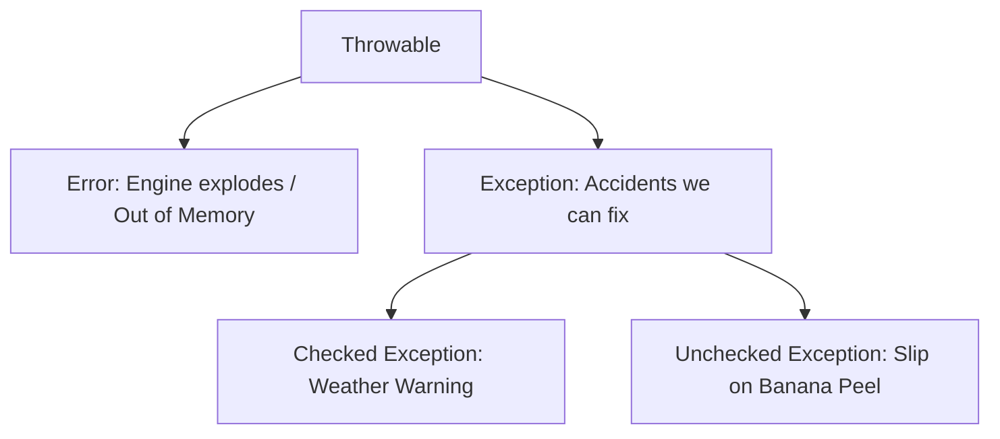

# 🕸️ Topic 08: The Safety Net (Exception Handling)

Sometimes things go wrong. A robot might trip over a block, or we might try to open a toy box that isn't there. If we don't plan for these accidents, our program will crash! In Java, we handle these accidents using **Exceptions**.

---

## 🏠 The Big Picture & Real-Life Example

### 🎪 The Trapeze Artist & The Safety Net
Imagine a trapeze artist performing tricks high in the air.
* **Normal Code**: The artist flies through the air, catches the bar, and lands on the platform.
* **The Crash (Exception)**: The artist slips and misses the bar! Without a safety net, they hit the ground and the show is ruined (the program crashes).
* **The Safety Net (try-catch)**: A giant safety net catches the artist. The artist bounces, wave to the crowd, and continues the show safely.

In Java:
* **`try`** is the tricky stunt we want to perform.
* **`catch`** is the safety net that catches us if we fall.
* **`finally`** is the clean-up crew that wipes the dust off the stage, no matter if the artist fell or landed perfectly!

---

## 🔬 Let's Look Closer: Errors vs. Exceptions

All accidents in Java belong to the **`Throwable`** family. There are two main types:



### 1. 💥 Errors (The Unfixable Disasters)
These are giant problems, like the computer running out of memory or the engine catching fire. As programmers, we can't fix these in code. We just have to let the program stop.

### 2. 🤕 Exceptions (The Fixable Accidents)
These are minor accidents that we *can* prepare for. They come in two types:
* **Checked Exceptions (Weather Warning 🌧️)**: These are checked *before* you compile the code. Java forces you to write a safety net.
  * *Example*: Trying to read a file from the disk. Java says: *"What if the file is missing? You must write a safety net now!"*
* **Unchecked / Runtime Exceptions (Banana Peel 🍌)**: These happen suddenly while the program is running. They are usually caused by programming mistakes.
  * *Example*: Trying to divide a number by `0`, or accessing index `5` on a rack with only `3` cubbies.

---

## 🧱 Writing the Safety Net

### 1. `try-catch-finally`
We put our risky code in `try`, catch the specific accident in `catch`, and do cleanup in `finally`.
```java
try {
    int cookies = 10 / 0; // Oops! Math error!
} catch (ArithmeticException e) {
    System.out.println("Caught the math error!");
} finally {
    System.out.println("This ALWAYS runs!");
}
```

### 2. Try-with-Resources (The Self-Closing Toy Box 🗃️)
When we open a file or database, we must close it when we are done so we don't leak memory. Java has **Try-with-Resources**. Any box that implements the `AutoCloseable` interface will automatically close itself when the try block finishes!
```java
try (BufferedReader br = new BufferedReader(new FileReader("diary.txt"))) {
    // Read files...
} // 'br' is automatically closed here! No finally block needed!
```

### 3. Raising Alarms: `throw` vs. `throws`
* **`throw`**: Used to trigger an accident manually (like pulling the fire alarm yourself!).
  * *Example*: `throw new ArithmeticException("No cookies left!");`
* **`throws`**: Used in a method signature to warn others that this method might have an accident. It's like putting a warning sign on a door saying: *"Watch out! Wet floor inside!"*
  * *Example*: `public void readFile() throws FileNotFoundException`

---

## 📖 Key Definitions

* **Exception**: An abnormal event or condition that occurs during program execution and disrupts the normal flow of instructions.
* **Error**: A serious system-level problem (subclass of `Throwable`) indicating a fatal failure that applications should not attempt to catch (e.g., `OutOfMemoryError`).
* **Checked Exception**: An exception checked at compile-time that a program must actively handle or declare in its method signature using the `throws` keyword.
* **Unchecked Exception (Runtime Exception)**: An exception that occurs at runtime, typically representing programming logic flaws (e.g., `NullPointerException`), which does not require compiler enforcement to catch.
* **Try-with-Resources**: A resource management control structure introduced in Java 7 that automatically closes resources (implementing `AutoCloseable`) when the associated try block terminates.
* **Throw vs. Throws**: `throw` is an active statement used to explicitly throw a single exception instance, whereas `throws` is a keyword used in method signatures to declare that a method may raise specified exceptions.

---

## 💻 Code Sandbox: Catching the Falling Toys

Copy, play, and run this code:

```java
import java.io.*;

// --- 1. CUSTOM EXCEPTION ---
// A custom alarm for when the cookie jar is empty!
class EmptyCookieJarException extends Exception {
    public EmptyCookieJarException(String message) {
        super(message);
    }
}

public class ExceptionDemo {
    // Warning others that this method might sound the empty jar alarm!
    public static void takeCookie(int count) throws EmptyCookieJarException {
        if (count == 0) {
            throw new EmptyCookieJarException("Oh no! The cookie jar is empty!");
        }
        System.out.println("Yum! Took a cookie.");
    }

    public static void main(String[] args) {
        // --- 2. Catching Runtime Exception ---
        try {
            int[] toyRack = {1, 2, 3};
            System.out.println(toyRack[5]); // 🍌 Slip! This cubby doesn't exist!
        } catch (ArrayIndexOutOfBoundsException e) {
            System.out.println("Safety net caught a banana-peel slip: " + e.getMessage());
        }

        // --- 3. Catching Multiple Exceptions ---
        try {
            String text = null;
            System.out.println(text.length()); // 🍌 Null pointer error!
        } catch (NullPointerException | ArithmeticException e) {
            System.out.println("Caught NullPointer or Math error in one net!");
        }

        // --- 4. Custom Exception & Try-Catch-Finally ---
        try {
            takeCookie(0); // Trigger the custom exception!
        } catch (EmptyCookieJarException e) {
            System.out.println("Caught Custom Alarm: " + e.getMessage());
        } finally {
            System.out.println("Cleaning up the kitchen... (finally block runs)");
        }
    }
}
```

---

> [!IMPORTANT]
> * The **`finally`** block runs *no matter what*—even if a catch block has a `return` statement inside it!
> * Always catch **specific** exceptions (like `ArithmeticException`) before generic ones (like `Exception`). If you put `catch (Exception e)` first, it will catch everything, and specific nets below it will never run!
> * Try-with-resources requires classes that implement `AutoCloseable` or `Closeable`.

---

## ❓ Interview Questions (Q1 - Q50)

### 🟢 Basic Questions (Q1 - Q20)
1. **What is an Exception in Java?**
   * *Answer*: An event that occurs during program execution that disrupts the normal flow of instructions.
2. **What is the root class of the entire Exception hierarchy in Java?**
   * *Answer*: `java.lang.Throwable`.
3. **What are the two main subclasses of `Throwable`?**
   * *Answer*: `java.lang.Exception` and `java.lang.Error`.
4. **What is the difference between an Exception and an Error?**
   * *Answer*: Exceptions represent conditions that a reasonable application should attempt to catch and handle; Errors represent severe conditions (like hardware or JVM resource failures) that should not be caught.
5. **What does a `try` block do?**
   * *Answer*: It encloses a block of code in which an exception might occur.
6. **What does a `catch` block do?**
   * *Answer*: It acts as a handler to catch and process a specific type of exception thrown from the associated `try` block.
7. **What is the purpose of the `finally` block?**
   * *Answer*: To execute a cleanup block of code that is guaranteed to run, whether an exception is thrown and caught or not.
8. **What does the `throw` keyword do?**
   * *Answer*: It is used to explicitly throw a single exception instance (e.g., `throw new Exception();`).
9. **What does the `throws` keyword do?**
   * *Answer*: It is used in a method declaration to list the checked exceptions that the method might throw.
10. **What is a `NullPointerException`?**
    * *Answer*: A runtime exception thrown when an application attempts to access members of an object reference that is currently `null`.
11. **What is an `ArithmeticException`?**
    * *Answer*: A runtime exception thrown when an exceptional arithmetic condition has occurred (e.g., integer division by zero).
12. **Can a `try` block exist without a `catch` block?**
    * *Answer*: Yes, if it is followed by a `finally` block (e.g., `try-finally`) or is used as a try-with-resources block.
13. **What is the parent class of all unchecked runtime exceptions?**
    * *Answer*: `java.lang.RuntimeException`.
14. **What does `e.printStackTrace()` do?**
    * *Answer*: It prints the exception name, description, and the sequence of method calls (stack trace) to the standard error stream.
15. **What is `ArrayIndexOutOfBoundsException`?**
    * *Answer*: A runtime exception thrown to indicate that an array has been accessed with an illegal index (negative or out of bounds).
16. **How do you define a custom Checked exception?**
    * *Answer*: By creating a class that extends `java.lang.Exception`.
17. **How do you define a custom Unchecked exception?**
    * *Answer*: By creating a class that extends `java.lang.RuntimeException`.
18. **Can you catch multiple exceptions in separate catch blocks?**
    * *Answer*: Yes, you can stack multiple `catch` blocks following a single `try` block.
19. **What is the result of catching `Exception` before catching `NullPointerException`?**
    * *Answer*: It causes a compilation error because `NullPointerException` is a subclass of `Exception` and is rendered unreachable.
20. **What is a stack trace?**
    * *Answer*: An active snapshot of the method call stack at the moment an exception was thrown.

### 🟡 Intermediate Questions (Q21 - Q40)
21. **What is the difference between Checked and Unchecked Exceptions?**
   * *Answer*: Checked exceptions are checked at compile-time (you must catch or declare them); unchecked exceptions inherit from `RuntimeException` and are evaluated at runtime (compile-time checks are skipped).
22. **What is Try-with-Resources?**
   * *Answer*: A control structure introduced in Java 7 that automatically closes resources (like files or database connections) declared in its header once the try block completes.
23. **What interface must a class implement to be used in a try-with-resources block?**
   * *Answer*: `java.lang.AutoCloseable` or `java.lang.Closeable`.
24. **What is a multi-catch block?**
   * *Answer*: A feature introduced in Java 7 that allows catching multiple unrelated exceptions in a single catch block separated by a pipe symbol (e.g., `catch (IOException | SQLException e)`).
25. **Is there any restriction on the variables inside a multi-catch block?**
   * *Answer*: Yes, the exception parameter variable (like `e`) is implicitly `final` and cannot be reassigned.
26. **What is Exception Chaining?**
   * *Answer*: A technique where you catch an exception and throw a new, higher-level exception while preserving the original cause (using `initCause()` or constructor arguments).
27. **Are there any scenarios where the `finally` block does not execute?**
   * *Answer*: Yes, if `System.exit()` is called, if the JVM crashes, if the thread is forcibly killed, or if the CPU runs into an infinite loop/power failure.
28. **What happens if an exception is thrown in a `finally` block?**
   * *Answer*: It overrides and masks any previous exception thrown in the `try` or `catch` block, and propagates up the call stack.
29. **What is a "suppressed exception" in Try-with-Resources?**
   * *Answer*: If an exception is thrown in the try block, and another is thrown while closing resources, the close exception is "suppressed" and attached to the primary exception (accessible via `e.getSuppressed()`).
30. **Can you throw a checked exception from a static initializer block?**
   * *Answer*: No, because static blocks cannot declare a `throws` clause. You must catch any checked exceptions internally.
31. **What is `ClassNotFoundException` vs. `NoClassDefFoundError`?**
   * *Answer*: 
     * `ClassNotFoundException` occurs when an application explicitly tries to load a class by string name (e.g., `Class.forName()`) but cannot find it on the classpath.
     * `NoClassDefFoundError` occurs when the compile-time class existed, but the classloader cannot find the class binary at runtime during normal linking/execution.
32. **Can a subclass method declare more checked exceptions in its `throws` clause than the overridden superclass method?**
   * *Answer*: No, an overriding subclass method cannot declare new or broader checked exceptions, though it can declare fewer, narrower checked exceptions, or any unchecked exceptions.
33. **Why does overriding method exception restriction exist?**
   * *Answer*: To preserve polymorphism and Liskov Substitution. If a client uses a parent reference, they must not be surprised by new checked exceptions thrown by subclass implementations.
34. **What is a `NumberFormatException`?**
   * *Answer*: A subclass of `IllegalArgumentException` thrown when trying to convert an incompatible string into a numeric type (e.g., `Integer.parseInt("abc")`).
35. **What is the difference between `throw e;` and throwing a new exception `throw new MyException(e);`?**
   * *Answer*: `throw e;` rethrows the same exception (maintaining stack trace origin); throwing a new wrapper preserves the original exception as the cause but begins a new exception context.
36. **Can we declare a constructor that throws exceptions?**
   * *Answer*: Yes, constructors can declare a `throws` clause for any checked or unchecked exceptions.
37. **What is the purpose of the `Throwable.getMessage()` method?**
   * *Answer*: It returns the detailed description string that was passed to the exception's constructor when it was instantiated.
38. **What is `ClassCastException`?**
   * *Answer*: An unchecked exception thrown when code attempts to cast an object to a subclass of which it is not an instance.
39. **Is `Error` caught by `catch (Exception e)`?**
   * *Answer*: No, `Error` inherits directly from `Throwable`, bypassing `Exception`. To catch both, you would need to catch `Throwable`.
40. **How does Java handle uncaught exceptions?**
    * *Answer*: It terminates the current thread and passes the exception to the thread's uncaught exception handler (which prints the stack trace and exits for non-daemon threads).

### 🔴 Advanced Questions (Q41 - Q50)
41. **Explain Exception Tables in JVM bytecode.**
   * *Answer*: When java code uses try-catch blocks, the compiler does not generate branch check instructions. Instead, it creates an Exception Table in the metadata of the class file. The table contains ranges of bytecode instructions (`from`, `to`) mapped to the target exception type and target jump handler offsets.
42. **Why is throwing exceptions considered computationally expensive in Java?**
   * *Answer*: Because instantiating any `Throwable` triggers a JVM execution stack walk to populate the stack trace array (`fillInStackTrace()`), which requires resolving native symbols and walking active frame pointers in memory.
43. **How can you optimize custom exceptions for high-frequency runtime events (GC-free exceptions)?**
   * *Answer*: By overriding the `fillInStackTrace()` method of your custom exception to return `this` directly, bypassing the expensive stack traversal phase (often called stackless exceptions).
44. **What happens if a method returns a value inside `try` but also contains a `return` statement inside `finally`?**
   * *Answer*: The `return` statement in the `finally` block executes last and discards/overwrites the return value or any pending exceptions generated in the `try` or `catch` blocks.
45. **What is a "destructor leak" during try-with-resources close operations?**
   * *Answer*: If multiple resources are opened in try-with-resources, they are closed in reverse order. If one `.close()` throws an exception, Java still guarantees that the remaining resources will be closed, collecting all intermediate close failures as suppressed exceptions.
   * *Note*: Standard manual try-catch close loops often skip subsequent closes if the first close crashes.
46. **What is the difference between JVM stack overflow (`StackOverflowError`) and out of memory (`OutOfMemoryError`)?**
   * *Answer*: 
     * `StackOverflowError` occurs when a thread's private stack frame limit is exceeded (usually due to deep or infinite recursion).
     * `OutOfMemoryError` occurs when the JVM Heap space is full and the GC cannot reclaim any memory for new object allocations.
47. **How does JVM handle an exception thrown inside a class constructor during instance creation?**
   * *Answer*: The object creation fails. The allocated heap space becomes eligible for garbage collection, and the constructor's partial initialization changes are discarded, which can result in resource leaks if opened files are not cleaned up.
48. **What is an Exception Loop Hole in Generics (Sneaky Throws)?**
   * *Answer*: A hack using generics or bytecode manipulation (e.g., Lombok's `@SneakyThrows`) that allows throwing checked exceptions from methods without declaring them in the `throws` clause, bypassing compiler type checks.
49. **How does the JVM handle asynchronous exceptions?**
   * *Answer*: These are exceptions thrown out of context of the executing thread (e.g., `ThreadDeath` or VM internal errors). The JVM injects them at safepoints during normal bytecode loop backedges or method entries.
50. **What is the difference between Checked and Unchecked exceptions at the bytecode level?**
    * *Answer*: At the JVM bytecode level, there is **no difference** between checked and unchecked exceptions. The distinction is strictly enforced by the Java language compiler (`javac`) during syntax validation.

