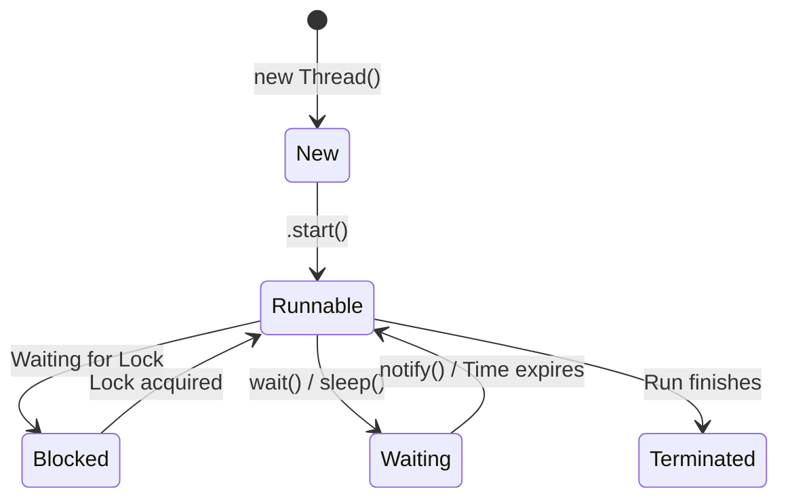

# 👥 Topic 12: Many Helpers (Multithreading & Concurrency)

If you have a giant stack of coloring books, coloring them by yourself takes a long time. What if you invite three friends over to help? You can color all the books in a fraction of the time! In Java, these helpers are called **Threads**.

---

## 🏠 The Big Picture & Real-Life Example

### 🧝 Santa's Workshop
Imagine you are Santa running a toy workshop.
* **Single Thread**: You only have **one** elf. This elf has to build the toy, paint it, wrap it in paper, and tie a bow. It takes all day!
* **Multithreading**: You hire **four** elves. 
  * Elf 1 builds the toy.
  * Elf 2 paints the toy.
  * Elf 3 wraps the toy.
  * Elf 4 ties the bow.
  They work at the **same time** to get the job done super fast!

---

## 🔬 Let's Look Closer: Thread Lifecycle & Creation

An elf (Thread) goes through several states during its shift:



1. **NEW**: The elf is hired but sitting in the breakroom (not started yet).
2. **RUNNABLE**: The elf is actively working on the assembly line.
3. **BLOCKED**: The elf is waiting for another elf to finish using the scissors (waiting for a lock).
4. **WAITING**: The elf is taking a nap, waiting for someone to tap them on the shoulder (`notify()`).
5. **TERMINATED**: The shift is complete, and the elf goes home.

### 🛠️ How to Hire a Thread (Create it)
There are two ways to tell a helper what job to do:

1. **Extend the `Thread` Class**: Create a subclass of `Thread` and override the `run()` method.
2. **Implement the `Runnable` Interface**: Write a list of instructions (implement `Runnable`), and hand it to a generic Thread helper. *This is the recommended way because it keeps your code flexible!*

---

## 🔒 Race Conditions & Thread Safety (`synchronized`)

### 🐖 The Piggy Bank Incident
Imagine you have a shared piggy bank (variable) containing `$10`.
1. Elf A reads: *"There is $10 in the piggy bank."*
2. Elf B reads: *"There is $10 in the piggy bank."*
3. Elf A adds $1 and writes: *"The bank now has $11."*
4. Elf B adds $1 and writes: *"The bank now has $11."*

Oh no! Two dollars were added, but the bank only reads `$11` because they bumped heads! This is a **Race Condition**.

### 🔑 The Fix: `synchronized`
We put a physical lock on the piggy bank. 
* Only one elf can hold the key (the **Monitor Lock**).
* While Elf A has the key, Elf B must wait. Once Elf A is done and puts the key back, Elf B can grab it and do their work safely.

### 📢 Thread Communication (`wait` & `notify`)
Elves can talk to each other:
* **`wait()`**: Elf A runs out of paint, so they sit down and wait.
* **`notify()`**: Elf B refills the paint bucket and shouts: *"Hey, paint is ready!"* Elf A wakes up and continues working.

### 📋 The Manager: Executor Service (Thread Pools)
Hiring and firing elves takes time. If you have 10,000 tiny tasks, creating 10,000 threads will crash the computer. 
Instead, we hire a permanent team of 4 elves (a **Thread Pool**) and a manager (the **ExecutorService**). The manager keeps a queue of tasks and assigns them to whichever elf is free!

---

## 📖 Key Definitions

* **Thread**: The smallest unit of execution within a process, representing a single path of code execution.
* **Multithreading**: A computer architecture or software design capability that allows an application to run multiple concurrent threads of execution simultaneously.
* **Race Condition**: A concurrency defect where the output of a program is dependent on the non-deterministic timing or execution order of multiple threads accessing shared resources.
* **Thread Safety**: A property of code indicating that it behaves correctly and maintains state integrity when executed concurrently by multiple threads.
* **Synchronized Keyword**: A Java keyword used to declare critical sections (methods or blocks) that require a thread to acquire a mutual exclusion lock before execution.
* **Volatile Keyword**: A field modifier indicating that writes to a variable must be made immediately visible to other threads, bypassing local thread caches.
* **Executor Service**: A framework interface introduced in Java 5 that manages thread execution, pooling, and scheduling, decoupling task submission from thread management.

---

## 💻 Code Sandbox: The Elf Workshop

Copy, play, and run this code:

```java
import java.util.concurrent.ExecutorService;
import java.util.concurrent.Executors;

// --- 1. CREATING RUNNABLE INSTRUCTIONS ---
class ElfWorker implements Runnable {
    private String name;

    public ElfWorker(String name) {
        this.name = name;
    }

    @Override
    public void run() {
        for (int i = 1; i <= 3; i++) {
            System.out.println(name + " is painting toy #" + i);
            try {
                Thread.sleep(500); // 💤 Take a 0.5-second nap
            } catch (InterruptedException e) {
                System.out.println(name + " was interrupted!");
            }
        }
    }
}

// --- 2. THE SHARED PIGGY BANK ---
class PiggyBank {
    private int balance = 0;

    // 'synchronized' ensures only ONE thread can add money at a time!
    public synchronized void addOneDollar() {
        int temp = balance;
        temp = temp + 1;
        balance = temp;
    }

    public int getBalance() {
        return balance;
    }
}

public class MultithreadingDemo {
    public static void main(String[] args) throws InterruptedException {
        // --- 3. Running Threads Manually ---
        System.out.println("Starting manual threads:");
        Thread thread1 = new Thread(new ElfWorker("Elf A"));
        Thread thread2 = new Thread(new ElfWorker("Elf B"));

        thread1.start(); // Start Elf A!
        thread2.start(); // Start Elf B!

        thread1.join(); // Main thread waits for Elf A to finish
        thread2.join(); // Main thread waits for Elf B to finish
        System.out.println("Manual Elves finished their jobs.\n");

        // --- 4. Testing Thread Safety ---
        System.out.println("Testing the Piggy Bank safety:");
        PiggyBank bank = new PiggyBank();

        // Create two workers trying to add money 1000 times
        Runnable task = () -> {
            for (int i = 0; i < 1000; i++) {
                bank.addOneDollar();
            }
        };

        Thread t1 = new Thread(task);
        Thread t2 = new Thread(task);

        t1.start();
        t2.start();

        t1.join();
        t2.join();

        // Should be exactly 2000! (If not synchronized, it would be less!)
        System.out.println("Final Bank Balance: $" + bank.getBalance() + "\n");

        // --- 5. Using the Manager (ExecutorService) ---
        System.out.println("Using a Manager (Thread Pool of size 2):");
        ExecutorService manager = Executors.newFixedThreadPool(2);

        // Submit 4 tasks to the pool
        manager.submit(new ElfWorker("Pool Elf 1"));
        manager.submit(new ElfWorker("Pool Elf 2"));
        manager.submit(new ElfWorker("Pool Elf 3"));
        manager.submit(new ElfWorker("Pool Elf 4"));

        manager.shutdown(); // Tell the manager to close shop after finishing tasks
    }
}
```

---

> [!IMPORTANT]
> * Never call `.run()` directly on a Thread! You must call **`.start()`** to tell Java to boot up the new helper. Calling `.run()` just executes the code on the current thread, defeating the purpose!
> * **`volatile`** keyword ensures that when one thread changes a variable, the change is written directly to main memory so other threads see the update instantly.
> * Always call `shutdown()` on your `ExecutorService` when done, otherwise your program will never stop running!

---

## ❓ Interview Questions (Q1 - Q50)

### 🟢 Basic Questions (Q1 - Q20)
1. **What is a Thread?**
   * *Answer*: A single sequential flow of control within a program (the smallest unit of execution).
2. **What is the difference between a Process and a Thread?**
   * *Answer*: A process is an executing application with its own isolated memory space allocated by the OS; a thread is a lightweight execution unit inside a process that shares memory with other threads.
3. **What are the two ways to create a Thread in Java?**
   * *Answer*: By extending the `java.lang.Thread` class, or by implementing the `java.lang.Runnable` interface.
4. **Why is implementing `Runnable` preferred over extending `Thread`?**
   * *Answer*: Because Java only supports single class inheritance. Implementing `Runnable` leaves the class free to extend another class, promotes loose coupling, and is better suited for thread pools.
5. **What is the difference between calling `start()` and `run()` on a Thread?**
   * *Answer*: `start()` allocates a new call stack and schedules the thread for execution, calling `run()` asynchronously. Calling `run()` directly runs the method synchronously on the *current* thread without spawning a new one.
6. **What are the main states in a Thread's lifecycle?**
   * *Answer*: `NEW`, `RUNNABLE`, `BLOCKED`, `WAITING`, `TIMED_WAITING`, and `TERMINATED`.
7. **What does the `Thread.sleep()` method do?**
   * *Answer*: It pauses the execution of the current thread for a specified duration (in milliseconds), transitioning it to the `TIMED_WAITING` state.
8. **What does `Thread.join()` do?**
   * *Answer*: It suspends execution of the current thread until the target thread terminates (waits for the target thread to die).
9. **What is a Daemon Thread?**
   * *Answer*: A low-priority background thread (like the Garbage Collector) that runs to support user threads. The JVM exits automatically when only daemon threads are left running.
10. **How do you declare a thread as a daemon thread?**
    * *Answer*: By calling `thread.setDaemon(true)` before launching the thread with `.start()`.
11. **What is the default priority of a thread in Java?**
    * *Answer*: `NORM_PRIORITY` (value 5). Thread priorities range from `MIN_PRIORITY` (1) to `MAX_PRIORITY` (10).
12. **What is the purpose of the `Thread.currentThread()` method?**
    * *Answer*: It returns the reference to the Thread object currently executing the statement.
13. **Can you restart a thread that has completed its execution?**
    * *Answer*: No, once a thread enters the `TERMINATED` state, calling `.start()` again throws an `IllegalThreadStateException`.
14. **What is a Race Condition?**
    * *Answer*: A concurrency bug where multiple threads access and modify shared data simultaneously, leading to unpredictable, corrupted results depending on execution timing.
15. **What is a Critical Section?**
    * *Answer*: A segment of code that accesses shared resources (like variables or files) and must not be executed by more than one thread concurrently.
16. **How do you synchronize a method in Java?**
    * *Answer*: By adding the `synchronized` modifier keyword to the method signature.
17. **What is a thread-safe class?**
    * *Answer*: A class whose instances behave correctly and maintain internal data consistency when accessed concurrently by multiple threads without external synchronization.
18. **What does the `volatile` keyword do?**
    * *Answer*: It guarantees that reads and writes to a variable are performed directly to/from main memory rather than local CPU caches, ensuring thread visibility.
19. **What is a Thread Pool?**
    * *Answer*: A managed collection of worker threads that wait to execute tasks dispatched from a shared queue, avoiding the overhead of constantly creating and destroying threads.
20. **Which interface is used to submit tasks to a thread pool?**
    * *Answer*: `java.util.concurrent.ExecutorService`.

### 🟡 Intermediate Questions (Q21 - Q40)
21. **What is the difference between Concurrency and Parallelism?**
   * *Answer*: Concurrency is about managing multiple tasks at the same time by interleaving execution on a single core; parallelism is about executing multiple tasks physically at the same instant on multiple CPU cores.
22. **What is the difference between Synchronized Methods and Synchronized Blocks?**
   * *Answer*: Synchronized methods lock the entire object instance (`this`) or the Class object for static methods. Synchronized blocks allow locking on a specific object and inside a subset of the method code, reducing lock scope and improving performance.
23. **What is a Deadlock?**
   * *Answer*: A situation where two or more threads are blocked forever, each waiting for a lock held by the other (e.g., Thread 1 holds Lock A, waits for Lock B; Thread 2 holds Lock B, waits for Lock A).
24. **How can you prevent deadlocks?**
   * *Answer*: By acquiring locks in a consistent, defined order, setting timeout limits on lock acquisitions (using `tryLock()`), or minimizing nested locks.
25. **What is the difference between `wait()` and `sleep()`?**
   * *Answer*: 
     * `wait()` is a method of the `Object` class, must be called from a synchronized context, and **releases the lock** while waiting.
     * `sleep()` is a static method of the `Thread` class, can be called anywhere, and **retains the lock** while sleeping.
26. **Why must `wait()` and `notify()` be called from a synchronized context?**
   * *Answer*: To prevent race conditions where a thread calls `wait()` right after another thread checks the condition but before it calls `notify()`, which would cause the waiting thread to sleep forever (lost wake-up problem).
27. **What is the difference between `notify()` and `notifyAll()`?**
   * *Answer*: `notify()` wakes up a single random thread waiting on the object's monitor monitor; `notifyAll()` wakes up all threads waiting on that monitor, letting them compete for the lock.
28. **What is Thread Starvation?**
   * *Answer*: A scenario where a thread is perpetually denied CPU execution time or lock access because higher-priority threads monopolize the resources.
29. **What is the difference between `Runnable` and `Callable`?**
   * *Answer*: `Runnable`'s `run()` method returns void and cannot throw checked exceptions. `Callable`'s `call()` method returns a generic result value (`<V>`) and can throw checked exceptions.
30. **What is a `Future` object?**
   * *Answer*: An object returned when submitting a `Callable` task to an `ExecutorService`, representing the pending result of the asynchronous computation.
31. **What is the difference between `Future.get()` and polling?**
   * *Answer*: `Future.get()` blocks the calling thread until the result is computed; polling uses `isDone()` in a loop to check for completion without blocking, though it wastes CPU cycles.
32. **What are the common factory methods of the `Executors` utility class to create thread pools?**
   * *Answer*: `newFixedThreadPool(int)`, `newCachedThreadPool()`, `newSingleThreadExecutor()`, and `newScheduledThreadPool(int)`.
33. **What is the difference between `shutdown()` and `shutdownNow()` in `ExecutorService`?**
   * *Answer*: `shutdown()` stops accepting new tasks but allows running tasks and queued tasks to complete; `shutdownNow()` attempts to stop all actively executing tasks immediately and discards queued tasks.
34. **What is `ThreadLocal`?**
   * *Answer*: A class that provides thread-local variables. Each thread accessing a `ThreadLocal` instance has its own independent, isolated copy of the variable, avoiding sharing state.
35. **What is the Livelock condition?**
   * *Answer*: A scenario where two or more threads continuously change their states in response to each other without making any actual progress (like two polite people trying to pass each other in a narrow hallway).
36. **What is the `yield()` method in the `Thread` class?**
   * *Answer*: A hint to the thread scheduler that the current thread is willing to yield its current use of the processor, allowing other threads of equal priority to run.
37. **What is a monitor lock (intrinsic lock)?**
   * *Answer*: An internal synchronization entity associated with every object instance in Java. When a thread executes a synchronized block, it must acquire that object's monitor.
38. **How does the `InterruptedException` behave?**
    * *Answer*: It is thrown when a thread that is sleeping, waiting, or blocked is interrupted by another thread calling `thread.interrupt()`, clearing the thread's interrupted status.
39. **What is Thread Leakage?**
    * *Answer*: A resource leak where threads are continuously spawned (often outside thread pools) but are never terminated, accumulating in memory and exhausting OS descriptors.
40. **What is the difference between `ArrayBlockingQueue` and `LinkedBlockingQueue`?**
    * *Answer*: `ArrayBlockingQueue` is bounded and backed by an array (pre-allocated memory); `LinkedBlockingQueue` is optionally bounded and backed by linked nodes (allocated dynamically).

### 🔴 Advanced Questions (Q41 - Q50)
41. **Compare `ReentrantLock` with `synchronized` blocks.**
   * *Answer*: `ReentrantLock` (from `java.util.concurrent.locks`) offers advanced capabilities: fair locking (prevents starvation), timed lock acquisition (`tryLock(timeout)`), interruptible lock acquisitions, and multiple condition variables, whereas `synchronized` is simpler and has cleaner syntax.
42. **What is Lock-Free Programming (CAS - Compare-And-Swap)?**
   * *Answer*: A concurrency synchronization technique that avoids blocking threads using CPU-level atomic instructions (like CAS). It compares a memory value to an expected value; if they match, it swaps it for a new value atomically (used in `AtomicInteger`).
43. **Explain the False Sharing problem in multi-core CPU architectures.**
   * *Answer*: It occurs when threads on different cores modify independent variables that reside on the same CPU cache line. When one core writes, it invalidates the cache line for other cores, forcing them to reload from main memory, degrading performance.
44. **What is the Work-Stealing Algorithm in the `ForkJoinPool`?**
   * *Answer*: A scheduling strategy where idle threads in a pool "steal" tasks from the tail of the double-ended queues (deques) of other busy threads, maximizing CPU utilization during recursive divide-and-conquer processing.
45. **What is the Java Memory Model (JMM) and the "Happens-Before" relationship?**
   * *Answer*: The JMM defines the rules for variable visibility and ordering across threads. A "Happens-Before" relationship is a guarantee that memory writes by one statement are visible to another statement (e.g., locking, thread start, volatile writes establish happens-before).
46. **What is a `CompletableFuture`?**
   * *Answer*: A class introduced in Java 8 implementing `Future` and `CompletionStage` that allows chaining asynchronous tasks, combining multiple tasks, and registering callback handlers to write non-blocking asynchronous code.
47. **How does Lock Elision optimize synchronization in the JIT compiler?**
   * *Answer*: If Escape Analysis detects that a locked object's scope is confined to a single thread (cannot escape to other threads), the JIT compiler removes the lock instructions entirely, eliminating synchronization overhead.
48. **Explain the ThreadLocal memory leak vulnerability in Web Servers.**
   * *Answer*: Web servers reuse threads in thread pools. If a servlet stores an object in a `ThreadLocal` and fails to call `.remove()` before finishing, the thread retains the reference. Since the thread lives forever in the pool, the classloader and associated objects cannot be garbage collected, causing memory leaks.
49. **How does bias locking optimize synchronized performance?**
   * *Answer*: A JVM optimization where a lock is "biased" toward the thread that first acquires it. Subsequent lock acquisitions by the same thread incur almost zero overhead as long as no other threads attempt to contend for the lock.
50. **What is a Semaphore, CountDownLatch, and CyclicBarrier?**
    * *Answer*: 
      * `Semaphore` controls access to a limited pool of shared resources using permits.
      * `CountDownLatch` blocks threads until a set of operations (counter reaches zero) completes (one-time use).
      * `CyclicBarrier` forces a set of threads to wait at a barrier point until all threads arrive before proceeding (reusable).

