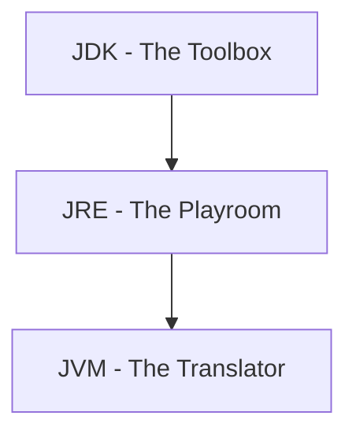
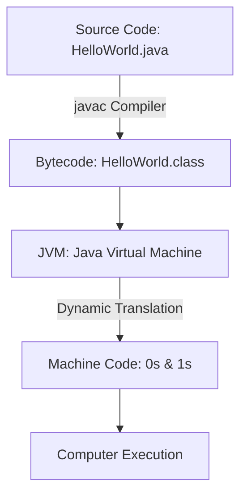

# 🎬 Topic 01: Welcome to Java!

Welcome, young explorer! Today, we are going to learn about **Java**. Think of Java as a magical language that lets us talk to computers and tell them to do cool things, like play games, show cartoons, or do math homework!

---

## 🏠 The Big Picture & Real-Life Example

### 🍔 The Hamburger Recipe Analogy
Imagine you want to teach a friend how to make your favorite hamburger. 
1. You write down the recipe in **English** (this is like your Java code!).
2. But your friend only speaks **French**. 
3. So, you need a **translator** to turn your English recipe into French instructions your friend can follow.

In the computer world:
* **You** are the chef.
* **Java** is the English recipe.
* **The Computer** is your French-speaking friend.
* **JVM (Java Virtual Machine)** is the translator who reads the recipe and tells the computer exactly what to do!

---

## 🔬 Let's Look Closer: The Three Helpers

When you install Java, you get three special helpers. Let's meet them!



### 1. JVM (Java Virtual Machine) — 🗣️ The Translator
The computer itself doesn't understand Java. It only understands 0s and 1s (like "beep boop"). The **JVM** is a smart translator. It takes your compiled Java code and reads it line-by-line to the computer, saying: *"Hey computer, print this text!"* or *"Hey computer, add these numbers!"*

### 2. JRE (Java Runtime Environment) — 🧸 The Playroom
Imagine a room filled with all the toys, blocks, and tables you need to play. The **JRE** is the playroom for Java. It has the JVM (the translator) plus all the pre-made blocks (libraries) that Java needs to run.

### 3. JDK (Java Development Kit) — 🧰 The Toolbox
If you want to build new toys, you need tools like hammers, screwdrivers, and paint. The **JDK** is the ultimate toolbox for programmers. It includes the playroom (JRE) and tools to build and compile your code.

| Helper | What is it? | Real-world Equivalent |
| :--- | :--- | :--- |
| **JVM** | Java Virtual Machine | The Interpreter/Translator |
| **JRE** | Java Runtime Environment | The Playroom with toys |
| **JDK** | Java Development Kit | The Builder's Toolbox (Tools + Playroom) |

---

## ⚙️ How Compiling Works (From English to Beep-Boop)

When you write Java code, you save it in a file ending in `.java`. Before the computer can run it, it must go through two steps:



1. **Compiling**: A tool called `javac` (Java Compiler) translates your `.java` file into a secret code called **Bytecode** (saved as a `.class` file). Think of bytecode as a universal secret language that only JVMs understand.
2. **Running**: The JVM reads this secret `.class` file and translates it on the spot into the computer's native "beep-boop" language.

This is why Java is famous for **"Write Once, Run Anywhere" (WORA)**. Whether you have a Windows PC, a Mac, or a toaster, as long as it has a JVM, it can read the secret bytecode!

---

## 📖 Key Definitions

* **Java**: A secure, class-based, object-oriented programming language designed to let developers "write once, run anywhere."
* **JVM (Java Virtual Machine)**: An engine that runs Java code on your computer by translating Java bytecode into machine instructions.
* **JRE (Java Runtime Environment)**: A software package that contains the JVM and core libraries needed to run Java applications.
* **JDK (Java Development Kit)**: A complete toolkit for developers that contains the JRE, the Java compiler (`javac`), and other tools to write and build Java code.
* **Compilation**: The process of translating human-readable Java source code (`.java`) into bytecode (`.class`) that the JVM can execute.

---

## 💻 Code Sandbox: Your First Program

Here is the classic `Hello World` program. It simply prints a friendly greeting to the screen.

```java
// This is a single-line comment. The computer ignores this!
/* 
   This is a multi-line comment.
   We can write as much as we want here.
*/

/**
 * This is a JavaDoc comment. 
 * It is used to make fancy manuals for our code!
 */
public class HelloWorld {

    // This is the starting gate! Every Java program starts running from here.
    public static void main(String[] args) {
        // This is the magic command to print text on the screen!
        System.out.println("Hello, World!"); 
    }
}
```

### 🔍 Breaking Down the Magic Words:
* **`public`**: Anyone can see and play with this!
* **`class HelloWorld`**: This is the name of our blueprint. It must match the filename (`HelloWorld.java`).
* **`static`**: This means the method belongs to the class itself, so it's ready to run immediately without building a house first.
* **`void`**: The helper does its job but doesn't bring back any physical gifts (returns nothing).
* **`main`**: The starting button of the program.
* **`String[] args`**: A list of words we can pass to the program when we start it.
* **`System.out.println(...)`**: System (the computer), out (the screen), println (print a line of text).

---

## 🧠 Points to Remember

> [!IMPORTANT]
> * Filenames in Java must match the **Class Name** exactly. If your class is `HelloWorld`, the file must be named `HelloWorld.java`.
> * Java is **case-sensitive**. `Main` is NOT the same as `main`.
> * Don't forget the semicolon `;` at the end of statements! It's like the period `.` at the end of a sentence.

> [!TIP]
> **Try it yourself!**
> 1. Write the code above in a file called `HelloWorld.java`.
> 2. Open terminal/cmd, go to the folder, and type:
>    ```bash
>    javac HelloWorld.java
>    ```
> 3. Then run it by typing:
>    ```bash
>    java HelloWorld
>    ```

---

## ❓ Interview Questions (Q1 - Q50)

### 🟢 Basic Questions (Q1 - Q20)
1. **What is Java?**
   * *Answer*: Java is a high-level, class-based, object-oriented, secure, and platform-independent programming language developed by Sun Microsystems (now Oracle).
2. **What does "Write Once, Run Anywhere" (WORA) mean?**
   * *Answer*: It means you compile your Java source code on one operating system (e.g., Windows), and the resulting bytecode can run on any other operating system (e.g., Linux, Mac) without modifications, as long as a JVM is present.
3. **What is the JVM?**
   * *Answer*: The Java Virtual Machine (JVM) is an abstract engine that loads, verifies, and executes Java bytecode on a target machine.
4. **What is the JRE?**
   * *Answer*: The Java Runtime Environment (JRE) is a package of libraries and the JVM required to *run* Java applications.
5. **What is the JDK?**
   * *Answer*: The Java Development Kit (JDK) is a full developer toolkit containing the JRE, compiler (`javac`), debugger, and other tools to write and build Java applications.
6. **What is the difference between JDK, JRE, and JVM?**
   * *Answer*: JVM runs bytecode; JRE is JVM + running libraries; JDK is JRE + developer tools (compilers, debuggers).
7. **What is Bytecode?**
   * *Answer*: The intermediate, platform-independent instruction set generated by compiling Java code (`.java` to `.class` file) that is executed by the JVM.
8. **What is `javac`?**
   * *Answer*: The Java Compiler tool included in the JDK that translates `.java` source files into `.class` bytecode files.
9. **Explain `public static void main(String[] args)`.**
   * *Answer*: It is the entry point of a Java application. `public` allows access from outside; `static` lets the JVM run it without creating a class instance; `void` means it returns nothing; `main` is the method name; `String[] args` accepts command-line arguments.
10. **Is Java case-sensitive?**
    * *Answer*: Yes. Variables, class names, and keywords like `void` and `Void` or `main` and `Main` are treated as completely different names.
11. **What are comments in Java and what are the three types?**
    * *Answer*: Text ignored by the compiler. The types are single-line (`//`), multi-line (`/* */`), and documentation comments (`/** */`).
12. **Can a Java file contain multiple classes?**
    * *Answer*: Yes, but only one class can be declared `public`, and its name must match the filename.
13. **What happens if you save a public class with a different filename?**
    * *Answer*: You will get a compilation error stating that the public class must be declared in a file of the same name.
14. **What is the file extension of a compiled Java file?**
    * *Answer*: `.class` (Bytecode).
15. **What is the file extension of a Java source code file?**
    * *Answer*: `.java`.
16. **Is Java a compiler-based or interpreter-based language?**
    * *Answer*: Both. The compiler (`javac`) translates source code to bytecode, and the JVM interpreter (assisted by the JIT compiler) translates bytecode to native machine code at runtime.
17. **What is the `System.out.println()` command?**
    * *Answer*: It prints the specified data to the standard output console and moves the cursor to a new line.
18. **What is the difference between `print()` and `println()`?**
    * *Answer*: `print()` leaves the cursor on the same line after printing; `println()` appends a newline character at the end.
19. **What is the default value of local variables in Java?**
    * *Answer*: Local variables do not have default values. They must be explicitly initialized before use, otherwise compilation fails.
20. **Can you write Java code without declaring a class?**
    * *Answer*: No. All code in Java must reside inside a class structure.

### 🟡 Intermediate Questions (Q21 - Q40)
21. **What is the JIT Compiler?**
   * *Answer*: The Just-In-Time (JIT) compiler is a JVM component that compiles frequently executed bytecode (hot spots) into native machine code at runtime to boost execution speed.
22. **Why is Java not 100% Object-Oriented?**
   * *Answer*: Because it supports primitive data types (like `int`, `char`, `boolean`) which are not objects.
23. **What is the ClassLoader in JVM?**
   * *Answer*: A subsystem of the JVM responsible for dynamically loading, linking, and initializing Java classes when they are referenced for the first time.
24. **Can we execute a Java program if we change `public static void main(String[] args)` to `static public void main(String[] args)`?**
   * *Answer*: Yes, the order of modifiers `public` and `static` does not matter, though `public static` is the standard convention.
25. **What happens if the `main` method lacks `String[] args`?**
   * *Answer*: The code compiles, but at runtime, the JVM will fail to locate the entry point and throw a `NoSuchMethodError`.
26. **What is the JVM Classpath?**
   * *Answer*: The system environment parameter or command-line option that tells the JVM where to look for user-defined classes and libraries (`.class` or `.jar` files).
27. **What is the difference between path and classpath?**
   * *Answer*: Path is an OS environment variable used to locate executable files (like `javac` and `java`); Classpath is a Java-specific parameter used to locate compiled bytecode classes.
28. **What is a JAR file?**
   * *Answer*: A Java Archive (JAR) file is a zipped package format used to aggregate multiple Java class files, metadata, and resources into a single file for distribution.
29. **What are the main areas of memory in a JVM?**
   * *Answer*: The Heap (for objects), Stack (for method executions and local variables), Method Area (for class structures and metadata), PC Register (for instruction addresses), and Native Method Stack.
30. **Can we declare a class as `private` or `protected` at the top level?**
   * *Answer*: No, top-level classes can only be `public` or package-private (default/no modifier). Only inner/nested classes can be `private` or `protected`.
31. **What is the difference between source code compilation and native compilation?**
   * *Answer*: Source code compilation converts `.java` files into universal `.class` bytecode; native compilation (via JIT) converts bytecode into CPU-specific native binary instructions.
32. **Can a Java application run without a `main` method?**
   * *Answer*: No. (In older Java versions, static blocks could execute code before main, but modern versions strictly require a valid `main` method to launch).
   * *Note*: In Java 21+, unnamed classes and instance main methods are supported, but a `main` method is still the launch pad.
33. **What is the Garbage Collector in Java?**
   * *Answer*: A background thread managed by the JVM that automatically detects and reclaims memory held by objects that are no longer reachable in the application code.
34. **Does Java support pointers?**
   * *Answer*: Java uses pointers implicitly (object references), but it does not support explicit pointer arithmetic or direct memory access for security reasons.
35. **Why is Java considered secure?**
   * *Answer*: Because it runs inside a virtual machine sandbox (JVM), has no explicit pointers, utilizes automatic memory management (garbage collection), and features a class bytecode verifier.
36. **What is the Bytecode Verifier?**
   * *Answer*: A JVM security check phase that inspects loaded class bytecodes to ensure they do not violate Java language safety rules (e.g., buffer overflows, illegal pointer access).
37. **What is a JVM HotSpot?**
   * *Answer*: The implementation name of Oracle's JVM that continuously monitors code execution to identify "hot spots" (frequently run code) and hands them to JIT for native compilation.
38. **Can you compile a Java file on a 64-bit OS and run it on a 32-bit OS?**
   * *Answer*: Yes, because Java bytecode is platform-independent. The target machine only needs a JVM compiled specifically for that 32-bit architecture.
39. **What is the static initializer block?**
   * *Answer*: A block of code inside a class marked `static { ... }` that runs exactly once when the class is first loaded into memory by the ClassLoader.
40. **How do you pass arguments to a Java program at runtime?**
    * *Answer*: By appending them after the class name in the terminal: `java MyClass arg1 arg2`. These are captured inside the `args` array parameter of the `main` method.

### 🔴 Advanced Questions (Q41 - Q50)
41. **Explain the three phases of ClassLoader loading.**
   * *Answer*: 
     1. **Loading**: Finds the binary representation of a class and creates a class object.
     2. **Linking**: Verifies the bytecode, prepares memory defaults for static variables, and optionally resolves symbolic references.
     3. **Initialization**: Executes static initializer blocks and assigns actual values to static variables.
42. **What is AOT (Ahead-of-Time) compilation in modern Java?**
   * *Answer*: The process of compiling Java bytecode into native machine code *before* running the application (e.g., using GraalVM), eliminating the JIT startup lag and reducing memory footprints.
43. **What is the Boot ClassLoader, Extension ClassLoader, and Application ClassLoader hierarchy?**
   * *Answer*: It is the Delegation Hierarchy Model. The Application loader delegates class loading to the Extension loader, which delegates to the Bootstrap loader. Class loading travels up first to avoid duplicates; if parent loaders fail, the child loader attempts loading.
44. **What is Java Native Interface (JNI)?**
   * *Answer*: A framework that allows Java code running in the JVM to call and be called by native applications and libraries written in other languages like C, C++, or assembly.
45. **What is a "memory leak" in a Garbage-Collected language like Java?**
   * *Answer*: A scenario where objects that are no longer needed by the program remain reachable in memory because they are still referenced by long-lived active objects, preventing the GC from reclaiming them.
46. **What is the difference between JVM Interpreter execution and JIT execution?**
   * *Answer*: The Interpreter reads and executes bytecode line-by-line (slower but starts immediately); the JIT compiles whole blocks of bytecode into native instructions (faster execution but introduces compilation overhead).
47. **How did Project Jigsaw (Java 9 modules) change the JRE structure?**
   * *Answer*: It divided the monolithic JDK/JRE runtime into distinct modules, allowing developers to package custom, lightweight runtimes containing only the specific runtime modules their application actually uses.
48. **Explain the role of the PC (Program Counter) Register in JVM.**
   * *Answer*: The PC Register stores the memory address of the JVM instruction currently being executed by a thread. Every thread has its own private PC Register.
49. **How does the JVM execute native method calls?**
   * *Answer*: It bypasses the Java Stack and executes them inside a dedicated Native Method Stack, utilizing dynamic linking to access compiled native OS libraries (via JNI).
50. **What is GraalVM and how does it relate to Java?**
   * *Answer*: A high-performance polyglot JDK distribution that compiles Java bytecode into highly optimized native machine binaries (AOT) and supports running multiple languages (JavaScript, Python, C++, etc.) alongside Java.

---

## ⏭️ Next Steps

* **Next Chapter**: [👉 Topic 02: Toy Boxes (Variables & Data Types)](02_variables_data_types.md)
* **Roadmap Index**: [🏠 Back to Roadmap](README.md)
