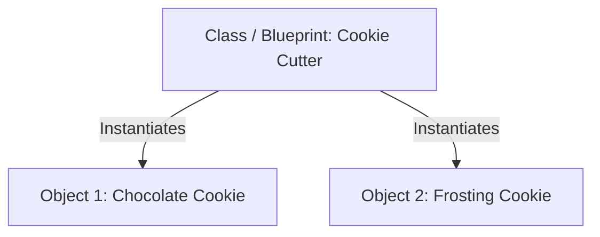

# 🏗️ Topic 06: Blueprints & Buildings (OOP Basics)

Computers are great at tracking numbers, but what if we want to program something complex from the real world, like a **Dog**, a **Super Mario Character**, or a **Spaceship**? In Java, we do this using **OOP (Object-Oriented Programming)**.

---

## 🏠 The Big Picture & Real-Life Example

### 🍪 The Gingerbread Cookie Analogy
Imagine you want to bake gingerbread cookies for a party.
1. You have a **Cookie Cutter** (or a mold). You cannot eat the mold itself. It's just a shape/design. This is a **Class**.
2. You press the cutter into dough and bake it. Now you have a real, delicious gingerbread cookie you can eat! This is an **Object** (also called an **Instance**).
3. You can bake 100 cookies using the *same* cookie cutter. Some cookies might have chocolate chips, and some might have frosting (these are **Attributes** / variables). They can all dance or walk (these are **Behaviors** / methods).



---

## 🔬 Let's Look Closer: Fields, Methods, & Constructors

Inside a Class (blueprint), we define three main things:

### 1. Attributes (Fields/State)
These are variables that describe what the object *is* or *has*.
* *Example*: A `Dog` has a `breed`, `color`, and `age`.

### 2. Behaviors (Methods)
These are blocks of code that describe what the object can *do*.
* *Example*: A `Dog` can `bark()` and `run()`.

### 3. Constructors (The Birthday Helper 🎂)
When you create a new object, the **Constructor** is the special code that runs first to set up the object. Think of it as a birth certificate where you write the baby's name for the first time.
* **Default Constructor**: If you don't write any constructor, Java builds a blank, silent one for you.
* **Parameterized Constructor**: A constructor where you pass in starting values (like setting the breed and name of a dog when it is born).
* **Constructor Chaining**: Using the `this()` keyword to call one constructor from another constructor in the same class. This saves you from writing duplicate setup code!
* **Copy Constructor**: A constructor that clones another existing object.

---

## 🔑 Special Keywords: `this` and `static`

* **`this`**: Points to the current object. It's like pointing to yourself and saying: *"My name is..."* inside your own head. Usually used to resolve confusion if a method argument has the same name as a class variable (e.g., `this.name = name;`).
* **`static`**: Things marked `static` belong to the **Class itself**, not to the individual objects.
  * *Analogy*: Imagine a school of kids. Each kid has their own private notebook (instance variable). But they all share the same big blackboard on the wall (static variable). If one kid writes on the blackboard, everyone else sees it!

---

## 🗑️ Garbage Collection: The Trash Truck

When you create objects in Java, they take up space in the computer's memory. When you stop using an object (for example, you set its reference to `null`), it becomes "trash."
Java has an automatic **Garbage Collector (GC)**. It's a friendly trash truck that runs in the background, finds unused objects, and sweeps them away to free up memory!
* **`finalize()` method**: A special method that used to run right before the object got swept away (like a final goodbye). *Note: It is now deprecated because it's slow and unreliable, but it's good to know for quizzes!*

---

## 📖 Key Definitions

* **Object-Oriented Programming (OOP)**: A programming style based on the concept of "objects" that contain data (fields) and code (methods).
* **Class**: A user-defined blueprint or template used to create individual objects.
* **Object (Instance)**: A concrete, real-world entity created from a class blueprint that lives in the computer's memory.
* **Constructor**: A special block of code that is executed automatically to initialize an object when it is created.
* **Static Keyword**: A modifier indicating that a variable or method belongs directly to the class, rather than to class instances.
* **Garbage Collection (GC)**: An automatic memory management process in Java that deletes unused objects to free up space.

---

## 💻 Code Sandbox: Building a Dog

Copy, compile, and run this code to see OOP in action:

```java
class Dog {
    // 1. Attributes (Fields)
    String name;
    String breed;
    
    // Static variable (Shared by ALL dogs!)
    static int dogCount = 0;

    // 2. Default Constructor
    public Dog() {
        // Constructor chaining: Calling the parameterized constructor!
        this("Unknown", "Street Dog"); 
    }

    // 3. Parameterized Constructor
    public Dog(String name, String breed) {
        this.name = name; // 'this.name' is the class field, 'name' is the argument
        this.breed = breed;
        dogCount++; // Add to the shared count every time a dog is born!
    }

    // 4. Copy Constructor (Cloning a dog)
    public Dog(Dog otherDog) {
        this.name = otherDog.name + " Clone";
        this.breed = otherDog.breed;
        dogCount++;
    }

    // 5. Behaviors (Methods)
    public void bark() {
        System.out.println(name + " says: Woof! Woof!");
    }

    // Static Method (Belongs to the class!)
    public static void printTotalDogs() {
        System.out.println("Total dogs created: " + dogCount);
    }
}

public class Main {
    public static void main(String[] args) {
        // Create dogs using different constructors
        Dog dog1 = new Dog("Buddy", "Golden Retriever");
        Dog dog2 = new Dog(); // Uses default -> chained constructor
        Dog dog3 = new Dog(dog1); // Uses copy constructor to clone dog1

        // Let them bark!
        dog1.bark(); // Buddy says: Woof! Woof!
        dog2.bark(); // Unknown says: Woof! Woof!
        dog3.bark(); // Buddy Clone says: Woof! Woof!

        // Print the shared static dog count
        Dog.printTotalDogs(); // Total dogs created: 3
    }
}
```

---

> [!IMPORTANT]
> * Constructors **do not have a return type** (not even `void`) and their name **must match the class name** exactly.
> * If you write your own parameterized constructor, Java will **not** create the default blank constructor for you anymore! You must write it manually if you still want to use it.
> * Static methods **cannot** use non-static fields. (The blackboard doesn't know what is written inside your private notebook!).

---

## ❓ Interview Questions (Q1 - Q50)

### 🟢 Basic Questions (Q1 - Q20)
1. **What is Object-Oriented Programming (OOP)?**
   * *Answer*: A programming paradigm based on the concept of "objects", which can contain data in the form of fields (attributes) and code in the form of methods (behaviors).
2. **What is a Class?**
   * *Answer*: A blueprint, template, or prototype that defines the attributes and behaviors common to all objects of that class type.
3. **What is an Object?**
   * *Answer*: A runtime instance of a class that has a state, behavior, and identity.
4. **What is the difference between a Class and an Object?**
   * *Answer*: A class is a logical template (no memory allocation); an object is a physical instance of that class allocated in memory.
5. **What is a Constructor?**
   * *Answer*: A special block of code that is executed when an object is created to initialize its state.
6. **How do you instantiate an object in Java?**
   * *Answer*: By using the `new` keyword (e.g., `Dog d = new Dog();`).
7. **What is a Default Constructor?**
   * *Answer*: A constructor with no parameters that is automatically provided by the Java compiler if no other constructor is defined in the class.
8. **What is the return type of a constructor?**
   * *Answer*: A constructor does not have any return type, not even `void`.
9. **Can a constructor name be different from the class name?**
   * *Answer*: No, a constructor name must match the class name exactly.
10. **What does the `this` keyword represent in Java?**
    * *Answer*: It represents the reference to the current object executing the method or constructor.
11. **What are instance variables?**
    * *Answer*: Variables declared within a class but outside methods, whose values are unique to each class instance (object).
12. **What are methods?**
    * *Answer*: Blocks of code that perform specific operations when called (representing object behavior).
13. **What is a static variable?**
    * *Answer*: A class-level variable declared with the `static` keyword that is shared among all instances of that class.
14. **What is a static method?**
    * *Answer*: A method belonging to the class rather than class instances, which can be invoked directly using the class name.
15. **Can a static method access non-static variables?**
    * *Answer*: No, static methods cannot access instance variables or call instance methods directly because they run without an object context.
16. **How do you access a static variable?**
    * *Answer*: Directly using the Class Name (e.g., `ClassName.staticVariable`).
17. **What is the default value of numeric instance variables?**
    * *Answer*: `0` for integers and `0.0` for floating-point numbers.
18. **What is the dot `.` operator used for in OOP?**
    * *Answer*: To access fields and invoke methods of an object (e.g., `myObject.myMethod()`).
19. **What is a Parameterized Constructor?**
    * *Answer*: A constructor that accepts one or more arguments to initialize instance variables with custom values during object creation.
20. **Can you overload a constructor?**
    * *Answer*: Yes, by defining multiple constructors with different parameter lists in the same class.

### 🟡 Intermediate Questions (Q21 - Q40)
21. **What is Constructor Chaining?**
   * *Answer*: The process of calling one constructor from another constructor in the same class (using `this()`) or the parent class (using `super()`).
22. **What is a Copy Constructor?**
   * *Answer*: A constructor that initializes a new object using the state of an existing object of the same class (passed as an argument).
23. **What is the rule for placing `this()` or `super()` inside a constructor?**
   * *Answer*: It must be the very first statement inside the constructor block.
24. **Can you use `this` inside a static method?**
   * *Answer*: No, the `this` keyword is unavailable in a static context because there is no current instance associated with static execution.
25. **What is an Instance Initializer Block?**
   * *Answer*: A block of code inside a class, enclosed in curly braces `{ ... }` without keywords, which runs every time an object is instantiated, right before the constructor.
26. **What is a Static Initializer Block?**
   * *Answer*: A block of code marked `static { ... }` that runs exactly once when the class is first loaded into memory by the ClassLoader.
27. **What is the execution order of initialization blocks and constructors?**
   * *Answer*: 
     1. Static blocks (on class load).
     2. Instance blocks (on object creation).
     3. Constructor (on object creation).
28. **What is the difference between static variables and instance variables in memory?**
   * *Answer*: Static variables are stored once in the Method Area when class is loaded; instance variables are allocated inside the Heap every time a new object is created.
29. **What is the `finalize()` method in Java?**
   * *Answer*: A method defined in the `Object` class that was historically invoked by the garbage collector right before collecting an unreachable object (now deprecated in modern Java).
30. **Does setting an object reference to `null` delete the object instantly?**
   * *Answer*: No, it simply disconnects the variable from the object, making the object eligible for garbage collection whenever the GC next decides to run.
31. **What is Garbage Collection (GC)?**
   * *Answer*: An automatic background process of the JVM that monitors allocated objects and reclaims memory held by objects that are no longer reachable by any active threads.
   * *Note*: This prevents manual memory allocation bugs.
32. **Can you force Garbage Collection to run?**
   * *Answer*: You can suggest GC to run by calling `System.gc()`, but the JVM does not guarantee when or if it will actually execute immediately.
33. **What is the difference between shallow copy and deep copy?**
   * *Answer*: A shallow copy copies primitive values and replicates object reference addresses (sharing reference structures); a deep copy copies primitives and recursively duplicates all nested objects.
34. **Can we declare a constructor as `static`?**
   * *Answer*: No, constructors cannot be `static` because they are explicitly designed to initialize instance objects.
35. **Can we declare a constructor as `private`?**
   * *Answer*: Yes, private constructors are used to prevent external instantiation (e.g., in Singleton classes or utility classes containing only static methods).
36. **What happens if you define a method with the same name as the class?**
   * *Answer*: It compiles as a normal method (not a constructor) if it has a return type (like `void`), although it violates standard naming conventions.
37. **What is the `Object` class?**
   * *Answer*: The ultimate superclass of all classes in Java; every class implicitly inherits from `java.lang.Object`.
38. **What are the common methods inherited from the `Object` class?**
    * *Answer*: `toString()`, `equals()`, `hashCode()`, `getClass()`, `clone()`, `finalize()`, `wait()`, `notify()`, and `notifyAll()`.
39. **What is the difference between instance methods and class (static) methods?**
    * *Answer*: Instance methods can access instance and static fields; static methods can only access static variables and other static methods.
40. **Does Java support local classes (classes declared inside methods)?**
    * *Answer*: Yes, classes can be declared within the scope of a method, known as local inner classes.

### 🔴 Advanced Questions (Q41 - Q50)
41. **How does the JVM execute constructor invocation at the bytecode level?**
   * *Answer*: Constructors are compiled into special instance initialization methods named `<init>`. The compiler inserts calls to `<init>` after allocating raw heap memory using the `new` bytecode instruction.
42. **What is Escape Analysis in JVM compiler optimization?**
   * *Answer*: A JIT optimization technique that checks if an object's scope escapes outside the executing method. If it does not, the JIT may optimize allocations by allocating the object on the **Stack Frame** instead of the Heap (Scalar Replacement), avoiding GC overhead.
43. **Where are static fields stored in Java 8 and later?**
   * *Answer*: They are stored inside the Class object allocated on the **JVM Heap**, whereas before Java 8 they resided in the Permanent Generation (PermGen) region of memory.
   * *Note*: PermGen was replaced by Metaspace.
44. **Explain how the ClassLoader loads static blocks safely in multi-threaded environments.**
   * *Answer*: The JVM ensures class loading and static block execution is synchronized. If two threads reference a class at the same time, the ClassLoader locks the class registration, running static blocks once while holding the lock.
45. **What are the different GC Generation Spaces (Eden, Survivor, Tenured)?**
   * *Answer*: 
     * **Eden Space**: Where new objects are initially allocated.
     * **Survivor Space (S0/S1)**: Where surviving objects from minor GC are copied.
     * **Tenured (Old) Space**: Where long-lived objects are moved after surviving multiple GC cycles.
46. **What is the difference between static nested classes and inner classes?**
   * *Answer*: A static nested class does not have access to the outer class's instance fields and does not hold an implicit reference to an outer instance. An inner class holds an implicit reference to the outer class object, which can lead to memory leaks.
47. **How does constructor chaining handle exception propagation?**
   * *Answer*: If a constructor in the chain throws a checked exception, all constructors invoking it via `this()` or `super()` must declare that exception in their `throws` clause.
   * *Note*: You cannot catch exceptions thrown from `super()` because it must be the first line.
48. **Explain the singleton design pattern thread safety issues with constructors.**
   * *Answer*: In a lazy initialization singleton, if two threads call `getInstance()` concurrently when the instance is null, both may enter the constructor, violating the pattern. This is solved using **double-checked locking** or the **Bill Pugh Singleton** inner class pattern.
49. **How does JVM handle class loading initialization loops?**
   * *Answer*: If Class A during initialization references Class B, and Class B references Class A, the JVM resolves references dynamically by returning partially initialized class references, which can lead to runtime issues if static variables are read before they are assigned values.
50. **What is the performance cost of object creation in high-frequency trading (HFT) systems?**
    * *Answer*: Instantaneous object creation causes GC pressure. High-allocation rate triggers frequent minor GC pauses (Stop-the-world events), which introduce execution latency. Such systems optimize code to be "GC-free" by recycling objects using **Object Pools**.

---

## ⏭️ Next Steps

* **Previous Chapter**: [👈 Topic 05: Toy Racks & Word Chains (Arrays & Strings)](05_arrays_strings.md)
* **Next Chapter**: [👉 Topic 07: The Four Pillars of OOP](07_oop_pillars.md)
* **Roadmap Index**: [🏠 Back to Roadmap](README.md)
