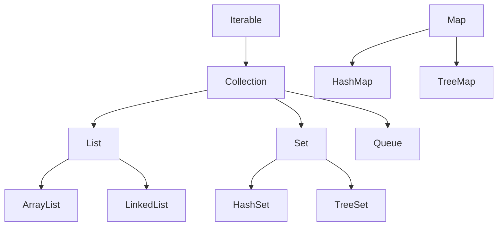

# 🎒 Topic 09: Super Bags (Collections Framework)

A basic array is like a wooden toy rack—it has a fixed size. What if you keep buying new toys? You need a **magical bag** that automatically expands when you put a new toy inside! In Java, these bags are called **Collections**.

---

## 🏠 The Big Picture & Real-Life Example

Imagine you have different types of organizers for your toys:
1. **The Chain Train (List)**: You connect toy train cars. You can add a car in the middle, and order matters.
2. **The Exclusive Club (Set)**: You have a box of unique stickers. If you try to add a second identical Pikachu sticker, the box kicks it out. No duplicates allowed!
3. **The Slide Line (Queue)**: A line of kids waiting for the slide. The first kid to join the line is the first to go down the slide (FIFO - First In, First Out).
4. **The Dictionary (Map)**: A notebook of secret codes where each friend's name (Key) matches their secret phone number (Value).



---

## 🔬 Let's Look Closer: The Bag Types

Let's explore the four main families of Java Collections:

### 1. 📋 Lists (Ordered, allows duplicates)
Lists keep items in the exact order you add them.
* **`ArrayList`**: Backed by a resizing array.
  * *Pros/Cons*: Super fast to find an item (like looking up cubby #3), but slow if you want to push a new item right in the middle (you have to slide all other items over!).
* **`LinkedList`**: Elements are connected like magnets. Each element points to the next one.
  * *Pros/Cons*: Super fast to add an item in the middle (just snap the magnets!), but slow to find an item (you have to count from the very first element to find the 50th one!).

### 🙅 2. Sets (No duplicates allowed)
Sets ensure all items are completely unique.
* **`HashSet`**: Fast and unordered. It uses a secret code (hash) to store toys in random spots.
* **`TreeSet`**: Automatically sorts your toys (like numbers from smallest to biggest, or words A to Z).

### 🎟️ 3. Maps (Key-Value pairs)
Maps store entries in pairs: **Key ➡️ Value**. Keys must be unique!
* **`HashMap`**: Fast, unordered lookup.
  * *Example*: `"Apple" ➡️ "A red crunchy fruit"`
* **`TreeMap`**: Keeps keys sorted in order.

### 🎢 4. Queues (Wait your turn!)
* **`PriorityQueue`**: The most important item goes first, rather than just the first one in line (like emergency room patients getting treated before minor coughs).

---

## 🔍 How to Sort and Walk Through Collections

### 1. The Iterator (The Magnifying Glass 🔍)
An **`Iterator`** is a tiny helper that moves step-by-step through a collection. It has two questions:
* *"Do you have a next item?"* (`hasNext()`)
* *"Give me the next item!"* (`next()`)

### 2. Comparable vs. Comparator (Sorting Rules)
How do we sort toys?
* **`Comparable`**: The toy knows how to compare itself naturally. (e.g., a `Toy` class implements `Comparable` and compares its own weight).
* **`Comparator`**: An external referee who decides. You can make custom comparators to sort by size, color, or price!

---

## 📖 Key Definitions

* **Java Collections Framework**: A set of classes and interfaces that help store, organize, and manipulate groups of objects.
* **List**: An ordered collection that allows duplicate elements and lets you access elements by their index position.
* **Set**: An unordered collection that does not allow duplicate elements, ensuring all items are unique.
* **Map**: An object that stores key-value pairs, where each unique key maps to exactly one value.
* **Queue**: A collection designed to hold elements in a specific order (typically first-in, first-out) before processing.
* **Iterator**: An object used to walk through the elements of a collection one by one.
* **Comparable**: An interface used to define the natural sorting order of a class (using the `compareTo` method).
* **Comparator**: An interface used to define a custom sorting order for objects outside their own class (using the `compare` method).

---

## 💻 Code Sandbox: Managing the Toy Store

Copy, play, and run this code:

```java
import java.util.*;

public class CollectionsDemo {
    public static void main(String[] args) {
        // --- 1. LIST (ArrayList): The Train of Toys ---
        List<String> toyTrain = new ArrayList<>();
        toyTrain.add("Robot");
        toyTrain.add("Car");
        toyTrain.add("Robot"); // Duplicate is allowed!
        
        System.out.println("ArrayList Train: " + toyTrain);
        System.out.println("Toy at index 1: " + toyTrain.get(1));

        // --- 2. SET (HashSet): The Unique Sticker Club ---
        Set<String> stickers = new HashSet<>();
        stickers.add("Pikachu");
        stickers.add("Charizard");
        stickers.add("Pikachu"); // duplicate will be ignored!

        System.out.println("HashSet Stickers: " + stickers); // Only unique stickers!

        // --- 3. MAP (HashMap): The Dictionary ---
        Map<String, String> wordBook = new HashMap<>();
        wordBook.put("Java", "A fun coding language");
        wordBook.put("Cookie", "A tasty baked snack");

        System.out.println("Definition of Java: " + wordBook.get("Java"));

        // --- 4. Iterating (Walking through the Set) ---
        System.out.println("Walking through stickers using Iterator:");
        Iterator<String> it = stickers.iterator();
        while (it.hasNext()) {
            System.out.println("Sticker: " + it.next());
        }

        // --- 5. Sorting using a Comparator ---
        List<Integer> scores = new ArrayList<>(Arrays.asList(90, 50, 100, 70));
        System.out.println("Before sorting: " + scores);
        
        // Natural Sort
        Collections.sort(scores);
        System.out.println("Naturally Sorted: " + scores);

        // Reverse Custom Sort
        scores.sort(Comparator.reverseOrder());
        System.out.println("Reverse Sorted: " + scores);
    }
}
```

---

## 🧠 Points to Remember

> [!IMPORTANT]
> * Use **`ArrayList`** if you need to read/find elements frequently.
> * Use **`LinkedList`** if you are frequently adding or deleting items from the middle of the list.
> * **`HashMap`** and **`HashSet`** do not keep items in the order you added them! If you need order, use **`LinkedHashMap`** or **`LinkedHashSet`**.
> * Keys in a Map cannot be duplicates. If you insert a key that already exists, the old value gets overwritten!

---

## ❓ Interview Questions (Q1 - Q50)

### 🟢 Basic Questions (Q1 - Q20)
1. **What is the Java Collections Framework?**
   * *Answer*: A unified architecture of interfaces, implementations, and algorithms for storing and manipulating groups of objects.
2. **What are the primary core interfaces of the Collections Framework?**
   * *Answer*: `List`, `Set`, `Queue`, and `Map` (Note: `Map` does not inherit directly from `Collection`, but is part of the framework).
3. **What is the difference between List and Set?**
   * *Answer*: `List` is an ordered collection that allows duplicate elements; `Set` is an unordered collection that forbids duplicates.
4. **How does an `ArrayList` differ from a standard array?**
   * *Answer*: A standard array has a fixed size; an `ArrayList` is a dynamic array that automatically resizes itself when elements are added or removed.
5. **What is a `Map` in Java?**
   * *Answer*: An object that maps unique keys to values (key-value pairs).
6. **How do you retrieve an element from an `ArrayList`?**
   * *Answer*: Using the `.get(index)` method.
7. **How do you add an element to a `HashSet`?**
   * *Answer*: Using the `.add(element)` method, which returns `false` if the element is already present.
8. **How do you retrieve a value from a `HashMap`?**
   * *Answer*: By calling the `.get(key)` method.
9. **What is an `Iterator`?**
   * *Answer*: An interface that provides methods (`hasNext()`, `next()`, `remove()`) to traverse sequentially through any collection.
10. **What is the difference between `add()` and `offer()` in a `Queue`?**
    * *Answer*: `add()` throws an exception if the queue is full; `offer()` returns `false` instead.
11. **Can a `Set` contain `null` elements?**
    * *Answer*: Yes, a `HashSet` can contain at most one `null` element.
12. **Can a `Map` contain duplicate keys?**
    * *Answer*: No, keys in a `Map` must be unique.
13. **Can a `Map` contain duplicate values?**
    * *Answer*: Yes, different keys can map to identical values.
14. **How do you remove all elements from a collection?**
    * *Answer*: By calling the `.clear()` method.
15. **How do you check if a collection is empty?**
    * *Answer*: By calling the `.isEmpty()` method.
16. **How do you check if an element exists in a `List`?**
    * *Answer*: By calling the `.contains(element)` method.
17. **Which list implementation is backed by a doubly-linked list?**
    * *Answer*: `java.util.LinkedList`.
18. **Which collection should you use to sort elements automatically?**
    * *Answer*: `TreeSet` or `TreeMap`.
19. **What is the difference between `remove()` and `poll()` in a `Queue`?**
    * *Answer*: `remove()` throws an exception if the queue is empty; `poll()` returns `null` instead.
20. **Is the `Collection` interface a subclass of `Iterable`?**
    * *Answer*: Yes, `Collection` extends `Iterable`.

### 🟡 Intermediate Questions (Q21 - Q40)
21. **What is the difference between `ArrayList` and `LinkedList`?**
   * *Answer*: `ArrayList` is backed by an array, offering $O(1)$ search but $O(N)$ insertion/deletion in the middle; `LinkedList` is backed by nodes, offering $O(1)$ insertions/deletions in the middle but $O(N)$ lookup.
22. **What is the difference between `Comparable` and `Comparator`?**
   * *Answer*: `Comparable` defines natural ordering of a class using `compareTo()` (implemented inside the class); `Comparator` defines custom ordering using `compare()` (implemented in an external class).
23. **What is the difference between Fail-Fast and Fail-Safe Iterators?**
   * *Answer*: Fail-fast iterators (e.g., `ArrayList` iterator) throw `ConcurrentModificationException` if the collection is structurally modified during iteration. Fail-safe (weakly consistent) iterators (e.g., `CopyOnWriteArrayList` iterator) iterate on a copy of the collection, avoiding exceptions.
24. **How does `HashMap` handle key collisions internally?**
   * *Answer*: Using chaining. Keys hashing to the same bucket index are stored in a linked list at that bucket. In Java 8, if the list length exceeds 8, it converts to a red-black tree.
25. **What is the difference between `HashMap` and `Hashtable`?**
   * *Answer*: `HashMap` is not synchronized (faster) and allows one `null` key and multiple `null` values; `Hashtable` is synchronized (slower) and forbids any `null` keys or values.
26. **What is the difference between `Vector` and `ArrayList`?**
   * *Answer*: `Vector` is synchronized (thread-safe, slower) and doubles its array capacity when full; `ArrayList` is not synchronized (faster) and increases its capacity by 50% when full.
27. **What is the load factor in `HashMap`?**
   * *Answer*: A measure (default 0.75) that determines when to resize the map. When the size exceeds `capacity * loadFactor`, the map capacity is doubled.
28. **What is the difference between `HashSet` and `TreeSet`?**
   * *Answer*: `HashSet` is implemented using a `HashMap` (unordered, $O(1)$ performance); `TreeSet` is implemented using a Red-Black Tree (sorted, $O(\log N)$ performance).
29. **What is the difference between `HashMap` and `LinkedHashMap`?**
   * *Answer*: `HashMap` does not maintain insertion order; `LinkedHashMap` uses a doubly-linked list running through all of its entries to maintain insertion order or access order.
30. **How does a `HashSet` eliminate duplicate values?**
   * *Answer*: It wraps a `HashMap` internally where elements are stored as *keys* in the map, and a constant dummy object is stored as the value. Since map keys are unique, duplicates are naturally eliminated.
31. **What is the difference between `Iterator` and `ListIterator`?**
   * *Answer*: `Iterator` can traverse only forward in a Collection; `ListIterator` can traverse both forward and backward, modify elements, and is specific to `List` implementations.
32. **What is a `PriorityQueue`?**
   * *Answer*: A queue that orders its elements according to their natural ordering or a custom `Comparator` rather than FIFO.
33. **What is a `Deque`?**
   * *Answer*: A double-ended queue (pronounced "deck") that supports inserting and removing elements at both the front and the end (e.g., `ArrayDeque`).
34. **Can you add primitive values (like `int`) to a Collection?**
    * *Answer*: Yes, because the Java compiler automatically applies autoboxing to convert primitives to their wrapper objects (e.g., `int` to `Integer`).
35. **What is the difference between `Collections` and `Collection`?**
    * *Answer*: `Collection` is an interface representing a group of objects; `Collections` is an utility helper class containing static methods to search, sort, and synchronize collections.
36. **What is the contract between `equals()` and `hashCode()` for keys in a `HashMap`?**
    * *Answer*: If two objects are equal according to `equals()`, they must return the same integer value from `hashCode()`. Failing this contract breaks `HashMap` lookup correctness.
37. **Why is it recommended to use immutable objects (like `String` or `Integer`) as keys in a `HashMap`?**
    * *Answer*: If a key's state changes after insertion, its `hashCode()` changes, causing the key to map to a different bucket, making the entry unretrievable (causing a memory leak).
38. **What is the default capacity of an `ArrayList` and `HashMap` in Java?**
    * *Answer*: `ArrayList` has a default capacity of 10 (since Java 7, deferred until first element is added); `HashMap` has a default capacity of 16 (must be a power of 2).
39. **What is `UnsupportedOperationException`?**
    * *Answer*: An exception thrown when an optional collection method is called on an unmodifiable or read-only collection (e.g., calling `.add()` on a list returned by `Collections.unmodifiableList()`).
40. **How do you convert an Array to a List in Java?**
    * *Answer*: Using `Arrays.asList(array)` or `List.of(array)` (returns immutable list).

### 🔴 Advanced Questions (Q41 - Q50)
41. **Explain the red-black tree conversion (Treeification) in `HashMap` since Java 8.**
   * *Answer*: When hash collisions cause a bucket list size to exceed the threshold (`TREEIFY_THRESHOLD = 8`) and the overall map capacity is at least 64, the linked list is converted into a balanced Red-Black Tree. This reduces the search time complexity from $O(N)$ to $O(\log N)$ under high collision rates.
42. **What is a Hash Collision Attack?**
   * *Answer*: A denial-of-service (DoS) attack where a malicious client sends requests containing keys crafted to generate identical hashcodes, overloading a web server's `HashMap` buckets into $O(N)$ operations, stalling execution.
43. **How does `ConcurrentHashMap` achieve high concurrency compared to `Hashtable`?**
   * *Answer*: `Hashtable` locks the entire map during operations. In Java 8+, `ConcurrentHashMap` locks only the specific bucket node using `synchronized` blocks and uses non-blocking Compare-And-Swap (CAS) instructions for initial insertion, allowing multiple threads to write to different buckets concurrently.
44. **Explain how `CopyOnWriteArrayList` achieves thread safety. What is its trade-off?**
   * *Answer*: Every mutative operation (like `.add()` or `.set()`) copies the underlying array. Iterators read the stable snapshot array. The trade-off is high memory and CPU cost during writes, making it ideal only for read-heavy collections.
45. **What is the difference between `IdentityHashMap` and a standard `HashMap`?**
   * *Answer*: Standard `HashMap` uses `.hashCode()` and `.equals()` to compare keys. `IdentityHashMap` bypasses these and uses system identity hashcodes and reference equality `==` to compare keys.
46. **What is a `WeakHashMap` and what is its primary use case?**
   * *Answer*: A map implementation where keys are wrapped in `WeakReference`s. If a key object is no longer referenced elsewhere, it becomes eligible for GC, and its map entry is automatically removed. It is primarily used for caching.
47. **How does `TreeMap` maintain its sorted order? What is its time complexity?**
   * *Answer*: It utilizes a Red-Black Tree data structure. All basic operations (get, put, remove, containsKey) execute in $O(\log N)$ time.
48. **Explain the structural difference between `ArrayDeque` and `LinkedList` when acting as a Stack.**
   * *Answer*: `ArrayDeque` is backed by a circular array (highly cache-friendly, no node object overhead, faster); `LinkedList` allocates node objects for every pushed item, causing GC overhead and cache misses.
49. **How does the JVM calculate bucket index from a key's hashcode in a `HashMap`?**
   * *Answer*: It uses a bitwise AND operation with the capacity minus 1: `index = hash & (capacity - 1)`. This is why capacity must be a power of 2, as it makes the operation equivalent to modulo calculation but extremely fast.
50. **What is the difference between `HashMap` resize (rehash) behavior in Java 7 vs. Java 8?**
    * *Answer*: In Java 7, resizing re-evaluated bucket indices and inserted nodes at the head of the new list, which could reverse elements and cause infinite loops under concurrent access. In Java 8, it uses a stable "split-run" algorithm that preserves element order, avoiding infinite loops (though concurrency bugs still occur).

---

## ⏭️ Next Steps

* **Previous Chapter**: [👈 Topic 08: The Safety Net (Exception Handling)](08_exception_handling.md)
* **Next Chapter**: [👉 Topic 10: Special Labeled Boxes (Generics & Wrappers)](10_generics_wrappers.md)
* **Roadmap Index**: [🏠 Back to Roadmap](README.md)
