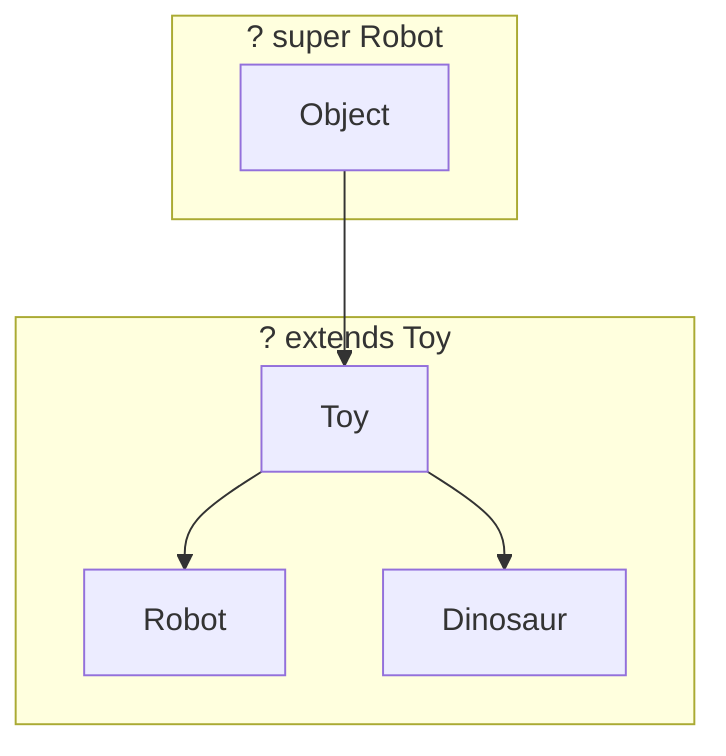

# 🏷️ Topic 10: Special Labeled Boxes (Generics & Wrappers)

What if you want to make a toy box that can hold anything, but you want to make sure no one accidentally mixes up toys? Today we will learn about **Generics** and **Wrapper Classes**.

---

## 🏠 The Big Picture & Real-Life Example

### 🍬 The Wrapped Candy (Wrapper Classes)
Imagine you have a piece of raw chocolate 🍫. It's just a raw ingredient. But if you want to give it as a gift, you put it in a fancy box with a ribbon. 
* The raw chocolate is a **Primitive Type** (like `int`).
* The fancy box is a **Wrapper Class** (like `Integer`).
* Putting the chocolate in the box is **Autoboxing**.
* Opening the box to eat the chocolate is **Unboxing**.

### 🏷️ The Toy Box Slot (Generics)
Imagine you buy a plastic sorting box. It has a shape-label slot on the front. 
* If you slide a **"Dinosaur"** 🦖 picture into the slot, the box will *only* let you put Dinosaur toys inside. If you try to slip in a doll, the box will sound an alarm!
* If you change the slot card to **"Car"** 🚗, it now only accepts Cars.
* In Java, this slot card is called a **Generic Parameter (`<T>`)**. It lets you make one blueprint, but specify what type of toys it can hold!

---

## 🔬 Let's Look Closer: Wrapper Classes

Java Collections (like `ArrayList`) are fancy. They can only hold **Objects**, not raw primitive values. So, if we want a list of numbers, we can't use `int`. We must wrap them in the **`Integer`** class!

Each primitive has a Wrapper Class partner:

| Primitive | Wrapper Class |
| :--- | :--- |
| `byte` | `Byte` |
| `int` | `Integer` |
| `char` | `Character` |
| `double` | `Double` |
| `boolean` | `Boolean` |

### 🔄 Auto-boxing & Unboxing
Java does this wrapping and unwrapping automatically:
```java
Integer boxedNum = 5; // Autoboxing (int ➡️ Integer)
int rawNum = boxedNum; // Unboxing (Integer ➡️ int)
```

---

## 🔬 Let's Look Closer: Generics

Generics add a type parameter (represented by letters like `<T>` for Type, `<E>` for Element, `<K>` for Key) to classes and methods.

```java
// A generic box that can hold ANY type of toy!
class Box<T> {
    private T item;

    public void setItem(T item) { this.item = item; }
    public T getItem() { return item; }
}
```

### 🃏 Wildcards (`?`)
Sometimes we want to accept boxes of various shapes. We use the wildcard symbol `?`:

1. **Unbounded Wildcard (`<?>`)**: A box holding absolutely anything.
2. **Upper-Bounded Wildcard (`<? extends Toy>`)**: A box holding a `Toy` or any of its child shapes (like `Robot` or `Dinosaur`).
3. **Lower-Bounded Wildcard (`<? super Robot>`)**: A box holding a `Robot` or any of its parent shapes (like `Toy` or `Object`).



### 🧼 Type Erasure
Java compilers are smart. They check all your generic labels (like `<String>`) to make sure your code is safe. Once the compiler is happy and generates the bytecode, it **erases** (wipes off) all these generic labels! 
This means at runtime, all generic boxes look like ordinary boxes holding `Object`s. This is done to make sure modern Java works on older JVMs.

---

## 📖 Key Definitions

* **Wrapper Classes**: Object classes corresponding to primitive types (like `Integer` for `int`), allowing primitives to be used in generic collections.
* **Autoboxing**: The automatic conversion that the Java compiler makes between a primitive type and its wrapper class.
* **Unboxing**: The automatic conversion that the Java compiler makes from a wrapper class back to its primitive type.
* **Generics**: A feature that lets you add type parameters (like `<String>`) to classes and methods to ensure compile-time type safety.
* **Wildcard (`?`)**: A special question-mark type argument in generics that represents an unknown type, adding flexibility.
* **Type Erasure**: The process where the compiler removes all generic type parameter information at compile time to maintain backward compatibility.

---

## 💻 Code Sandbox: The Custom Toy Organizer

Copy, play, and run this code:

```java
import java.util.ArrayList;
import java.util.List;

// 1. Creating a Generic Toy Box!
class ToyBox<T> {
    private T toy;

    public void putToy(T toy) {
        this.toy = toy;
    }

    public T getToy() {
        return toy;
    }
}

// Simple classes for toys
class Toy {}
class Robot extends Toy {
    public void dance() { System.out.println("Robot is dancing beep-boop!"); }
}
class Dinosaur extends Toy {}

public class GenericsDemo {
    // 2. A method that uses Wildcards (? extends Toy)
    public static void playWithToys(List<? extends Toy> toyList) {
        System.out.println("Playing with a list of toys!");
        // We can safely treat everything inside as a 'Toy'!
        for (Toy t : toyList) {
            System.out.println("We have a toy: " + t.getClass().getSimpleName());
        }
    }

    public static void main(String[] args) {
        // --- 3. Wrapper Classes (Autoboxing) ---
        List<Integer> scoreList = new ArrayList<>();
        scoreList.add(100); // Automatically turns raw 100 into Integer object!
        int score = scoreList.get(0); // Automatically unboxes to raw int!
        System.out.println("Score: " + score);

        // --- 4. Custom Generics ---
        ToyBox<Robot> robotBox = new ToyBox<>();
        robotBox.putToy(new Robot());
        // robotBox.putToy(new Dinosaur()); // ❌ ERROR! The label slot says Robot only!

        Robot myRobot = robotBox.getToy(); // No casting needed!
        myRobot.dance();

        // --- 5. Wildcard lists ---
        List<Robot> robotList = new ArrayList<>();
        robotList.add(new Robot());
        playWithToys(robotList); // Works because Robot extends Toy!
    }
}
```

---

> [!IMPORTANT]
> * Generics only work with **Reference Types (Objects)**, not Primitives. You cannot write `List<int>` (must be `List<Integer>`).
> * Upper bounds (`? extends T`) are read-only! You cannot add elements to a list defined with `? extends T` because Java doesn't know what specific subclass the list is actually holding.
> * Type Erasure means generic type checks only happen during **compilation**, not at runtime.

---

## ❓ Interview Questions (Q1 - Q50)

### 🟢 Basic Questions (Q1 - Q20)
1. **What are Wrapper Classes in Java?**
   * *Answer*: Object representations of Java primitive data types, allowing them to be manipulated as objects (e.g., `Integer` for `int`).
2. **What is Autoboxing?**
   * *Answer*: The automatic conversion of primitive types to their corresponding wrapper classes by the Java compiler (e.g., converting `int` to `Integer`).
3. **What is Unboxing?**
   * *Answer*: The automatic conversion of a wrapper class object back to its corresponding primitive type (e.g., converting `Integer` to `int`).
4. **What are Generics?**
   * *Answer*: A feature introduced in Java 5 that allows types (classes, interfaces, and methods) to be parameterized, providing compile-time type safety.
5. **Why were Generics introduced in Java?**
   * *Answer*: To detect type errors at compile-time and eliminate the need for explicit type casting when retrieving items from collections.
6. **How do you declare a generic class?**
   * *Answer*: By appending a type parameter in angle brackets after the class name (e.g., `public class Box<T> { ... }`).
7. **What do the common type parameter letters `T`, `E`, `K`, and `V` stand for by convention?**
   * *Answer*: `T` for Type, `E` for Element, `K` for Key, and `V` for Value.
8. **Can you declare a generic collection of primitive types (e.g., `List<int>`)?**
   * *Answer*: No, generics in Java only work with reference types (objects). You must use wrapper classes (e.g., `List<Integer>`).
9. **What is a raw type?**
   * *Answer*: A generic class used without specifying a type argument (e.g., using `List` instead of `List<String>`).
10. **Why should raw types be avoided?**
    * *Answer*: They bypass compiler type-safety checks, risking class cast exceptions at runtime.
11. **How does autoboxing behave in `Integer x = 100; Integer y = 100; System.out.println(x == y);`?**
    * *Answer*: It prints `true` because the JVM caches `Integer` objects for values between -128 and 127.
12. **How does autoboxing behave in `Integer x = 200; Integer y = 200; System.out.println(x == y);`?**
    * *Answer*: It prints `false` because 200 is outside the integer cache range, causing the JVM to allocate two distinct objects.
13. **What is a generic method?**
    * *Answer*: A method that declares its own type parameters before its return type (e.g., `public <T> void print(T item) { ... }`).
14. **How do you instantiate a generic class using the diamond operator?**
    * *Answer*: By writing empty angle brackets `Count<String> count = new Count<>()` since Java 7, letting the compiler infer type arguments.
15. **What is the wrapper class of `char`?**
    * *Answer*: `java.lang.Character`.
16. **What is the wrapper class of `int`?**
    * *Answer*: `java.lang.Integer`.
17. **Can wrapper class objects be compared using relational operators like `>` or `<`?**
    * *Answer*: Yes, they are automatically unboxed to primitives before comparison.
18. **What does the wildcard `?` mean in generics?**
    * *Answer*: It represents an unknown type parameter.
19. **How do you write a generic method that accepts any type of argument?**
    * *Answer*: `public <T> void process(T argument)`.
20. **Does a wrapper class consume more memory than its primitive counterpart?**
    * *Answer*: Yes, because wrapper classes allocate heap object headers, padding, and references compared to raw stack primitive bytes.

### 🟡 Intermediate Questions (Q21 - Q40)
21. **What is Type Erasure?**
   * *Answer*: A process where the compiler removes all generic type parameter information during compilation, replacing type parameters with their bounds (or `Object` if unbounded) to maintain backwards compatibility.
22. **What is the PECS rule?**
   * *Answer*: **Producer Extends, Consumer Super**. Use `? extends T` if the generic collection produces data (read-only). Use `? super T` if the collection consumes data (write-only).
23. **What is the difference between `List<Object>` and `List<?>`?**
   * *Answer*: `List<Object>` is a concrete type-safe list that can only hold `Object` types (and subclasses); `List<?>` is a read-only list of an *unknown* type (any type list can be assigned to it).
24. **Why is `List<String>` not a subclass of `List<Object>` in Java?**
   * *Answer*: Because generics are **invariant**. If `List<String>` were a subclass of `List<Object>`, you could add an `Integer` to it using an `Object` reference, breaking string type safety.
25. **What is the difference between `<? extends T>` and `<? super T>`?**
   * *Answer*: `<? extends T>` specifies an upper bound (accepts `T` or its subclasses); `<? super T>` specifies a lower bound (accepts `T` or its superclasses).
26. **Why can't you add elements to a collection defined with `<? extends T>`?**
   * *Answer*: Because the compiler cannot verify the specific subclass of the list at runtime. Adding an element (other than `null`) is blocked to guarantee type safety.
27. **Why can you add elements to a collection defined with `<? super T>`?**
   * *Answer*: Because the list is guaranteed to hold a type that is a superclass of `T` (or `T` itself), making it safe to write `T` objects to the collection.
28. **What is the difference between a type parameter (like `T`) and a wildcard (like `?`)?**
   * *Answer*: A type parameter `T` declares a named variable type that can be referenced throughout the class or method; a wildcard `?` represents a single, anonymous, unknown type argument.
29. **What occurs during autoboxing when a null wrapper is unboxed (e.g., `Integer val = null; int raw = val;`)?**
   * *Answer*: It throws a `NullPointerException` at runtime because the JVM attempts to call `.intValue()` on a null reference.
30. **How can you check the generic type of a class at runtime?**
   * *Answer*: You cannot directly do so (e.g. `obj instanceof List<String>` is illegal) due to Type Erasure, though you can inspect raw class headers (e.g. `obj instanceof List`).
31. **What is a bounded type parameter? Give an example.**
   * *Answer*: A type parameter restricted to a specific family of classes (e.g., `<T extends Number>` restricts the type parameter to subclasses of `Number`).
32. **Can you define a type parameter with multiple bounds (e.g., `<T extends A & B>`)?**
   * *Answer*: Yes, where `T` must be a subclass of class `A` and implement interface `B` (class bound must be listed first).
33. **Does Java support lower bounds on class-level type parameters (e.g., `class MyClass<T super Number>`)?**
   * *Answer*: No, lower bounds (`super`) are only supported on wildcards in method signatures, not on class-level declarations.
34. **What is the difference between `Arrays.asList()` and `List.of()` regarding null elements?**
    * *Answer*: `Arrays.asList()` allows null elements; `List.of()` throws a `NullPointerException` if a null element is passed.
35. **Why can't you create instance variables of a generic type parameter (e.g., `T var = new T();`)?**
    * *Answer*: Because Type Erasure wipes out the type parameter, meaning the JVM does not know what constructor to call at runtime.
36. **Why can't you declare static fields using class-level generic parameters (e.g., `private static T count;`)?**
    * *Answer*: Because static members are shared by the class across all instances. If you instantiate `MyClass<String>` and `MyClass<Integer>`, they share the same static variable, making a single generic parameter representation illogical.
37. **How do you instantiate a generic array safely in Java?**
    * *Answer*: By allocating a raw object array and casting it (e.g., `T[] arr = (T[]) new Object[10];`), or using reflection: `Array.newInstance(clazz, size)`.
38. **Are wrapper classes mutable?**
    * *Answer*: No, all wrapper classes (`Integer`, `Double`, `Character`, etc.) are designed to be completely immutable.
39. **What is the difference between `Integer.valueOf(100)` and `new Integer(100)`?**
    * *Answer*: `new Integer(100)` bypasses caching and always allocates a new object; `Integer.valueOf(100)` utilizes the JVM integer cache, making it faster and memory-efficient.
40. **How can you customize the Integer cache limit?**
    * *Answer*: By using the JVM configuration flag `-XX:AutoBoxCacheMax=<size>` at startup.

### 🔴 Advanced Questions (Q41 - Q50)
41. **What are Bridge Methods generated during Type Erasure?**
   * *Answer*: Synthetic methods generated by the compiler to maintain polymorphism when a class implements a parameterized interface. For example, if a class overrides a method returning `T` as a subclass type, the compiler creates a bridge method returning `Object` that delegates to the subclass method.
42. **What is Heap Pollution? How does it occur?**
   * *Answer*: A condition where a variable of a parameterized type refers to an object that is not of that type, typically caused by raw type casts, mixing generic and non-generic code, or unsafe varargs operations (leading to runtime `ClassCastException`s).
43. **What does the `@SafeVarargs` annotation do?**
   * *Answer*: An annotation applied to methods with generic varargs parameters to promise the compiler that the method does not perform unsafe operations (heap pollution) on the varargs array, suppressing compiler warnings.
44. **Explain how Type Erasure handles type parameter bounds (e.g., `<T extends Number & Comparable<T>>`) in bytecode.**
   * *Answer*: The compiler erases the type parameter to its **first bound** (in this case, `Number`). Wherever `T` is referenced in bytecode, it is replaced with `Number`, and explicit checks and casts are generated for the second bound `Comparable`.
45. **How does Reflection access generic type information if type erasure occurs?**
   * *Answer*: Although type info is removed for local variables, class definitions, method signatures, and field declarations preserve their generic type metadata in the class file's `Signature` attribute, which can be retrieved via reflection (e.g., `Field.getGenericType()`).
46. **What is a Super Type Token?**
   * *Answer*: A design pattern (pioneered by Neal Gafter) that uses anonymous inner classes to capture generic type parameters at runtime, bypassing erasure (commonly used in libraries like Jackson/Gson via `TypeReference`).
47. **Why is it unsafe to create arrays of parameterized types (e.g., `List<String>[]`)?**
   * *Answer*: Arrays in Java are **covariant** and check types at runtime. Generics are **invariant** and erased. If you could create a generic array, you could assign it to an `Object[]`, insert a `List<Integer>`, and read it as `List<String>`, bypassing compile-time safety and crashing at runtime.
48. **Explain the difference in performance between raw primitives and generic collections in numeric loops.**
   * *Answer*: Looping through primitive arrays is highly cache-efficient and directly manipulates register values. Generic collections store boxed wrapper objects, requiring reference dereferencing, extra object allocations, and constant GC cache thrashing.
49. **How does the compiler implement type checks for generics under the hood?**
   * *Answer*: The compiler performs type verification on the source AST, inserts explicit cast instructions in the compiled bytecode at points where values are retrieved from parameterized classes, and replaces type parameters with raw bounds.
50. **What is the difference between raw type wildcard `<?>` and unbounded type parameter `<T>`?**
    * *Answer*: `<?>` represents a completely read-only representation where the type is anonymous and cannot be used to declare local variables in the method body. `<T>` declares a formal type variable that can be used to read, write, and reference the type repeatedly within the method.

---

## ⏭️ Next Steps

* **Previous Chapter**: [👈 Topic 09: Super Bags (Collections Framework)](09_collections_framework.md)
* **Next Chapter**: [👉 Topic 11: Reading & Writing (File I/O & Serialization)](11_file_io.md)
* **Roadmap Index**: [🏠 Back to Roadmap](README.md)
