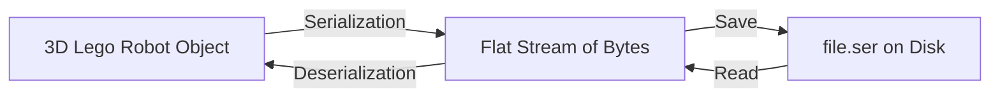

# 💾 Topic 11: Reading & Writing (File I/O & Serialization)

Computers forget everything when we turn them off. If we want our robot game to remember our high score tomorrow, we must write it down in a file on the hard drive. In Java, this is called **File I/O (Input/Output)**.

---

## 🏠 The Big Picture & Real-Life Example

### 🚰 The Water Pipe (Streams)
Imagine you want to move water from a lake into your playroom. You lay down a long pipe. 
* Water coming **into** your playroom is **Input** (reading a file).
* Water pumped **out** of your playroom is **Output** (writing a file).

In Java, these pipes are called **Streams**.
* **Byte Streams (The Water Pipe)**: Moves raw drops of data (bytes). Used for pictures 🖼️, music 🎵, or games.
* **Character Streams (The Letter Pipe)**: Moves alphabet letters. Used for text files like `.txt` or `.html`.

### 🪣 The Bucket Boost (Buffers)
Imagine drinking water from the lake by walking back and forth with a tiny spoon (reading character-by-character from the hard drive). It's super slow! 
Instead, you use a giant bucket (a **Buffer**). You fill the bucket once, bring it to your desk, and drink from it. Java has **BufferedReader** and **BufferedWriter** to make file reading lightning fast!

---

## 🔬 Let's Look Closer: Serialization (The Shrink Ray ⚡)

What if you have a complex LEGO robot object in memory and want to save the *whole robot* to disk, rather than just writing name fields?



1. **Serialization (Shrinking)**: A magical shrink ray turns your 3D LEGO robot object into a flat stream of numbers (bytes) so it can fit inside a file.
   * To allow this, your class must promise it's okay to shrink by implementing the **`Serializable`** interface.
2. **Deserialization (Expanding)**: The expander ray reads the numbers from the file and builds the exact same 3D LEGO robot object back in memory!
3. **The `transient` keyword (Secret Sticker 🤫)**: If you stick a "do not shrink" label on a variable using the word `transient`, Java will ignore it during serialization.
   * *Example*: You don't want to save a user's password to a file on disk for safety, so you mark it `transient`.

---

## 📖 Key Definitions

* **File I/O**: The process of reading information from external files (Input) or writing information down into files (Output).
* **Stream**: An abstraction representing a continuous flow of data from a source to a destination.
* **Byte Stream**: A stream that reads or writes data one byte (8 bits) at a time, used for binary files like images.
* **Character Stream**: A stream designed to read or write text data 16-bit characters at a time.
* **Buffered Stream**: A wrapper stream that uses memory buffering to read/write data in chunks, making operations faster.
* **Serialization**: The process of converting a live Java object into a binary byte stream so it can be saved to a file or sent over a network.
* **Deserialization**: The process of reconstructing a live Java object in memory from a saved binary byte stream.
* **Transient Keyword**: A variable modifier that tells Java not to save it during the serialization process.

---

## 💻 Code Sandbox: Writing in the Diary

Copy, play, and run this code:

```java
import java.io.*;

// --- 1. PREPARING OBJECT FOR SERIALIZATION ---
class GameSave implements Serializable {
    private static final long serialVersionUID = 1L; // Version ID for verification
    
    String playerName;
    int level;
    transient String temporaryPassword; // 🤫 Secret! Will NOT be saved to disk!

    public GameSave(String name, int lvl, String pwd) {
        this.playerName = name;
        this.level = lvl;
        this.temporaryPassword = pwd;
    }
}

public class FileIODemo {
    public static void main(String[] args) {
        String filename = "diary.txt";
        String saveFile = "gamesave.ser";

        // --- 2. WRITING TEXT (BufferedWriter) ---
        try (BufferedWriter writer = new BufferedWriter(new FileWriter(filename))) {
            writer.write("Dear Diary,\n");
            writer.write("Today I learned Java File I/O! It was super fun.");
            System.out.println("Written to text diary successfully!");
        } catch (IOException e) {
            System.out.println("Oops, could not write to file: " + e.getMessage());
        }

        // --- 3. READING TEXT (BufferedReader) ---
        try (BufferedReader reader = new BufferedReader(new FileReader(filename))) {
            String line;
            System.out.println("\nReading from text diary:");
            while ((line = reader.readLine()) != null) {
                System.out.println("  " + line);
            }
        } catch (IOException e) {
            System.out.println("Oops, could not read file: " + e.getMessage());
        }

        // --- 4. SERIALIZATION (Saving Object to Disk) ---
        GameSave save1 = new GameSave("Vishal", 5, "Secret123");
        try (ObjectOutputStream out = new ObjectOutputStream(new FileOutputStream(saveFile))) {
            out.writeObject(save1);
            System.out.println("\nGame saved successfully!");
        } catch (IOException e) {
            System.out.println("Error saving game: " + e.getMessage());
        }

        // --- 5. DESERIALIZATION (Loading Object from Disk) ---
        try (ObjectInputStream in = new ObjectInputStream(new FileInputStream(saveFile))) {
            GameSave loadedSave = (GameSave) in.readObject();
            System.out.println("Game loaded successfully!");
            System.out.println("  Player: " + loadedSave.playerName);
            System.out.println("  Level: " + loadedSave.level);
            // This will be null because it was marked transient!
            System.out.println("  Password: " + loadedSave.temporaryPassword); 
        } catch (IOException | ClassNotFoundException e) {
            System.out.println("Error loading game: " + e.getMessage());
        }
    }
}
```

---

## 🧠 Points to Remember

> [!IMPORTANT]
> * Always close your pipes (Streams)! The best way is using **Try-with-Resources**, which automatically closes them even if the code crashes halfway through.
> * If you don't implement the `Serializable` interface and try to write the object using `ObjectOutputStream`, Java will crash with a `NotSerializableException`!
> * `serialVersionUID` is a special version number that helps Java make sure the file you are loading matches the blueprint class.

---

## ❓ Interview Questions (Q1 - Q50)

### 🟢 Basic Questions (Q1 - Q20)
1. **What is File I/O in Java?**
   * *Answer*: The system of reading data from files (Input) and writing data to files (Output) on external disk storage.
2. **What is a Stream in Java?**
   * *Answer*: An abstraction representing a continuous sequence of data flowing from a source to a destination.
3. **What is the difference between Byte Streams and Character Streams?**
   * *Answer*: Byte streams read/write data in raw 8-bit bytes (used for binary data like images); character streams read/write 16-bit Unicode characters (used for text).
4. **Which classes act as the root of all Byte Streams?**
   * *Answer*: `java.io.InputStream` and `java.io.OutputStream`.
5. **Which classes act as the root of all Character Streams?**
   * *Answer*: `java.io.Reader` and `java.io.Writer`.
6. **Which class is used to read bytes from a file?**
   * *Answer*: `java.io.FileInputStream`.
7. **Which class is used to write bytes to a file?**
   * *Answer*: `java.io.FileOutputStream`.
8. **Which class is used to read text characters from a file?**
   * *Answer*: `java.io.FileReader`.
9. **Which class is used to write text characters to a file?**
   * *Answer*: `java.io.FileWriter`.
10. **What is the purpose of the `File` class in `java.io`?**
    * *Answer*: It represents a file or directory path name, allowing checks for existence, file size, deleting files, and directory navigation.
11. **Does the `File` class allow you to read or write the actual file contents?**
    * *Answer*: No, it only manages metadata and paths, not the file contents themselves.
12. **How do you create a new directory using the `File` class?**
    * *Answer*: Using `.mkdir()` (creates one directory) or `.mkdirs()` (creates nested directory paths).
13. **What is Serialization?**
    * *Answer*: The process of converting the state of a live Java object into a binary format (byte stream) to save it to a file or send it over a network.
14. **What is Deserialization?**
    * *Answer*: The process of reconstructing a live Java object in memory from a serialized binary byte stream.
15. **What interface must a class implement to be serializable?**
    * *Answer*: `java.io.Serializable`.
16. **Is `Serializable` a functional interface?**
    * *Answer*: No, it is a marker interface (contains no methods or fields).
17. **What does the `transient` keyword do?**
    * *Answer*: It flags an instance variable so that it is ignored during the serialization process (e.g., sensitive passwords are not saved).
18. **Why is it important to close I/O streams?**
    * *Answer*: To release system file handles and prevent memory leaks or file locking bugs.
19. **Which exception is commonly thrown during file operations?**
    * *Answer*: `java.io.IOException` (specifically `FileNotFoundException` if files are missing).
20. **Can you read a line of text directly using `FileReader`?**
    * *Answer*: No, `FileReader` only reads single characters or arrays. You must wrap it in a `BufferedReader` to read whole lines.

### 🟡 Intermediate Questions (Q21 - Q40)
21. **What is the purpose of Buffered Streams (like `BufferedReader`)?**
   * *Answer*: They use an internal memory buffer to read/write data in chunks rather than invoking disk access for every byte, significantly improving execution speed.
22. **What does `BufferedReader.readLine()` return when the end of the file is reached?**
   * *Answer*: `null`.
23. **What is the role of `serialVersionUID`?**
   * *Answer*: A unique version identifier that ensures a serialized object matches the class definition loaded during deserialization.
24. **What happens if a class definition changes but the loaded `serialVersionUID` remains the same?**
   * *Answer*: The JVM attempts to deserialize the object, initializing missing fields to defaults and ignoring deleted fields.
25. **What happens if the `serialVersionUID` values do not match?**
   * *Answer*: The JVM throws an `InvalidClassException` and deserialization fails.
26. **What is the difference between `Serializable` and `Externalizable`?**
   * *Answer*: 
     * `Serializable` automatically handles serialization using reflection (easier but slower).
     * `Externalizable` implements `writeExternal()` and `readExternal()`, forcing the developer to write custom serialization logic (manual but faster and smaller footprint).
27. **What happens if you try to serialize an object of a class that does not implement `Serializable`?**
   * *Answer*: The JVM throws a `java.io.NotSerializableException`.
28. **Does serialization save static variables of a class?**
   * *Answer*: No, static variables belong to the class itself, not to any object instance, and are therefore ignored.
29. **What happens to transient variables during deserialization?**
   * *Answer*: They are initialized to their default values (e.g., `0` for numeric primitives, `null` for references).
30. **Does a class constructor execute during the deserialization of a `Serializable` object?**
   * *Answer*: No, the JVM constructs the object dynamically using reflection without invoking any constructor of the serialized class.
31. **Does a constructor execute for the parent class of a serialized object?**
   * *Answer*: Yes, the default (no-argument) constructor of the first non-serializable superclass in the inheritance hierarchy is executed.
32. **What is the difference between `java.io` and `java.nio` (New I/O)?**
   * *Answer*: 
     * `java.io` is stream-oriented and blocking (threads block waiting for read operations).
     * `java.nio` is buffer-oriented, channel-based, and supports non-blocking I/O (threads do not block).
33. **What is a `Path` in Java NIO?**
   * *Answer*: A modern interface representing a hierarchical path to a file or directory, replacing the legacy `File` class.
34. **How do you write a list of strings directly to a file using the NIO `Files` class?**
    * *Answer*: By calling `Files.write(Path, List<String>)` in a single statement.
35. **What does the `PrintWriter` class do?**
    * *Answer*: A text-formatting writer class that provides helper methods like `print()` and `printf()` to write formatted representations of objects to text streams.
36. **What is the difference between `FileOutputStream` constructor with one argument vs two arguments?**
    * *Answer*: `new FileOutputStream(file)` overwrites the file; `new FileOutputStream(file, true)` appends new data to the end of the file.
37. **What is the purpose of `System.in`, `System.out`, and `System.err`?**
    * *Answer*: They represent standard input (keyboard), standard output (console), and standard error (console) byte streams managed by the JVM.
38. **Can you serialize an object containing references to other non-serializable objects?**
    * *Answer*: No, all referenced objects inside the instance fields must also implement `Serializable`, otherwise a `NotSerializableException` is thrown.
39. **What is `PrintStream`?**
    * *Answer*: An output stream class (which `System.out` is an instance of) that formats values and prints them to a target output stream without throwing `IOException`s.
40. **How do you read primitive values directly from a binary file?**
    * *Answer*: Using `DataInputStream` wrapping a `FileInputStream`, calling methods like `readInt()` or `readDouble()`.

### 🔴 Advanced Questions (Q41 - Q50)
41. **What are Memory-Mapped Files in Java NIO?**
   * *Answer*: A high-performance technique where a file's contents are mapped directly into a region of virtual memory (using `FileChannel.map()`), allowing direct memory read/write operations that bypass JVM heap buffering.
42. **What is File Locking in Java? How is it implemented?**
   * *Answer*: A mechanism to prevent multiple processes from modifying a file concurrently. It is implemented using `FileChannel.lock()` or `FileChannel.tryLock()` from Java NIO.
   * *Note*: Locks can be shared or exclusive.
43. **How does the JVM handle custom serialization using `writeObject` and `readObject`?**
   * *Answer*: If a serializable class defines private `writeObject(ObjectOutputStream)` and `readObject(ObjectInputStream)` methods, the JVM calls these methods instead of applying default serialization, allowing custom encryption or compression.
44. **What is the `writeReplace` and `readResolve` method pair in serialization?**
   * *Answer*: 
     * `writeReplace` allows an object to nominate a replacement object to be serialized in its place.
     * `readResolve` allows replacing the deserialized object with a specific instance (e.g., maintaining a Singleton instance constraint).
45. **Explain the security vulnerabilities associated with Java Deserialization.**
   * *Answer*: Deserializing untrusted byte streams is dangerous because the JVM instantiates classes dynamically. Attackers can craft malicious byte streams containing "gadget chains" that execute arbitrary shell commands on the server during object reconstruction.
46. **How does Project Loom (Virtual Threads) affect blocking File I/O?**
   * *Answer*: Legacy blocking File I/O operations block OS threads. Project Loom maps virtual threads to yield execution when blocking on I/O, allowing the carrier thread to execute other virtual threads, maintaining high scale without NIO rewrite complexities.
47. **What is Java NIO Selector?**
   * *Answer*: A multiplexor component that allows a single thread to monitor multiple NIO channels (like network sockets) for readiness events (e.g. connections, read events), enabling highly scalable network servers.
48. **Does inheritance affect serialization?**
   * *Answer*: Yes. If a parent class is `Serializable`, all of its subclasses are automatically serializable. If a parent is not serializable, the subclass can still be serialized, but the parent's fields are lost during reconstruction unless handled manually.
49. **How do you prevent a subclass from being serialized if its parent class implements `Serializable`?**
   * *Answer*: By overriding the `writeObject` and `readObject` methods in the subclass to explicitly throw a `NotSerializableException`.
50. **What is the difference between direct and non-direct ByteBuffers in Java NIO?**
    * *Answer*: Non-direct buffers are allocated inside the JVM heap; direct buffers are allocated in native system memory outside the garbage collector's scope, bypassing GC copy overhead but incurring higher allocation costs.

---

## ⏭️ Next Steps

* **Previous Chapter**: [👈 Topic 10: Special Labeled Boxes (Generics & Wrappers)](10_generics_wrappers.md)
* **Next Chapter**: [👉 Topic 12: Many Helpers (Multithreading & Concurrency)](12_multithreading_concurrency.md)
* **Roadmap Index**: [🏠 Back to Roadmap](README.md)
