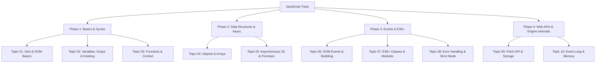

# 💛 JavaScript Learning Path Roadmap 🚀

Welcome to the **JavaScript Learning Path**! This sub-roadmap organizes your journey from absolute basics (script embedding, variable declarations) to advanced execution loops, closures, and custom memory management setups.

---

## 🗺️ JavaScript Track Curriculum

---

## 📚 Topics Directory

### 🟢 Phase 1: Basics & Syntax
* 🎬 **[Topic 01: Introduction to JavaScript & DOM Basics](01_intro_dom_basics.md)** — Meet JS engines (V8), write your first scripts, and select basic DOM elements.
* 📦 **[Topic 02: Variables, Scope & Hoisting](02_variables_scope_hoisting.md)** — Compare `var`, `let`, and `const`, master block scope, and understand variable hoisting.
* 🚦 **[Topic 03: Functions & Execution Context](03_functions_execution_context.md)** — Arrow functions, lexical scopes, the Call Stack, and the magic of Closures.

### 🟡 Phase 2: Data Structures & Async
* 🗃️ **[Topic 04: Objects, Arrays & Destructuring](04_objects_arrays_destructuring.md)** — Learn about prototypes, array helper methods (`map`, `filter`, `reduce`), and destructuring patterns.
* ⚡ **[Topic 05: Asynchronous JS & Promises](05_async_promises_async_await.md)** — Escape callback hell. Promises lifecycle and `async`/`await` commands.

### 🟠 Phase 3: Events & ES6+
* 📡 **[Topic 06: DOM Events & Propagation](06_dom_events_propagation.md)** — Bubbling, capturing, event delegation, and dynamic DOM manipulation.
* 🏗️ **[Topic 07: ES6+ Classes & Modules](07_es6_classes_modules.md)** — Object-Oriented JS, constructor functions, prototypes, and ES modules (`import`/`export`).
* 🛡️ **[Topic 08: Error Handling & Strict Mode](08_error_handling_strict_mode.md)** — Catch runtime errors using `try-catch` blocks and enforce clean code rules with `"use strict"`.

### 🔴 Phase 4: Web APIs & Engine Internals
* 🌐 **[Topic 09: Fetch API & Web Storage](09_fetch_api_web_storage.md)** — Connect to servers using Fetch, and store local session states in `localStorage` and `sessionStorage`.
* 🏆 **[Topic 10: The Event Loop & Memory Management](10_memory_event_loop_advanced.md)** — Look under the hood. Garbage collection heaps, and microtasks vs macrotasks scheduling.

---

## 💻 Practical Coding Interview Prep
Ready to test your hands-on coding skills? Open the **[JavaScript Practical Coding Interview Guide](coding_interview_questions.md)** to practice 50 classic programming challenges with complete code walkthroughs and explanations.

---

## 🎨 Layout of Each Chapter

1. 🏠 **Analogies**: Real-world scenarios representing JavaScript concepts.
2. 🔬 **Deep Dives**: Concrete explanations of compilation, memory heaps, V8 engine setups, and DOM nodes.
3. 💻 **Code Sandbox**: Reusable script code blocks.
4. 📖 **Interview-Ready Definitions**: Simple-English summaries of core JavaScript jargon.
5. ❓ **50 Interview Questions**: Chronological, categorized lists of questions with complete answers.

Let's begin! Open **[Topic 01: Introduction to JavaScript & DOM Basics](01_intro_dom_basics.md)** to get started!
