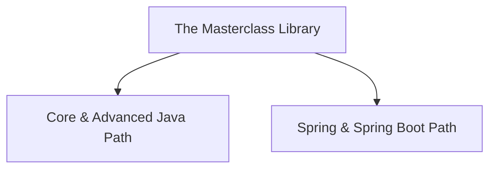

# 🎓 The Ultimate Java & Spring Boot Masterclass 🚀

Welcome to your complete learning playground! This repository is your all-in-one resource for mastering **Java programming** and the **Spring / Spring Boot** enterprise frameworks. 

Every single concept inside this repository is explained using **simple English, real-life analogies**, interactive **Code Sandboxes**, and exact **Interview-Ready definitions** so you can learn without ever needing to look at external sites or tutorials!

---

## 🗺️ Choose Your Learning Path

Select one of the learning paths below to get started:

### ☕ [1. Core & Advanced Java Track](Java/README.md)
Go from absolute basics (variables, arrays) up to advanced platform features (multithreading, reflection, File I/O). Perfect for building a solid foundational understanding of object-oriented programming.
* **Topics**: Variables, Operators, Arrays, Strings, OOP Pillars, Exception Handling, Collections, Generics, Multithreading, Java 8/11/17/21 updates, and Reflection.
* **Get Started**: [👉 Open Java Track](Java/README.md)

### 🍃 [2. Spring & Spring Boot Framework Track](SpringBoot/README.md)
Learn the industry-standard enterprise framework for building production-grade web applications, microservices, and secure APIs. Completely self-contained with deep-dives into data, security, testing, caching, messaging, and scaling.
* **Topics**: IoC/DI, AOP, Spring Boot Starters, REST APIs, JPA/Hibernate, Database Relations, JWT Security, Unit/Integration Testing, Caching (Redis), Microservices (Eureka, Feign, Gateway, Resilience4j), and Messaging (Apache Kafka).
* **Get Started**: [👉 Open Spring Boot Track](SpringBoot/README.md)

---

## 🎨 How to Use These Notes

1. **👦 Analogies**: Start with the real-world analogy to grasp the concept in plain English.
2. **🔬 Let's Look Closer**: Read the technical details of the API or class behavior.
3. **💻 Code Sandbox**: Copy the code examples directly into your local IDE (e.g. IntelliJ or VS Code) to run them and experiment.
4. **📖 Interview-Ready Definitions**: Study the definitions at the end of each file—they are optimized to be professional yet easy to say.
5. **❓ Interview Prep**: Challenge yourself with the **50 questions** at the bottom of each file to verify your knowledge!
