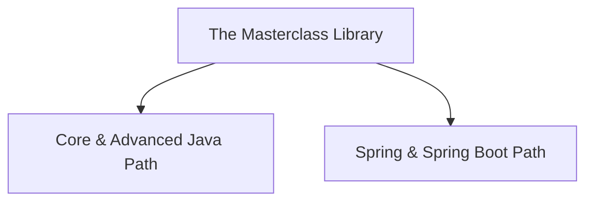

# 🎓 The Ultimate Java & Spring Boot Masterclass 🚀

Welcome to your complete learning playground! This repository is your all-in-one resource for mastering **Java programming** and the **Spring / Spring Boot** enterprise frameworks. 

Every single concept inside this repository is explained using **simple English, real-life analogies**, interactive **Code Sandboxes**, and exact **Interview-Ready definitions** so you can learn without ever needing to look at external sites or tutorials!

---

## 🗺️ Choose Your Learning Path

Select one of the learning paths below, or click directly on any topic list below to access the material:

---

## ☕ Core & Advanced Java Track

*Go from absolute basics up to advanced platform features in Java.*

### 🟢 Phase 1: The Basics (The Playground Rules)
- [ ] 🎬 **[Topic 01: Welcome to Java!](Java/01_introduction_to_java.md)** — Learn what Java is, meet your translation helpers (JVM, JRE, JDK), and write your first words in code.
- [ ] 📦 **[Topic 02: Toy Boxes (Variables & Data Types)](Java/02_variables_data_types.md)** — Storing toys of different sizes, matching labels, and learning how to funnel big toys into small boxes.
- [ ] ➕ **[Topic 03: The Magic Wand (Operators)](Java/03_operators.md)** — Doing math, comparing your toys, and using logic magic.
- [ ] 🚦 **[Topic 04: Traffic Lights & Circles (Control Flow)](Java/04_control_flow.md)** — Making choices (if-else, switch) and running in circles (loops).
- [ ] 🗃️ **[Topic 05: Toy Racks & Word Chains (Arrays & Strings)](Java/05_arrays_strings.md)** — Keeping lists of toys and playing with words.

### 🟡 Phase 2: Object-Oriented Programming (The Builder Phase)
- [ ] 🏗️ **[Topic 06: Blueprints & Buildings (OOP Basics)](Java/06_oop_basics.md)** — Writing blueprints (Classes) to build real toys (Objects), and understanding special terms like `this` and `static`.
- [ ] 🏛️ **[Topic 07: The Four Pillars of OOP](Java/07_oop_pillars.md)** — The superpowers of coding: Encapsulation (Secrets), Inheritance (Family Traits), Polymorphism (Shape-shifting), and Abstraction (Steering wheels vs. Engines).

### 🔴 Phase 3: Intermediate & Advanced Skills (The Pro Developer)
- [ ] 🕸️ **[Topic 08: The Safety Net (Exceptions)](Java/08_exception_handling.md)** — Catching falling toys and dealing with unexpected accidents in your code.
- [ ] 🎒 **[Topic 09: Super Bags (Collections Framework)](Java/09_collections_framework.md)** — Upgrading your toy boxes to magical lists, unique clubs, and dictionaries.
- [ ] 🏷️ **[Topic 10: Special Labeled Boxes (Generics & Wrappers)](Java/10_generics_wrappers.md)** — Making sure your boxes only hold exactly what they say on the label, and wrapping raw items.
- [ ] 💾 **[Topic 11: Reading & Writing (File I/O & Serialization)](Java/11_file_io.md)** — Writing diary entries to disk and saving whole toy states to load them later.
- [ ] 👥 **[Topic 12: Many Helpers (Multithreading & Concurrency)](Java/12_multithreading_concurrency.md)** — Hiring multiple workers to run tasks at the same time without bumping into each other.
- [ ] ⚡ **[Topic 13: Super Power Upgrades (Java 8 to 21)](Java/13_java8_features.md)** — Writing shortcuts (Lambdas), using filters (Streams), and discovering modern patterns (Records, Sealed classes).
- [ ] 🔮 **[Topic 14: The Horizon (Advanced Overview)](Java/14_advanced_topics.md)** — A sneak peek into Databases (JDBC), looking under the hood (Reflection), Build Managers (Maven/Gradle), and blueprints for patterns (Design Patterns).

---

## 🍃 Spring & Spring Boot Track

*Build enterprise-grade web applications, microservices, and secure APIs.*

### 🟢 Phase 1: Core Spring Framework Foundations
- [ ] 🍃 **[Topic 01: Introduction to Spring Framework](SpringBoot/01_intro_to_spring_framework.md)** — Understand Inversion of Control (IoC), Dependency Injection (DI), Bean Lifecycles, and ApplicationContext.
- [ ] 🏷️ **[Topic 02: Spring Core Annotations & Configuration](SpringBoot/02_spring_annotations_configuration.md)** — Master annotations like `@Component`, `@Autowired`, `@Bean`, `@Configuration`, `@Scope`, and `@Profile`.
- [ ] 🛡️ **[Topic 03: Aspect-Oriented Programming (AOP) & Logging](SpringBoot/03_spring_aop_logging.md)** — Learn how to separate cross-cutting concerns using AOP (Aspects, Advices, `@Around`) and set up logging (SLF4J/Logback).

### 🟡 Phase 2: Building Web APIs with Spring Boot
- [ ] ⚡ **[Topic 04: Introduction to Spring Boot](SpringBoot/04_intro_to_spring_boot.md)** — Discover the magic under the hood: Auto-Configuration, Starter Dependencies, and the `@SpringBootApplication` bootstrap.
- [ ] 📡 **[Topic 05: Building REST APIs with MVC](SpringBoot/05_rest_api_mvc.md)** — Create robust RESTful endpoints with Controllers, Request Mapping (`@GetMapping`, `@PostMapping`), and ResponseEntities.
- [ ] 🛑 **[Topic 06: Global Exception Handling & Validation](SpringBoot/06_exception_handling_validation.md)** — Learn validation (`@Valid`, `@NotNull`) and set up clean, uniform API responses for errors using `@ControllerAdvice`.

### 🟠 Phase 3: Data Access & Enterprise Persistence
- [ ] 🗃️ **[Topic 07: Spring Data JPA & Hibernate](SpringBoot/07_spring_data_jpa.md)** — Connect Java objects to relational databases using ORM, write Entities, and leverage JpaRepository for CRUD operations.
- [ ] 🔗 **[Topic 08: Database Relationships & Transactions](SpringBoot/08_relationships_transactions.md)** — Configure `@OneToMany` and `@ManyToOne` mappings, understand Eager/Lazy loading, and protect operations using `@Transactional`.
- [ ] ⚙️ **[Topic 09: External Configuration & Profiles](SpringBoot/09_external_configuration_profiles.md)** — Manage configurations for Dev, Test, and Prod using `application.yml`, `@Value`, and `@ConfigurationProperties`.

### 🔴 Phase 4: Production Security, Testing, & Operations
- [ ] 🔑 **[Topic 10: Spring Security & JWT Authentication](SpringBoot/10_security_jwt.md)** — Secure your application. Set up UserDetailsService, BCrypt password hashing, and build a custom JWT Stateless Filter Chain.
- [ ] 🧪 **[Topic 11: Testing in Spring Boot](SpringBoot/11_spring_boot_testing.md)** — Write clean tests using JUnit 5 and Mockito. Master `@SpringBootTest`, `@WebMvcTest`, and `@MockBean`.
- [ ] 🔋 **[Topic 12: Advanced Features & Caching](SpringBoot/12_actuator_scheduling_async.md)** — Monitor your system with Actuator, schedule recurring tasks (`@Scheduled`), run async threads (`@Async`), and configure **Caching with Redis**.
- [ ] 🌐 **[Topic 13: Microservices Architecture & Resilience](SpringBoot/13_microservices_basics.md)** — Transition to microservices. Connect services via Eureka Registry, route traffic with API Gateway, communicate with Feign, and implement **Resilience4j Circuit Breakers** and **Distributed Tracing**.
- [ ] 📦 **[Topic 14: Deployment, Containers, & Messaging](SpringBoot/14_spring_boot_deployment.md)** — Package apps (executable JAR), containerize with **Docker**, deploy to production, and integrate **Apache Kafka** for event-driven messaging.

---

## 🎨 How to Use These Notes

1. **👦 Analogies**: Start with the real-world analogy to grasp the concept in plain English.
2. **🔬 Let's Look Closer**: Read the technical details of the API or class behavior.
3. **💻 Code Sandbox**: Copy the code examples directly into your local IDE (e.g. IntelliJ or VS Code) to run them and experiment.
4. **📖 Interview-Ready Definitions**: Study the definitions at the end of each file—they are optimized to be professional yet easy to say.
5. **❓ Interview Prep**: Challenge yourself with the **50 questions** at the bottom of each file to verify your knowledge!
