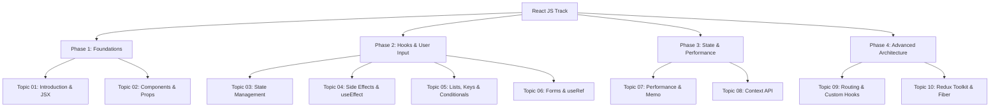

# ⚛️ React JS Learning Path Roadmap 🚀

Welcome to the **React JS Learning Path**! This sub-roadmap organizes your journey from a complete beginner to building enterprise-grade, blazing-fast, reactive single-page applications (SPAs).

---

## 🗺️ React JS Track Curriculum

---

## 📚 Topics Directory

### 🟢 Phase 1: Foundations
* 🎬 **[Topic 01: Introduction to React & JSX](01_intro_to_react_jsx.md)** — Meet the Virtual DOM, compile JSX, and compare React's declarative nature to vanilla JavaScript.
* 📦 **[Topic 02: Components & Props](02_components_props.md)** — Learn about functional components, reusability, passing variables (Props), and composition.

### 🟡 Phase 2: Hooks & User Input
* 🚦 **[Topic 03: State Management (useState)](03_state_management.md)** — Master internal component state, event callbacks, and batch updates.
* ⚡ **[Topic 04: Side Effects & useEffect](04_useeffect_side_effects.md)** — Interact with the outside world: fetching APIs, cleanup functions, and dependencies.
* 🗂️ **[Topic 05: Lists, Keys & Conditionals](05_lists_keys_conditionals.md)** — Dynamic arrays rendering, key identifiers importance, and conditional JSX blocks.
* ✍️ **[Topic 06: Forms & Event Handling (useRef)](06_forms_useref.md)** — Controlled vs Uncontrolled forms, Synthetic Events, and DOM peeking.

### 🟠 Phase 3: Global State & Performance
* 🚀 **[Topic 07: Performance & Memoization](07_performance_memoization.md)** — Speed up your UI. `React.memo`, `useMemo`, and `useCallback` hook optimizations.
* 🔌 **[Topic 08: Context API & Prop Drilling](08_context_api.md)** — Solve component tree variables passing without drilling. Providers, Consumers, and useContext.

### 🔴 Phase 4: Advanced Architecture & Production
* 🌐 **[Topic 09: Routing & Custom Hooks](09_routing_custom_hooks.md)** — Multi-page client navigation (`react-router-dom`), route guards, and writing reusable custom hook logic.
* 🏆 **[Topic 10: State Managers & Advanced Concepts](10_redux_toolkit_fiber.md)** — Redux Toolkit slice architecture, selectors, thunks, React Fiber reconciliation, and Error Boundaries.

---

## 💻 Practical Coding Interview Prep
Ready to test your hands-on coding skills? Open the **[React Practical Coding Interview Guide](coding_interview_questions.md)** to practice 50 classic React development challenges with complete code walkthroughs and explanations.

---

## 🎨 Layout of Each Chapter

1. 🏠 **Analogies**: Real-world scenarios representing React concepts.
2. 🔬 **Deep Dives**: Concrete explanations of browser reconciliation, Fiber, hook internals, and performance.
3. 💻 **Code Sandbox**: Reusable functional component code blocks.
4. 📖 **Interview-Ready Definitions**: Simple-English summaries of core React jargon.
5. ❓ **50 Interview Questions**: Chronological, categorized lists of questions with complete answers.

Let's begin! Open **[Topic 01: Introduction to React & JSX](01_intro_to_react_jsx.md)** to get started!
