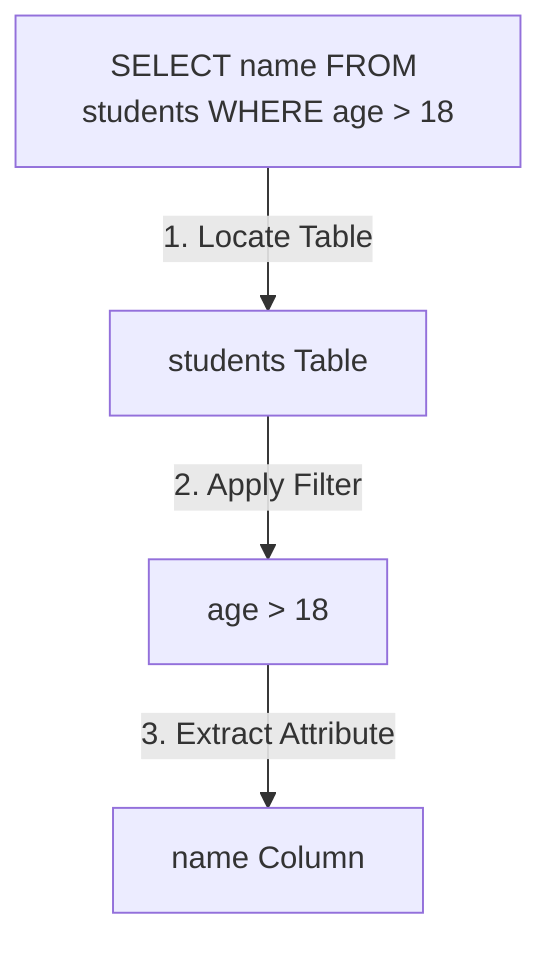

# 🗃️ Topic 01: Introduction to Databases & SQL

Welcome, data explorer! In this chapter, we will learn about **Databases** and **SQL (Structured Query Language)**. As a software developer, you need a way to store information permanently (like users, orders, and messages) and retrieve it quickly. We will understand how data is organized into tables, how SQL differs from NoSQL, and write our first queries to search and sort records.

---

## 🏠 The Big Picture & Real-Life Example

### 🗄️ The Digital Filing Cabinet
Imagine you are running a giant school library:
* **The Database (The Library Room)**: A dedicated space built to hold all information.
* **Tables (The Filing Cabinets)**: You have separate cabinets labeled:
  * `Students` (contains records of names, ages, and student IDs).
  * `Books` (contains lists of book titles, authors, and check-out status).
* **Rows / Records (A Single Drawer Folder)**: A specific folder inside the `Students` cabinet belonging to "John Doe".
* **Columns / Fields (Lines on the Form)**: The specific lines on the registration form: Name, Email, and Phone.
* **SQL (The Library Assistant)**: Instead of walking around search drawers yourself, you write a note to your assistant (SQL): *"Go to the Students cabinet, find the student named John, and write down his email."* The assistant returns with the result in milliseconds!

---

## 🔬 Let's Look Closer

### 1. RDBMS vs. NoSQL
* **RDBMS (Relational Database Management System)**: Stores data in strict tables with pre-defined structures (schemas). Tables are connected by relationships (e.g. Order #5 belongs to Customer #12). Popular engines include **MySQL**, **PostgreSQL**, and **Oracle**.
* **NoSQL (Not Only SQL)**: Stores data in flexible formats like JSON documents (MongoDB) or key-value pairs (Redis). Used for unstructured, rapidly changing data.

### 2. The Anatomy of a Query
A SQL query is a declarative sentence. You tell the database *what* data you want, not *how* to get it.
* **`SELECT`**: Specifies which columns you want to view.
* **`FROM`**: Specifies the table containing the data.
* **`WHERE`**: Filters the records based on a condition.
* **`ORDER BY`**: Sorts the results (Ascending `ASC` or Descending `DESC`).



---

## 💻 Code Sandbox

Let's look at a mock database table and the queries we use to interact with it.

### The Table: `employees`
| id (INT) | name (VARCHAR) | department (VARCHAR) | salary (DECIMAL) | hire_date (DATE) |
|---|---|---|---|---|
| 1 | Alice | HR | 55000.00 | 2020-03-15 |
| 2 | Bob | IT | 80000.00 | 2021-06-01 |
| 3 | Charlie | IT | 95000.00 | 2019-11-10 |
| 4 | David | Sales | 45000.00 | 2022-01-20 |

### 1. Retrieving all columns
```sql
-- The asterisk (*) acts as a wildcard, meaning "return all columns"
SELECT * FROM employees;
```

### 2. Selecting specific columns
```sql
-- Retrieves only names and salaries
SELECT name, salary FROM employees;
```

### 3. Filtering records with WHERE
```sql
-- Finds IT department employees earning more than $75,000
SELECT name, salary 
FROM employees 
WHERE department = 'IT' AND salary > 75000;
```

### 4. Sorting results with ORDER BY
```sql
-- Lists all employees sorted by salary in descending order (highest first)
SELECT name, salary 
FROM employees 
ORDER BY salary DESC;
```

---

## 🧠 Points to Remember

* SQL commands are case-insensitive (`select` is the same as `SELECT`), but writing keywords in uppercase is the standard best practice for readability.
* The order of execution in SQL is different from the order you write it: **`FROM`** runs first to locate the table, then **`WHERE`** filters the rows, and finally **`SELECT`** retrieves the requested columns.
* Always filter queries using `WHERE` in production databases; running `SELECT *` on tables with millions of rows can exhaust database memory and slow down the server.

---

## 📖 Key Definitions

* **Relational Database (RDBMS)**: A data storage system that organizes information into structured tables containing rows and columns, linked together by defined relationships.
* **SQL (Structured Query Language)**: The standardized programming language used by developers to communicate, query, and manipulate relational databases.
* **Table**: A database object containing a grid of rows and columns representing a single entity (like users or orders).
* **Record (Row)**: A single horizontal entry inside a database table containing data for a specific item.
* **SELECT**: The fundamental SQL command used to query and retrieve data columns from a database table.

---

## ❓ Interview Questions

### 🟢 Basic Questions (1-20)

1. **What is a database?**
   * *Answer*: A structured collection of data stored electronically in a computer system, designed for easy access, management, and updates.
2. **What does SQL stand for?**
   * *Answer*: Structured Query Language.
3. **What is RDBMS?**
   * *Answer*: Relational Database Management System, a database system that stores data in tables linked by relationships (e.g., MySQL, Oracle, PostgreSQL).
4. **What is the difference between SQL and NoSQL?**
   * *Answer*: SQL databases are relational, use structured tables, and have strict schemas. NoSQL databases are non-relational, use flexible structures (like JSON documents), and scale horizontally.
5. **What is a table in SQL?**
   * *Answer*: A table is a database object consisting of rows and columns used to store related data records.
6. **What is a primary key?**
   * *Answer*: A column (or group of columns) that uniquely identifies each row in a database table. It cannot contain NULL values.
7. **What is a foreign key?**
   * *Answer*: A column in one table that points to the primary key of another table, creating a relationship link between them.
8. **What is a row (record) in SQL?**
   * *Answer*: A single horizontal data entry inside a table containing values for specific columns.
9. **What is a column (field) in SQL?**
   * *Answer*: A vertical division in a table that represents a specific attribute of the data (like email or registration date).
10. **What does `SELECT *` mean?**
    * *Answer*: It retrieves all columns from the specified table in a query.
11. **What is the purpose of the `WHERE` clause?**
    * *Answer*: It filters query results to return only the rows that meet a specified condition.
12. **How do you sort query results in SQL?**
    * *Answer*: By appending the `ORDER BY` clause to the end of the query.
13. **What is the difference between `ASC` and `DESC` in `ORDER BY`?**
    * *Answer*: `ASC` sorts results in ascending order (default), while `DESC` sorts them in descending order (highest/newest first).
14. **How do you filter records with multiple conditions?**
    * *Answer*: By using logical operators like `AND` and `OR` inside the `WHERE` clause.
15. **What is a DBMS?**
   * *Answer*: Database Management System, software used to define, create, maintain, and control access to databases.
16. **Name three popular relational database engines.**
    * *Answer*: PostgreSQL, MySQL, and Oracle Database.
17. **What does the `LIMIT` clause do?**
    * *Answer*: It restricts the maximum number of rows returned by a query, useful for paginating results.
18. **What is the default sorting order of `ORDER BY`?**
    * *Answer*: Ascending (`ASC`).
19. **How do you select only distinct (unique) values from a column?**
    * *Answer*: By prefixing the column name with the `DISTINCT` keyword (e.g. `SELECT DISTINCT department FROM employees;`).
20. **Can you use `ORDER BY` on multiple columns?**
    * *Answer*: Yes, by separating them with commas (e.g. `ORDER BY department ASC, salary DESC`).

### 🟡 Intermediate Questions (21-40)

21. **Explain the difference between the physical layout of SQL and NoSQL databases.**
    * *Answer*: SQL databases write records sequentially on disk in pages representing grids. NoSQL databases (like document store MongoDB) write collections of independent documents as self-contained BSON objects.
22. **What is the logical order of execution of a SQL query?**
    * *Answer*: The database engine executes clauses in this order: `FROM` -> `JOIN` -> `WHERE` -> `GROUP BY` -> `HAVING` -> `SELECT` -> `DISTINCT` -> `ORDER BY` -> `LIMIT`.
23. **Why does the database engine execute `FROM` before `SELECT`?**
    * *Answer*: It must first identify which table file to open and scan on disk before it can parse the columns to return to the memory buffer.
24. **What is a NULL value in SQL?**
    * *Answer*: A marker indicating that data value is missing, unknown, or not applicable. It is not equivalent to zero or an empty string.
25. **How do you check for NULL values in a query?**
    * *Answer*: Using `IS NULL` or `IS NOT NULL` (e.g., `WHERE email IS NULL`). You cannot use `= NULL`.
26. **What is a Schema in a relational database?**
    * *Answer*: The logical structural blueprint of the database, defining tables, column types, relationships, constraints, and indexes.
27. **What is a composite primary key?**
    * *Answer*: A primary key consisting of two or more columns combined to guarantee row uniqueness (e.g., combining `student_id` and `class_id`).
28. **What are the rules of a Primary Key?**
    * *Answer*: (1) It must contain unique values for every row. (2) It cannot contain NULL values. (3) A table can have only one primary key.
29. **What is the difference between a Primary Key and a Unique Key?**
    * *Answer*: A primary key uniquely identifies a row and cannot accept NULL values. A unique key guarantees column uniqueness but can accept a single NULL value (or multiple NULLs depending on the database engine).
30. **Explain how `LIMIT` (or `OFFSET`) works under the hood.**
    * *Answer*: The engine scans, filters, and sorts the rows in memory. It then discards rows until it reaches the `OFFSET` index, and returns only the number of rows declared in `LIMIT`.
31. **What is the cost of using `SELECT *` in production code?**
    * *Answer*: It wastes network bandwidth, increases memory consumption on the application server, and prevents the database from using "Covering Indexes" which optimize scans.
32. **Can a table have multiple foreign keys?**
    * *Answer*: Yes, a table can have as many foreign keys as needed to establish relationships with other tables.
33. **What is referential integrity?**
    * *Answer*: A database rule that ensures relationships between tables remain consistent. It prevents you from deleting a customer record if that customer has active orders linked via a foreign key.
34. **What does the `IN` operator do?**
    * *Answer*: It allows you to specify multiple values in a `WHERE` clause, acting as a shortcut for multiple `OR` statements (e.g. `WHERE id IN (1, 2, 3)`).
35. **What is the `BETWEEN` operator used for?**
    * *Answer*: It filters values within a inclusive range (e.g. `WHERE salary BETWEEN 40000 AND 60000`).
36. **Explain the difference between DDL and DML.**
    * *Answer*: DDL (Data Definition Language) commands modify database structure (`CREATE`, `ALTER`, `DROP`). DML (Data Manipulation Language) commands modify database records (`SELECT`, `INSERT`, `UPDATE`, `DELETE`).
37. **What is a Transaction?**
    * *Answer*: A single logical unit of database operations that must succeed entirely or fail entirely (e.g., transferring money between bank accounts).
38. **What does `ORDER BY 1` or `ORDER BY 2` mean?**
    * *Answer*: It sorts the results by the column index in the `SELECT` statement (e.g., `ORDER BY 1` sorts by the first column declared in the SELECT clause). This is discouraged in production.
39. **How do database engines handle character string comparisons in WHERE?**
    * *Answer*: By using the configured collation settings of the database, which determines if comparisons are case-sensitive or case-insensitive.
40. **Explain the purpose of column aliases (`AS`).**
    * *Answer*: Used to temporarily rename a column in the query output for better readability (e.g. `SELECT name AS employee_name`).

### 🔴 Advanced Questions (41-50)

41. **How does an RDBMS engine locate rows on disk when running a SELECT query without an index?**
    * *Answer*: It performs a **Full Table Scan (Sequential Scan)**. It loads the entire table's data pages from disk into memory block-by-block and evaluates the `WHERE` condition against every row.
42. **Why does SQL use three-valued logic?**
    * *Answer*: Because of NULL. A boolean expression in SQL can evaluate to `TRUE`, `FALSE`, or `UNKNOWN`. Comparing any value to NULL using logical operators returns `UNKNOWN`.
43. **How does the SQL parser handle query compiling?**
    * *Answer*: When a query is received, the parser verifies syntax, checks table definitions against the system catalog, builds a logical syntax tree (AST), and hands it to the Query Optimizer to create a physical execution plan.
44. **What is the difference between physical page reads and logical page reads in RDBMS memory buffers?**
    * *Answer*: A logical read occurs when the engine finds the required data page in the shared buffer cache (RAM). A physical read occurs when the page is missing from RAM and must be fetched from persistent disk storage (slow I/O).
45. **Explain the ACID properties of relational databases.**
    * *Answer*:
      * **Atomicity**: Transactions succeed or fail completely.
      * **Consistency**: Transactions transition database from one valid state to another.
      * **Isolation**: Concurrent transactions do not interfere with each other.
      * **Durability**: Committed data is written permanently to disk even during crashes.
46. **What is a table's physical heap structure?**
    * *Answer*: A storage structure where records are inserted into data pages in no specific order, and the database relies on row IDs (RIDs) to locate records.
47. **How does MySQL's InnoDB storage engine differ from PostgreSQL's MVCC storage model?**
    * *Answer*: InnoDB uses an Undo Log to manage transaction rollbacks and rollback segments. PostgreSQL uses Multi-Version Concurrency Control (MVCC) where modifying a row writes a completely new physical row version to disk, cleaning old versions using VACUUM.
48. **Explain the security risks of SQL Injection.**
    * *Answer*: An attack where malicious SQL statements are injected into application inputs (e.g., `OR 1=1`), allowing hackers to manipulate queries, bypass logins, and read database contents.
49. **How do database Connection Pools optimize application queries?**
    * *Answer*: Opening database TCP connections is CPU-intensive. Connection Pools maintain a cache of active database connections, allowing applications to reuse connections instantly, reducing latency.
50. **What is the purpose of the Write-Ahead Log (WAL)?**
    * *Answer*: To guarantee durability (D in ACID). Before any database transaction changes are written to the main data tables on disk, they are appended sequentially to a fast write log (WAL). If the system crashes, the database replays the WAL to recover data.

---

## ⏭️ Next Steps

* **Next Chapter**: [👉 Topic 02: Filtering & Pattern Matching](02_filtering_pattern_matching.md)
* **Roadmap Index**: [🏠 Back to Roadmap](README.md)
