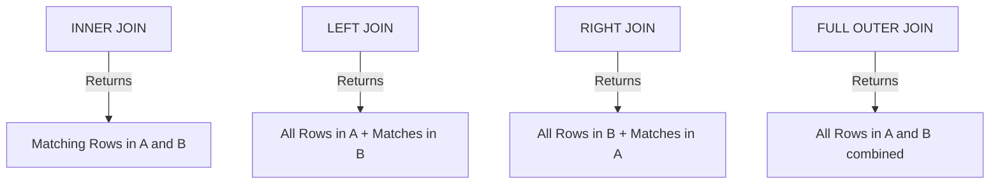

# 🔗 Topic 04: Joins (Combining Tables)

Welcome back, data connector! In this chapter, we will learn about **Joins** in SQL. In relational databases, data is split across multiple tables to avoid duplication (normalization). For example, users are in one table, and orders are in another. To make sense of the data, you need to stitch these tables back together. We will master Inner Joins, Left/Right Joins, Outer Joins, and special setups like Self Joins.

---

## 🏠 The Big Picture & Real-Life Example

### 🧩 The Puzzle Pieces & Ticket Slips
Imagine a busy clothing store:
* **Table A: Customer Cards (`customers`)**: A card with Customer ID and Name.
* **Table B: Order Slips (`orders`)**: A slip with Order ID, Customer ID, and Purchase Amount.
* **INNER JOIN (The Matching Pairs)**: You only list orders where you have a matching Customer Card, and Customer Cards that have active Order Slips. If a customer never bought anything, they are excluded. If an order has a missing Customer ID, it is excluded.
* **LEFT JOIN (All Customers, Matching Orders)**: You lay out *every single* Customer Card on the desk. Under each card, you place their Order Slips. If a customer (like "John") never bought anything, you still keep John's card on the desk and write *"Orders: None (NULL)"* next to him.
* **RIGHT JOIN (All Orders, Matching Customers)**: You lay out *every single* Order Slip on the desk. You search for matching Customer Cards. If an order has a Customer ID that doesn't exist in your cards, you still keep the order slip and write *"Customer: Unknown (NULL)"*.
* **FULL OUTER JOIN (Everything)**: You lay out all Customer Cards and all Order Slips. You match what you can, and leave NULLs for everything else.
* **SELF JOIN (The Employee Manager Hierarchy)**: You have a table of employees. Each employee row has a column `manager_id` pointing to *another* employee's `id` in the same table. You join the employee table to itself to see who reports to whom!

---

## 🔬 Let's Look Closer

### 1. Join Types & Logic
We use the **`ON`** clause to define the relationship key linking the tables:
* **`INNER JOIN`**: Returns rows when there is a match in both tables.
* **`LEFT JOIN`** (or `LEFT OUTER JOIN`): Returns all rows from the left table, and matched rows from the right table.
* **`RIGHT JOIN`** (or `RIGHT OUTER JOIN`): Returns all rows from the right table, and matched rows from the left.
* **`FULL OUTER JOIN`**: Returns rows when there is a match in either table.
* **`CROSS JOIN`**: Returns the Cartesian product (every row from Table A paired with every row from Table B).



---

## 💻 Code Sandbox

Let's combine data from a customer table and an order table.

### The Tables
**`customers`**
| customer_id | name |
|---|---|
| 1 | Alice |
| 2 | Bob |
| 3 | Charlie (no orders) |

**`orders`**
| order_id | customer_id | amount |
|---|---|---|
| 101 | 1 | 250.00 |
| 102 | 2 | 120.00 |
| 103 | 1 | 45.00 |

### 1. INNER JOIN (Only active buyers)
```sql
-- Returns only Alice and Bob because Charlie has no orders
SELECT c.name, o.order_id, o.amount 
FROM customers c 
INNER JOIN orders o ON c.customer_id = o.customer_id;
```

### 2. LEFT JOIN (Include Charlie)
```sql
-- Returns Alice, Bob, and Charlie (Charlie's order columns will be NULL)
SELECT c.name, o.order_id, o.amount 
FROM customers c 
LEFT JOIN orders o ON c.customer_id = o.customer_id;
```

### 3. Finding customers who NEVER placed an order
```sql
-- Left join and check for NULL in the right table key (very popular interview query!)
SELECT c.name 
FROM customers c 
LEFT JOIN orders o ON c.customer_id = o.customer_id 
WHERE o.order_id IS NULL;
```

### 4. SELF JOIN (Managers and Employees)
Given an `employees` table with `id`, `name`, and `manager_id`:
```sql
-- Joins table to itself using aliases 'emp' and 'mgr'
SELECT emp.name AS employee, mgr.name AS manager 
FROM employees emp 
LEFT JOIN employees mgr ON emp.manager_id = mgr.id;
```

---

## 🧠 Points to Remember

* The words `LEFT JOIN` and `LEFT OUTER JOIN` are completely identical in SQL. The `OUTER` keyword is optional.
* When joining tables, always prefix column names with table aliases (e.g. `c.name` instead of `name`) to avoid the *"Ambiguous Column"* database syntax error.
* If you perform a `CROSS JOIN` on Table A (1,000 rows) and Table B (1,000 rows), the output will be 1,000,000 rows, which can easily crash a database session if run accidentally.

---

## 📖 Key Definitions

* **JOIN**: A SQL operation used to combine rows from two or more tables based on a related column between them.
* **INNER JOIN**: A join type that returns only the records that have matching values in both tables.
* **LEFT JOIN (LEFT OUTER JOIN)**: A join type that returns all records from the left table, and the matched records from the right table. If there is no match, NULL values are returned for the right table columns.
* **FULL OUTER JOIN**: A join type that returns all records when there is a match in either left or right table.
* **SELF JOIN**: A regular join operation where a table is joined with itself, using table aliases to distinguish the instances.

---

## ❓ Interview Questions

### 🟢 Basic Questions (1-20)

1. **What is a JOIN in SQL?**
   * *Answer*: An operation used to query and combine data from multiple tables based on a logical relationship between columns.
2. **What is the difference between INNER JOIN and LEFT JOIN?**
   * *Answer*: `INNER JOIN` returns only rows with matches in both tables. `LEFT JOIN` returns all rows from the left table, plus matching rows from the right table (with NULLs if no match).
3. **What is a RIGHT JOIN?**
   * *Answer*: A join that returns all records from the right table and the matched records from the left table.
4. **What is a FULL OUTER JOIN?**
   * *Answer*: A join that returns all records when there is a match in either the left or right table, filling missing columns with NULLs.
5. **What is a CROSS JOIN?**
   * *Answer*: A join that returns the Cartesian product of two tables, pairing every row from the first table with every row from the second.
6. **What is a SELF JOIN?**
   * *Answer*: A join where a table is joined with itself, useful for hierarchical data like employee-manager trees.
7. **What is the purpose of table aliases (like `FROM employees e`)?**
   * *Answer*: To shorten table references in the query and to resolve column naming conflicts (ambiguity).
8. **What does the `ON` clause do?**
   * *Answer*: It defines the matching condition that links the primary/foreign keys of the joined tables.
9. **Can you join more than two tables in a single query?**
   * *Answer*: Yes, you can chain multiple JOIN clauses sequentially (e.g. `JOIN B ON A.id = B.id JOIN C ON B.id = C.id`).
10. **What happens if you write `JOIN` without specifying `INNER` or `LEFT`?**
    * *Answer*: By default, the database treats a standard `JOIN` keyword as an `INNER JOIN`.
11. **What is a Cartesian Product?**
    * *Answer*: The output of joining tables without a matching condition, resulting in every row combination.
12. **Is `LEFT OUTER JOIN` different from `LEFT JOIN`?**
    * *Answer*: No, they are syntactically identical.
13. **How does a LEFT JOIN represent missing matches in the right table?**
    * *Answer*: It fills all column values from the right table with `NULL`.
14. **What is the difference between an Equi-Join and Non-Equi-Join?**
    * *Answer*: An Equi-Join uses the equality operator (`=`) in the join condition. A Non-Equi-Join uses comparison operators (like `<`, `>`, `BETWEEN`).
15. **Can you join tables on multiple columns?**
    * *Answer*: Yes, by combining conditions with the `AND` operator (e.g. `ON a.id = b.id AND a.year = b.year`).
16. **What is an Ambiguous Column error?**
    * *Answer*: An error thrown when you reference a column name (like `id`) that exists in multiple joined tables without prefixing it with a table alias.
17. **What does the `USING` clause do?**
    * *Answer*: A shortcut for the `ON` clause when the joining columns share the exact same name (e.g. `JOIN orders USING (customer_id)`).
18. **Can you join a table based on a text string column?**
    * *Answer*: Yes, tables can be joined on any compatible data types.
19. **What is a Natural Join?**
    * *Answer*: A join that automatically matches columns sharing the same name in both tables. This is risky and discouraged in production.
20. **How do you find the count of joined records?**
    * *Answer*: By combining `JOIN` with the `COUNT(*)` aggregate function.

### 🟡 Intermediate Questions (21-40)

21. **Explain the physical execution algorithms databases use to perform Joins.**
    * *Answer*: Databases use three main algorithms: **Nested Loop Join**, **Hash Join**, and **Sort-Merge Join**, selected by the optimizer based on table sizes and indexes.
22. **What is a Nested Loop Join?**
    * *Answer*: An algorithm where the engine loops through each row of the outer table (left) and scans the inner table (right) to find matches. Efficient for small tables, especially when the inner table has an index.
23. **What is a Hash Join?**
    * *Answer*: An algorithm that reads the smaller table into memory, builds a hash table of its join keys, and scans the larger table, hashing its keys to find matches. Excellent for large, unsorted tables.
24. **What is a Sort-Merge Join?**
    * *Answer*: An algorithm that sorts both tables by the join keys first, then steps through both tables in parallel to merge matches. Highly efficient for large tables if the columns are already indexed (sorted).
25. **Explain the performance difference: filtering inside the `ON` clause vs filtering in the `WHERE` clause in a LEFT JOIN.**
    * *Answer*: In a `LEFT JOIN`, filtering in the `ON` clause filters right-table rows *before* joining (retaining all left rows). Filtering in the `WHERE` clause filters rows *after* the join has completed, which can convert the LEFT JOIN into an INNER JOIN.
26. **What is a Semi-Join?**
    * *Answer*: A join that returns rows from the first table that have at least one match in the second table, without duplicating rows or returning columns from the second table (often compiled from `EXISTS` or `IN`).
27. **What is an Anti-Join?**
    * *Answer*: A join that returns rows from the first table that have **no** matches in the second table (often compiled from `NOT EXISTS` or `LEFT JOIN ... WHERE right.key IS NULL`).
28. **How does MySQL handle `FULL OUTER JOIN` since it doesn't support it natively?**
    * *Answer*: By combining a `LEFT JOIN` and a `RIGHT JOIN` query using the `UNION` operator to merge the datasets.
29. **What is the difference between `UNION` and `UNION ALL` when combining query results?**
    * *Answer*: `UNION` combines results and removes duplicate rows (requires sorting/overhead). `UNION ALL` combines results and keeps all duplicates (faster because no sorting is done).
30. **How do you join a table to a subquery?**
    * *Answer*: By wrapping the subquery in parentheses and giving it an alias (e.g. `JOIN (SELECT id FROM users) u ON u.id = orders.user_id`).
31. **Explain how database indexes on Foreign Keys optimize Join performance.**
    * *Answer*: When joining Table A and Table B, indexes on the joining key columns allow the engine to perform fast B-Tree index seeks to match rows, avoiding full scans.
32. **Can you join tables across two different databases on the same server?**
    * *Answer*: Yes, by prefixing the table with the database name (e.g. `SELECT * FROM db1.users u JOIN db2.orders o ON u.id = o.user_id`).
33. **What is a Self Join's typical use case in database design?**
    * *Answer*: Representing hierarchical structures, such as organizational charts (employee to manager) or category trees (sub-category to parent category).
34. **How do you prevent duplicate rows when joining a one-to-many relationship table?**
    * *Answer*: By using `GROUP BY` on the primary key of the "one" table and aggregating the "many" columns, or using `EXISTS` instead of a JOIN.
35. **What is the cost of joining too many tables (e.g. 10+ tables) in a single query?**
    * *Answer*: The Query Optimizer's search space increases exponentially. It takes longer to compile the query plan, and memory requirements rise, potentially causing bad join order choices.
36. **Explain the behavior of a join on columns containing NULL values.**
    * *Answer*: Rows containing NULL values in the join columns will **not match** each other, because `NULL = NULL` is not true. They are excluded from `INNER JOIN` outputs.
37. **What is the difference between a Left Join and a Left Semi-Join?**
    * *Answer*: A Left Join returns multiple rows if the right table has multiple matches, duplicating left table data. A Left Semi-Join returns a left table row at most once, as soon as a single match is found.
38. **How does the cost-based optimizer decide whether to use a Hash Join or a Nested Loop Join?**
    * *Answer*: It evaluates table size estimates. If one table is small enough to fit in the CPU cache, it prefers Nested Loop. If both tables are large, it selects Hash Join.
39. **What is a covering index and how does it optimize joins?**
    * *Answer*: An index that contains all columns requested by the query (both join keys and selected data). This allows the join to execute entirely in memory scanning the index pages, never reading the actual heap table files on disk.
40. **How do you join tables that have different data types on the join columns?**
    * *Answer*: By explicitly casting one column type to match the other inside the `ON` condition (e.g. `ON a.id = CAST(b.id_str AS INT)`), though this prevents index seeks.

### 🔴 Advanced Questions (41-50)

41. **Explain the physical memory allocation mechanism for a Hash Join's build and probe phases.**
    * *Answer*: During the **Build Phase**, the engine reads the smaller table and loads join keys into a Hash Table bucket array in memory (Worktable). During the **Probe Phase**, it scans the larger table, hashes its keys, finds matching buckets, and merges rows. If the build phase exceeds the Workfile RAM limit, it spills to disk, creating partition files.
42. **Why does casting a column inside a JOIN condition (e.g., `ON CAST(a.id AS VARCHAR) = b.code`) destroy query performance?**
    * *Answer*: It makes the condition **non-sargable (Search Argument Able)**. The database engine cannot traverse the B-Tree index because the values must first be transformed by the cast function row-by-row, forcing a full scan of the index or table.
43. **Explain how Sort-Merge Joins leverage index ordering to achieve $O(M + N)$ time complexity.**
    * *Answer*: If both tables are pre-sorted by the join keys (via B-Tree indexes), the engine starts pointers at the beginning of both tables. It advances the pointer of the lower key until it finds a match. It never backtracks or rescans rows, reading both tables exactly once.
44. **What is a "Late Materialization" join optimization strategy?**
    * *Answer*: A plan where the engine joins only the compact primary/foreign keys first to identify matching row IDs (RIDs). Only after filtering the list to final matches does it fetch the actual wide data columns (like descriptions, names) from disk, minimizing disk read buffer volumes.
45. **How do Distributed Joins operate in a sharded database system (e.g., Google Spanner or Citus)?**
    * *Answer*: If tables are co-located (sharded on the same key), joins run locally on each shard (Colocated Join). If not, the coordinator node must fetch data partitions over the network to perform a Shuffle Join or Broadcast Join, which introduces high network latency.
46. **What is a Broadcast Join vs a Shuffle Join in distributed SQL systems?**
    * *Answer*: A **Broadcast Join** copies a small table entirely to all network nodes to join with local partitions. A **Shuffle Join** hashes and redistributes both tables across the network so rows sharing the same join key land on the same node (expensive data transfer).
47. **How does the SQL optimizer resolve functional dependencies to rewrite JOINs into EXISTS?**
    * *Answer*: If a query joins Table A to Table B in a one-to-many relationship but only selects columns from Table A, and the join column is unique in Table B, the optimizer rewrites the join into an `EXISTS` semi-join to prevent row duplication and skip scans.
48. **Explain the "Star Schema Join" optimization technique (Bitmapped Joins).**
    * *Answer*: Used in data warehouses. The engine applies filters to multiple small dimension tables first, generates compact bitmaps of matching keys, combines the bitmaps using CPU bitwise AND operations, and queries the massive central Fact table using the final bitmap.
49. **How would you debug a plan where the optimizer chooses a Nested Loop Join on two tables with 10 million rows, causing a query hang?**
    * *Answer*: I would check if: database statistics are stale (making the optimizer think one table is small), join column data types mismatch (preventing index seek), or if a missing index on the foreign key column is forcing the engine to perform full table scans for every loop iteration.
50. **Explain how "Adaptive Joins" work in modern database engines (like SQL Server or Oracle).**
    * *Answer*: A dynamic execution feature. The optimizer generates a plan that contains both a Hash Join and a Nested Loop Join. When the query starts, the engine monitors the actual rows read from the first table. If it exceeds a threshold, it switches the execution algorithm on the fly.

---

## ⏭️ Next Steps

* **Previous Chapter**: [👈 Topic 03: Aggregation & Grouping](03_aggregation_grouping.md)
* **Next Chapter**: [👉 Topic 05: Subqueries & CTEs](05_subqueries_ctes.md)
* **Roadmap Index**: [🏠 Back to Roadmap](README.md)
