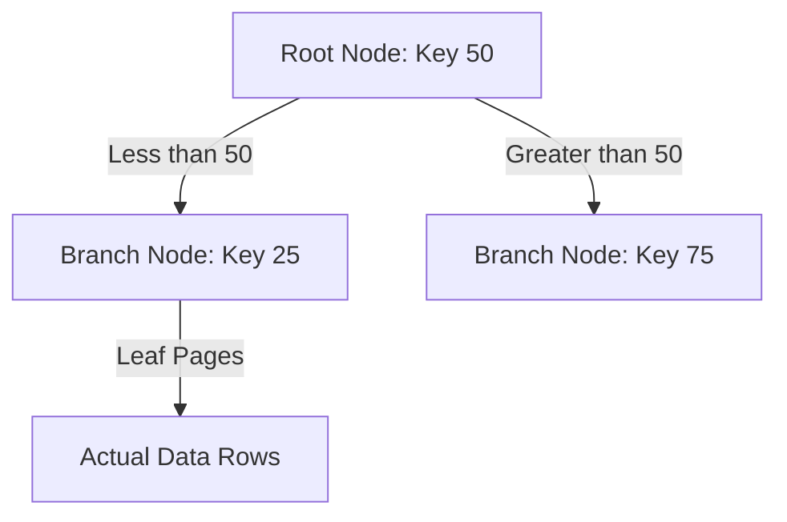

# 🚀 Topic 08: Indexes & Query Optimization

Welcome back, query optimizer! In this chapter, we will learn about **Indexes & Query Optimization**. In production applications, databases can grow to hold hundreds of millions of rows. If your database takes 5 seconds to load a user profile, your app is dead. We will learn how to write lightning-fast queries by building index tables, understanding B-Tree structures, comparing seeking vs scanning, and reading Execution Plans using `EXPLAIN`.

---

## 🏠 The Big Picture & Real-Life Example

### 📖 The Book Index
Imagine you have a 1,000-page book about world history:
* **The Heap (No Index)**: You want to find where the word "Napoleon" is mentioned. Without an index, you must start on Page 1 and read every single page to Page 1,000 (Full Table Scan). It takes hours!
* **The Index (Clustered & Non-Clustered)**:
  * **Clustered Index**: The book is physically sorted chronologically by Year. You don't need a separate index file; the pages themselves are arranged in order.
  * **Non-Clustered Index (The Glossary)**: At the back of the book, you have a small index file. Under "N", it lists: *"Napoleon: Pages 125, 142, 602"*.
    * You open the glossary (Non-clustered Index).
    * You find "Napoleon" and read the page numbers (Index Seek).
    * You flip directly to Page 125 (Key Lookup / RID Lookup).
    * It takes seconds!

---

## 🔬 Let's Look Closer

### 1. Clustered vs. Non-Clustered Indexes
* **Clustered Index**: The index *is* the table. The actual data rows are stored in B-Tree leaf pages in sorted key order. A table can have only **one** clustered index (usually on the Primary Key).
* **Non-Clustered Index**: A separate structure containing selected column values (keys) along with pointers (bookmark/row ID) back to the actual data page. You can have multiple non-clustered indexes.

### 2. Index Seek vs. Index Scan
* **Index Seek**: The query engine uses B-Tree branch pointers to walk down the index tree, reading only a few index nodes to locate the exact match (fast, $O(log N)$).
* **Index Scan**: The engine reads the entire index table leaf level from start to finish. Faster than scanning the whole heap, but still $O(N)$.
* **Table Scan**: The engine reads every page of the main table from disk (slow, $O(N)$).

### 3. Execution Plan (EXPLAIN)
Prefixing your query with **`EXPLAIN`** (or `EXPLAIN ANALYZE`) tells the database compiler to output its execution plan, showing which indexes it intends to use, estimated costs, and join methods.



---

## 💻 Code Sandbox

Let's write indexes and inspect queries using EXPLAIN.

### The Table: `transactions`
| id (PK) | user_id | amount | transaction_date |
|---|---|---|---|
| 1 | 12 | 150.00 | 2026-07-01 |
| 2 | 45 | 20.00 | 2026-07-01 |

### 1. Creating a Basic Index
```sql
-- Create an index on the user_id column
-- If we frequently query transactions by user_id, this index makes queries fast!
CREATE INDEX idx_user_id ON transactions(user_id);
```

### 2. Creating a Composite Index (Multi-column)
```sql
-- Create a composite index on both user_id and transaction_date
-- Optimizes queries filtering by both user AND date!
CREATE INDEX idx_user_date ON transactions(user_id, transaction_date);
```

### 3. Analyzing a Query with EXPLAIN
```sql
-- Prefix query with EXPLAIN to inspect how the optimizer runs it
EXPLAIN 
SELECT * 
FROM transactions 
WHERE user_id = 45;
```

*Expected EXPLAIN Output (MySQL/PostgreSQL format):*
* **Type/Scan**: `Index Seek` (or `Index Scan` using `idx_user_id`).
* **Keys**: `idx_user_id` selected.
* **Rows**: Estimated 1 row scanned.

---

## 🧠 Points to Remember

* Indexes speed up queries (`SELECT`), but slow down modifications (`INSERT`, `UPDATE`, `DELETE`) because the database must update the index tables every time data changes.
* **SARGable conditions**: If you write `WHERE YEAR(transaction_date) = 2026`, the engine cannot use an index on `transaction_date` because the column is wrapped in a function. You must write: `WHERE transaction_date >= '2026-01-01' AND transaction_date < '2027-01-01'`.
* **The Left-Prefix Rule**: In a composite index `(col_a, col_b)`, you can query by `col_a` alone or `col_a + col_b` together, but you *cannot* use the index if you filter by `col_b` alone!

---

## 📖 Key Definitions

* **Clustered Index**: An index structure that determines the physical storage order of data rows in a table on disk.
* **Non-Clustered Index**: A separate index structure containing copies of selected columns along with pointers to the actual data rows.
* **Index Seek**: A high-performance index scan operation that uses B-Tree pointers to navigate directly to matching keys.
* **Index Scan**: An operation where the database engine scans the entire index leaf page level from start to finish.
* **Execution Plan (EXPLAIN)**: The compiler output plan showing the exact operations, index choices, and joins the query engine intends to execute.

---

## ❓ Interview Questions

### 🟢 Basic Questions (1-20)

1. **What is an index in SQL?**
   * *Answer*: A separate database structure that indexes table columns, allowing the database to search and retrieve rows quickly without scanning the whole table.
2. **What is a Clustered Index?**
   * *Answer*: An index that physically stores the actual data rows of the table in sorted order based on the index key.
3. **What is a Non-Clustered Index?**
   * *Answer*: A separate index structure containing index keys along with pointers (Row IDs) pointing back to the physical location of the table data pages.
4. **How many Clustered Indexes can a table have?**
   * *Answer*: A table can have only **one** clustered index because physical data rows can only be sorted in one order.
5. **How many Non-Clustered Indexes can a table have?**
   * *Answer*: A table can have multiple non-clustered indexes (typically up to several hundred depending on the database engine).
6. **What is the default index structure used by most relational databases?**
   * *Answer*: **B-Tree** (Balanced Tree) index structure.
7. **What is a Full Table Scan?**
   * *Answer*: A slow operation where the database engine reads every data page of a table from disk to find matching rows.
8. **What is the difference between Index Seek and Index Scan?**
   * *Answer*: Index Seek walks down the B-Tree directly to the matching keys (fast). Index Scan reads all index leaf entries from start to finish (slower).
9. **What does the `EXPLAIN` keyword do?**
   * *Answer*: It displays the query execution plan generated by the database compiler, showing how it intends to run the query.
10. **Does creating an index speed up `INSERT` statements?**
    * *Answer*: No, indexes slow down inserts, updates, and deletes because the database must update the index structures alongside the table pages.
11. **What is a unique index?**
    * *Answer*: An index that prevents duplicate values from being inserted into the indexed columns.
12. **What is a composite index?**
    * *Answer*: An index created on two or more columns combined (e.g. `idx_name (last_name, first_name)`).
13. **What is the Left-Prefix rule in composite indexes?**
    * *Answer*: The rule stating that a composite index `(A, B)` can optimize queries filtering by `A` or `A and B`, but cannot optimize queries filtering by `B` alone.
14. **How do you delete an index?**
    * *Answer*: Using the `DROP INDEX index_name;` command.
15. **What is a Primary Key's relationship with indexes?**
    * *Answer*: Creating a primary key automatically creates a unique clustered index on that column.
16. **Why should you avoid indexing columns with low cardinality (like gender)?**
    * *Answer*: Low cardinality columns contain few distinct values. The engine prefers a full table scan over B-Tree seeks for such columns because seeks return too many rows, making the B-Tree overhead useless.
17. **What is the difference between `EXPLAIN` and `EXPLAIN ANALYZE`?**
    * *Answer*: `EXPLAIN` shows the compiler's estimated plan without running the query. `EXPLAIN ANALYZE` runs the query and displays actual execution times and row counts.
18. **What does a Key Lookup (or RID Lookup) mean in an execution plan?**
    * *Answer*: It means the engine found matching keys in the non-clustered index, but had to go to the main table pages to fetch columns not included in the index.
19. **What is a non-unique clustered index?**
    * *Answer*: A clustered index on a non-unique column. The engine automatically appends a hidden internal row identifier (uniqueifier) to make rows unique.
20. **What is the default index type in PostgreSQL?**
    * *Answer*: **B-Tree** index.

### 🟡 Intermediate Questions (21-40)

21. **Explain the mathematical search complexity of a B-Tree index seek vs a Full Table Scan.**
    * *Answer*: A B-Tree index seek has logarithmic search complexity of **$O(log N)$** because it splits the search space at each branch node. A Full Table Scan has linear complexity of **$O(N)$** because it evaluates every record.
22. **What is a Covering Index (Index Covering)?**
    * *Answer*: A non-clustered index that contains all columns requested by a query (both the filter keys and selected columns). This allows the engine to return data directly from the index, skipping table heap lookups.
23. **How does the `INCLUDE` clause optimize covering indexes in SQL Server/PostgreSQL?**
    * *Answer*: It allows appending non-key columns to the leaf nodes of a non-clustered index, making it a covering index without increasing B-Tree sorting overhead on non-key columns.
    * *Example*: `CREATE INDEX idx_name ON table(id) INCLUDE (email);`.
24. **What is index fragmentation and how do you resolve it?**
    * *Answer*: Fragmentation occurs when data page insertions and page splits cause empty page spaces and out-of-order physical sequences. Resolved by rebuilding (`ALTER INDEX ... REBUILD`) or reorganizing the index.
25. **Explain the term "SARGable" (Search Argument Able) in query optimization.**
    * *Answer*: A query condition is SARGable if it can utilize B-Tree indexes. Using functions or arithmetic on columns in `WHERE` (like `WHERE ABS(id) = 1`) makes them non-sargable.
26. **Why does `WHERE col LIKE '%ABC'` prevent B-Tree index seeks?**
    * *Answer*: Because B-Tree nodes are sorted from left to right. Since the leading characters are wildcards, the engine cannot traverse the branches and must perform a full scan of the index leaf level.
27. **What is a B-Tree fill factor?**
    * *Answer*: A configuration setting defining what percentage of space on each index page is filled with data during index creation, leaving empty space to prevent page splits during future inserts.
28. **What is a B+ Tree and how does it differ from a standard B-Tree?**
    * *Answer*: In a **B+ Tree**, data records are stored exclusively in the leaf nodes, and leaf nodes are linked sequentially (linked list). This allows fast range scans compared to a standard B-Tree where records are spread across all levels.
29. **What is a covering index scan vs an index seek?**
    * *Answer*: A covering index scan reads the entire non-clustered index tree leaf nodes because filters are not sargable. An index seek traverses branch nodes directly to a range of keys.
30. **Explain how database statistics histograms are used by the query optimizer.**
    * *Answer*: Database statistics compile distribution metrics of column values. The optimizer reads these histograms to estimate **selectivity** (how many rows a query will return) to decide whether to use an index or table scan.
31. **Explain the risk of "Parameter Sniffing".**
    * *Answer*: A scenario where the query engine compiles an execution plan optimized for the parameter values used in the first execution, but reuse of that plan leads to poor performance for different parameter values later.
32. **What is a Partial Index (or Filtered Index)?**
    * *Answer*: An index built only on a subset of table rows using a WHERE filter (e.g. `CREATE INDEX idx ON table(id) WHERE status = 'Active'`), saving disk space and speed.
33. **What is a Expression-Based Index (or Function-Based Index)?**
    * *Answer*: An index built on the output of a function (e.g. `CREATE INDEX idx ON table(UPPER(name))`). This makes query conditions using that function sargable.
34. **What is a Clustered Index scan?**
    * *Answer*: Since the clustered index is the table, a Clustered Index Scan is equivalent to a Full Table Scan—the engine scans all physical data pages.
35. **What is a B-Tree Page Split?**
    * *Answer*: A disk I/O operation occurring when an insert target page is full. The engine splits the page in half, moves 50% rows to a new page, and inserts the new key, causing slow transaction latency.
36. **Explain the selectivity threshold for indexes (The tipping point).**
    * *Answer*: The point where the optimizer decides an index is useless. If a query returns more than 10-20% of a table's rows, the cost of B-Tree seeks followed by millions of individual disk page lookups exceeds the cost of a sequential table scan, so the optimizer skips the index.
37. **What does the SQL Server hint `WITH (INDEX(index_name))` do?**
    * *Answer*: It forces the query optimizer to use the specified index, overriding the compiler's cost estimates. This should be used with caution.
38. **What is a Hash Index and how does it differ from a B-Tree index?**
    * *Answer*: A Hash index uses a hash function to map keys to buckets. It offers $O(1)$ search speeds for equality comparisons (`=`) but is useless for range queries (`>`, `<`) or sorting.
39. **Explain the purpose of a covering index on Joins.**
    * *Answer*: Placing a covering index on the joining columns allows the database engine to perform the join entirely within index RAM pages without reading the main table files.
40. **How does the cost-based optimizer choose between physical scans?**
    * *Answer*: It calculates cost units based on CPU usage and estimated disk I/O reads. It evaluates multiple plans and runs the one with the lowest calculated cost.

### 🔴 Advanced Questions (41-50)

41. **Explain the structural differences between B-Trees, B+ Trees, and Log-Structured Merge (LSM) Trees.**
    * *Answer*: **B-Trees** store keys and data on all nodes. **B+ Trees** store data only in leaf nodes linked sequentially, optimizing range queries. **LSM Trees** append writes sequentially to a memory buffer (MemTable) first and periodically flush them to immutable disk files (SSTables), optimizing write-heavy systems (NoSQL) over B-Tree random-write disk page split overheads.
42. **Why does a Key Lookup (Bookmark Lookup) in a non-clustered index search cause random disk I/O bottleneck?**
    * *Answer*: A non-clustered index B-Tree seek returns Row IDs (RIDs). RIDs contain physical page coordinates. The engine must execute random disk I/O reads to fetch data pages from different sectors on disk. If there are 100,000 matches, this generates 100,000 random I/O reads, which is much slower than sequential reads during full table scans.
43. **How does the Left-Prefix rule operate mathematically on composite index keys?**
    * *Answer*: Composite index keys are concatenated and sorted sequentially (e.g. key is `colA_colB`). B-Tree splits nodes by checking prefix sequences. If a query filters by `colB` alone, the B-Tree cannot evaluate branch splits because the leading prefix `colA` is missing, rendering B-Tree traversal impossible.
44. **Explain how "Index Union" (Index Merge) plans operate in execution plans.**
    * *Answer*: If a query has `WHERE colA = 1 OR colB = 2`, the engine runs index seeks on `idx_A` and `idx_B` in parallel. It generates two lists of Row IDs (RIDs), merges them using union/intersection bitwise operations, and reads only the matching rows from the table heap.
45. **What is a "Covering Index" optimization on Join operations?**
    * *Answer*: If Table A joins Table B on `id`, and both tables have index tables containing `id` and the selected columns, the engine executes a **Merge Join** or **Hash Join** directly on the index leaf pages in memory, completely bypassing heap page fetches.
46. **How does PostgreSQL's BRIN (Block Range Index) index work, and when is it preferred over B-Tree?**
    * *Answer*: BRIN indexes do not store individual keys. They store the minimum and maximum values of a column for a block of pages on disk (e.g., page 10-20 has values between 100 and 200). It is extremely small and preferred for massive, sequentially ordered datasets (like log timestamp tables) where B-Trees would consume gigabytes of RAM.
47. **What is a "SARGable" rewrite of a query containing a math operator (e.g. `WHERE price * 1.10 > 100`)?**
    * *Answer*: To make it SARGable, move the math operator to the right side of the comparison, keeping the indexed column isolated: `WHERE price > 100 / 1.10`. This allows the engine to calculate the constant once and perform B-Tree seeks on `price`.
48. **Explain the performance risk of Index Fragmentation on SSDs vs HDDs.**
    * *Answer*: HDDs suffer massively from fragmentation because read heads must physically move to different disk sectors (high latency). SSDs handle random reads much faster (no moving parts), but highly fragmented indexes still waste memory cache pages and increase CPU overhead.
49. **How would you write a script to identify unused indexes in a PostgreSQL database to improve write speeds?**
    * *Answer*: Query the system view `pg_stat_user_indexes`:
      ```sql
      SELECT indexrelname, idx_scan 
      FROM pg_stat_user_indexes 
      WHERE idx_scan = 0 AND schemaname = 'public';
      ```
      If `idx_scan` is 0, the index has never been used by the optimizer and is wasting write resources.
50. **What is a "Seek-Covering-Scan" hybrid execution plan?**
    * *Answer*: A plan where the engine performs an index seek to find the starting boundary of a range of keys, and then performs an index scan sequentially along the leaf node linked list pointers until it reaches the end of the range, combining seek precision with sequential scan speeds.

---

## ⏭️ Next Steps

* **Previous Chapter**: [👈 Topic 07: Table Design & Constraints (DDL)](07_ddl_constraints.md)
* **Next Chapter**: [👉 Topic 09: Views, Stored Procedures & Triggers](09_views_procedures_triggers.md)
* **Roadmap Index**: [🏠 Back to Roadmap](README.md)
