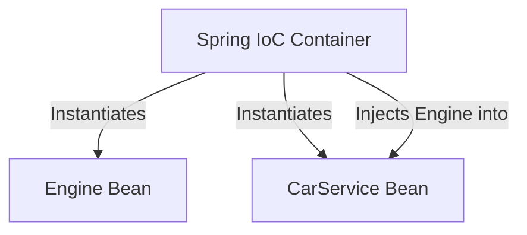

# 🍃 Topic 01: Introduction to Spring Framework (IoC & DI)

Welcome, future backend master! In this chapter, we will learn about the **Spring Framework**, which is the skeleton of modern enterprise Java applications. We will understand two very famous terms: **Inversion of Control (IoC)** and **Dependency Injection (DI)**, which make your code clean, modular, and easy to test.

---

## 🏠 The Big Picture & Real-Life Example

### 🍔 The Chef and the Kitchen (Dependency Injection)
Imagine you are a Chef hired to cook delicious hamburgers at a busy restaurant.
* **Bad way (Manual Control)**: If you need a stove, you leave the kitchen, go to a metal factory, build a stove from scratch, install gas pipes, and drag it back to the kitchen. Then you do the same to get a refrigerator and a pan. You spend 90% of your time building appliances instead of cooking!
* **Spring way (Inversion of Control)**: When you walk into the kitchen, the restaurant owner (the **Spring Container**) has already set up the stove, refrigerator, and pan. They are just handed to you. All you have to do is declare: *"I need a stove"* and it is instantly injected into your workspace. You focus 100% on cooking!

In the computer world:
* **The Chef** is your Java Class (e.g., `CarService`).
* **The Stove/Pan** are the dependencies (e.g., `Engine`, `Tire`).
* **The Restaurant Owner** is the **Spring IoC Container** (`ApplicationContext`).
* **Handing appliances to the Chef** is **Dependency Injection (DI)**.

---

## 🔬 Let's Look Closer

### 1. Inversion of Control (IoC)
Normally in Java, if class `A` needs class `B`, we write `B b = new B();` inside class `A`. 
With **IoC**, we flip (invert) this control! You don't create objects yourself. Instead, you register your classes with the Spring Container and let the container instantiate, configure, and manage their lifecycles.

### 2. Dependency Injection (DI)
DI is the design pattern Spring uses to implement IoC. Instead of a class looking up or creating its dependencies, Spring passes (injects) them in. There are three main ways to do this:
1. **Constructor Injection (Recommended)**: Dependencies are provided through the class constructor.
2. **Setter Injection**: Dependencies are provided through setter methods.
3. **Field Injection**: Spring uses Reflection to inject values directly into private variables (uses `@Autowired` directly on the field - not recommended for production because it is hard to unit-test without Spring).



### 3. The Spring Bean & Lifecycle
Any object managed by the Spring IoC Container is called a **Spring Bean**. A bean undergoes a specific lifecycle:
1. **Instantiation**: Spring creates the object in memory (calling its constructor).
2. **Populate Properties**: Spring injects dependencies.
3. **Initialization**: Custom startup code runs (marked with `@PostConstruct`).
4. **Ready for Use**: The application uses the bean.
5. **Destruction**: Custom cleanup code runs (marked with `@PreDestroy`) when the application shuts down.

---

## 💻 Code Sandbox

Here is a simple example showing how to configure and retrieve Spring Beans using Java Config.

### 1. The Dependency: `Engine.java`
```java
package com.example;

public class Engine {
    public void start() {
        System.out.println("Vroom! Engine started.");
    }
}
```

### 2. The Dependent Class: `Car.java`
```java
package com.example;

import javax.annotation.PostConstruct;
import javax.annotation.PreDestroy;

public class Car {
    private final Engine engine; // Injected dependency

    // Constructor Injection
    public Car(Engine engine) {
        this.engine = engine;
    }

    public void drive() {
        engine.start();
        System.out.println("Car is moving smoothly!");
    }

    @PostConstruct
    public void init() {
        System.out.println("Car bean is initialized and ready to roll!");
    }

    @PreDestroy
    public void cleanup() {
        System.out.println("Car bean is being destroyed. Cleaning up resource files...");
    }
}
```

### 3. Configuration Class: `AppConfig.java`
```java
package com.example;

import org.springframework.context.annotation.Bean;
import org.springframework.context.annotation.Configuration;

@Configuration // Tells Spring this class defines Bean blueprints
public class AppConfig {

    @Bean
    public Engine engineBean() {
        return new Engine(); // Registers Engine as a bean
    }

    @Bean
    public Car carBean() {
        // Injects the engineBean() into Car's constructor
        return new Car(engineBean());
    }
}
```

### 4. Running the Application: `Main.java`
```java
package com.example;

import org.springframework.context.annotation.AnnotationConfigApplicationContext;

public class Main {
    public static void main(String[] args) {
        // 1. Start the Spring Container and read config
        AnnotationConfigApplicationContext context = 
                new AnnotationConfigApplicationContext(AppConfig.class);

        // 2. Fetch the managed Car bean
        Car myCar = context.getBean(Car.class);

        // 3. Use the bean
        myCar.drive();

        // 4. Close container (triggers @PreDestroy)
        context.close();
    }
}
```

---

## 🧠 Points to Remember

* **Spring Container** (or IoC Container) is the engine that manages objects. `BeanFactory` is the basic version, and `ApplicationContext` is the advanced, feature-rich version.
* **Spring Beans** are Java objects managed by Spring, not by you using `new`.
* **Constructor Injection** is the best practice because it enforces required dependencies, allows objects to be immutable (`final`), and prevents null pointer exceptions.
* **Loose Coupling** is the main goal. It means your classes depend on interfaces rather than concrete classes, making it easy to swap implementations.

---

## 📖 Key Definitions

* **Spring Framework**: A popular Java open-source platform that simplifies enterprise application development by providing infrastructure support like dependency management, transaction handling, and web controllers.
* **Inversion of Control (IoC)**: A software design principle where the control of object creation, configuration, and lifecycle management is handed over to a container framework rather than the application code itself.
* **Dependency Injection (DI)**: A design pattern used to achieve Inversion of Control, where the container automatically passes dependent objects into a class instead of the class creating them manually.
* **Spring Bean**: A Java object that is instantiated, configured, and managed entirely by the Spring IoC container.
* **ApplicationContext**: The main interface representing the Spring IoC Container, responsible for loading bean definitions, wiring dependencies together, and managing bean lifecycles.

---

## ❓ Interview Questions

### 🟢 Basic Questions (1-20)

1. **What is Spring Framework?**
   * *Answer*: Spring is a lightweight, open-source framework for building enterprise-grade Java applications. It provides features like dependency injection, database integration, transaction management, and security.
2. **What is Inversion of Control (IoC)?**
   * *Answer*: IoC is a design principle where the responsibility of creating and managing objects is shifted from the programmer (who normally writes `new MyClass()`) to a container (like Spring).
3. **What is Dependency Injection (DI)?**
   * *Answer*: DI is a design pattern used to implement IoC. It is the process of injecting dependent objects into a class rather than letting the class create them itself.
4. **What is a Spring Bean?**
   * *Answer*: A Spring Bean is a Java object that is instantiated, configured, and managed by the Spring IoC container.
5. **What is the Spring IoC Container?**
   * *Answer*: It is the core engine of Spring that reads configuration metadata (annotations, XML, or Java config), creates beans, links their dependencies, and manages their lifecycles.
6. **Name the two main containers provided by Spring.**
   * *Answer*: `BeanFactory` (a basic container for simple dependency injection) and `ApplicationContext` (an advanced container with enterprise features).
7. **What is the difference between `BeanFactory` and `ApplicationContext`?**
   * *Answer*: `BeanFactory` loads beans lazily (when requested), whereas `ApplicationContext` loads all singletons eagerly (during startup) and provides advanced features like event propagation and internalization.
8. **What are the different types of Dependency Injection in Spring?**
   * *Answer*: Constructor Injection, Setter Injection, and Field Injection.
9. **Which type of Dependency Injection is highly recommended and why?**
   * *Answer*: Constructor Injection is recommended because it allows dependencies to be `final` (immutable), ensures all required dependencies are provided, and makes unit-testing easy.
10. **What is Field Injection, and why is it discouraged?**
    * *Answer*: Field injection is when `@Autowired` is placed directly over a class field. It is discouraged because it hides dependencies, makes class mock testing harder, and can bypass constructor verification.
11. **How do you define a Spring Bean using Java configuration?**
    * *Answer*: By annotating a configuration class with `@Configuration` and marking methods with `@Bean` to return object instances.
12. **What is the default scope of a Spring Bean?**
    * *Answer*: The default scope is `singleton`, meaning Spring creates only one instance of that bean in the entire application container.
13. **How do you define custom startup code for a Spring Bean?**
    * *Answer*: By annotating a void method inside the bean with `@PostConstruct`.
14. **How do you define custom cleanup code for a Spring Bean?**
    * *Answer*: By annotating a void method inside the bean with `@PreDestroy`.
15. **What does the `@Configuration` annotation do?**
    * *Answer*: It tells Spring that the class contains methods annotated with `@Bean`, which the container will execute to register beans.
16. **What is the purpose of the `@Autowired` annotation?**
    * *Answer*: It tells Spring to automatically resolve and inject a matching bean dependency into a constructor, setter, or field.
17. **What happens if Spring finds multiple beans of the same type during injection?**
    * *Answer*: It will throw a `NoUniqueBeanDefinitionException` unless resolved using annotations like `@Primary` or `@Qualifier`.
18. **What is the difference between `@Bean` and `@Component`?**
    * *Answer*: `@Component` is placed on class declarations for automatic scanning, while `@Bean` is placed on methods inside configuration classes to register third-party library objects.
19. **What is Component Scanning in Spring?**
    * *Answer*: A process where Spring scans the packages of your application to find classes annotated with `@Component` (or stereotypes like `@Service`) and automatically registers them as beans.
20. **Can we make a Spring application without any XML configuration?**
    * *Answer*: Yes, modern Spring applications use 100% Java-based configurations using `@Configuration` and annotations.

### 🟡 Intermediate Questions (21-40)

21. **Explain the lifecycle phases of a Spring Bean.**
    * *Answer*: The phases are: Instantiation (constructor called) -> Populate Properties (dependency injection) -> BeanNameAware / Aware interfaces -> BeanPostProcessors (Before Initialization) -> Custom Initialization (`@PostConstruct` or `InitializingBean`) -> BeanPostProcessors (After Initialization) -> Ready for Use -> Destruction (`@PreDestroy` or `DisposableBean`).
22. **What are Aware interfaces in Spring?**
    * *Answer*: Interfaces (like `BeanNameAware`, `ApplicationContextAware`) that allow a bean to become aware of the container's infrastructure details.
23. **What is a `BeanPostProcessor`?**
    * *Answer*: An interface that allows developers to run custom logic before and after a bean completes its initialization (e.g., wrapping a bean in a proxy).
24. **What is the difference between `@PostConstruct` and implementing `InitializingBean`?**
    * *Answer*: `@PostConstruct` is a standard annotation (recommended), whereas `InitializingBean` is a Spring interface that couples your code to the Spring APIs by requiring you to override `afterPropertiesSet()`.
25. **How can you resolve circular dependency issues in Spring?**
    * *Answer*: By redesigning the code to remove the circular loop, using Setter Injection instead of Constructor Injection, or annotating dependencies with `@Lazy`.
26. **What does `@Qualifier` do, and when should you use it?**
    * *Answer*: It is used to specify the exact name of the bean you want to inject when multiple beans of the same type exist in the container.
27. **What is the `@Primary` annotation?**
    * *Answer*: It marks a bean as the default choice for injection when multiple beans of the same type are available.
28. **Explain the `prototype` bean scope.**
    * *Answer*: A scope where Spring creates a brand new object instance every single time the bean is requested from the container.
29. **What are the five web-aware bean scopes?**
    * *Answer*: `request` (one instance per HTTP request), `session` (one per HTTP session), `application` (one per ServletContext), and `websocket` (one per WebSocket connection).
30. **What is a Singleton Bean with a Prototype Dependency problem, and how do you solve it?**
    * *Answer*: Because singletons are created once, any prototype dependency injected into them will also be injected only once. To get a fresh prototype instance each time, you must use **Lookup Injection** (`@Lookup` annotation) or inject an ObjectProvider.
31. **What is the purpose of `@Lazy` annotation?**
    * *Answer*: It tells Spring to delay the creation of a bean until it is requested for the first time, rather than creating it during container startup.
32. **What is the difference between Eager loading and Lazy loading of beans?**
    * *Answer*: Eager loading creates all singletons during container startup to fail fast on errors; Lazy loading delays bean creation to save memory at startup but might delay response times.
33. **What is the Bean Definition Registry?**
    * *Answer*: An internal registry in the Spring container where all bean configuration blueprints (types, scope, dependencies) are stored before they are instantiated.
34. **How do you pass property values into a Spring Bean?**
    * *Answer*: Using the `@Value` annotation to read properties from configuration files (like `application.properties`) directly into fields.
35. **What does `@Value("${app.title:Default Title}")` mean?**
    * *Answer*: It reads the configuration key `app.title` and injects it. If the key is not defined, it defaults to the string value `"Default Title"`.
36. **What is the purpose of `@Import` annotation?**
    * *Answer*: It allows loading bean configuration classes from another `@Configuration` class, making modular configurations possible.
37. **What is the Spring Expression Language (SpEL)?**
    * *Answer*: A powerful expression language used to query and manipulate objects at runtime within Spring configs (syntax looks like `#{engine.horsepower * 2}`).
38. **How can you conditionally register a Bean based on a system setting?**
    * *Answer*: By using the `@Conditional` annotation along with a custom condition class, or using `@ConditionalOnProperty`.
39. **What is Dependency Lookup and how does it differ from Dependency Injection?**
    * *Answer*: Dependency Lookup is when a class actively asks the container for an object (`context.getBean(Class)`), whereas Dependency Injection is passive (the container pushes the object to the class).
40. **How does Spring handle multithreaded requests for a singleton bean?**
    * *Answer*: Spring does not make singleton beans thread-safe automatically. Developers must ensure singleton beans do not contain changeable instance state (they should be stateless).

### 🔴 Advanced Questions (41-50)

41. **Explain the Bean Lifecycle extension using `BeanFactoryPostProcessor`.**
    * *Answer*: A `BeanFactoryPostProcessor` allows modifying the metadata definitions of beans before they are actually instantiated by the container (e.g., resolving placeholders using PropertySourcesPlaceholderConfigurer).
42. **How does Spring use the Proxy pattern under the hood for `@Configuration` classes?**
    * *Answer*: Spring wraps `@Configuration` classes in a CGLIB subclass proxy. When you call a `@Bean` method inside a configuration class, the proxy intercepts the call to ensure that if the method is called multiple times, it returns the same singleton instance rather than creating duplicates.
43. **What is the difference between Setter Injection and Constructor Injection concerning immutability?**
    * *Answer*: Constructor Injection allows dependencies to be declared as `final` variables, guaranteeing immutability. Setter Injection cannot use `final` fields since they must be modified after instantiation, leaving objects mutable.
44. **What happens during Context Refreshed Event (`ContextRefreshedEvent`)?**
    * *Answer*: It is fired when the `ApplicationContext` is fully initialized or refreshed, meaning all singleton beans have been created, dependencies wired, and the container is ready for traffic.
45. **How does `@Lookup` annotation work under the hood?**
    * *Answer*: Spring overrides the method annotated with `@Lookup` using dynamic CGLIB byte-code generation to query the container for the target bean type every time the method is executed.
46. **What is the role of `MergedBeanDefinitionPostProcessor`?**
    * *Answer*: An internal Spring post-processor interface that scans and prepares metadata annotations like `@Autowired` and `@Value` on beans before their properties are set.
47. **How does Spring resolve circular dependencies using Three-Level Caching?**
    * *Answer*: Spring uses three maps inside `DefaultSingletonBeanRegistry`: `singletonObjects` (fully initialized beans), `earlySingletonObjects` (instantiated but unwired beans), and `singletonFactories` (object factories for partially created beans). By exposing partially built objects early, it breaks the circular loop.
48. **Can you declare a bean inside a standard `@Component` class instead of `@Configuration`? What is the difference?**
    * *Answer*: Yes, this is called **Lite Mode**. The difference is that Spring does not generate a CGLIB proxy for standard components. Calling a `@Bean` method inside a component class behaves like a normal Java method call and does not guarantee singleton behavior.
49. **How would you debug a `NoSuchBeanDefinitionException`?**
    * *Answer*: I would check if: the target class has a stereotype annotation like `@Component`, the class is in a package scanned by `@ComponentScan`, the configuration file has a `@Bean` method for it, or if profile mismatches are disabling the bean creation.
50. **How can you dynamically register beans programmatically into an active ApplicationContext?**
    * *Answer*: By casting the container to `GenericApplicationContext` and using its `BeanDefinitionRegistry` to register a `BeanDefinition` programmatically, or using `registerBean(...)` in Java 8+.

---

## ⏭️ Next Steps

* **Next Chapter**: [👉 Topic 02: Spring Core Annotations & Configuration](02_spring_annotations_configuration.md)
* **Roadmap Index**: [🏠 Back to Roadmap](README.md)
