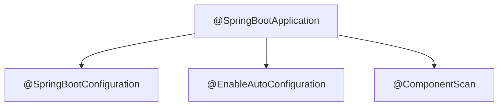

# ⚡ Topic 04: Introduction to Spring Boot

Welcome, backend champion! In this chapter, we will learn about **Spring Boot**. Spring Boot is an extension of the Spring Framework that makes it incredibly fast and easy to build, test, and deploy production-grade Java applications. We will dive deep into its core features: **Starter Dependencies**, **Auto-Configuration**, and the magic behind the `@SpringBootApplication` annotation.

---

## 🏠 The Big Picture & Real-Life Example

### 🍜 Raw Ingredients vs. The Instant Meal Box (Spring vs. Spring Boot)
Imagine you want to cook a bowl of hot ramen noodles:
* **The Spring Way (Raw Ingredients)**: You go to the market and buy raw flour, make the dough, roll the noodles, boil them, slice fresh vegetables, and make soup stock from bones. You also have to assemble your own stove and set up gas lines! (In Java, this means configuring web servers, setting up DispatcherServlet, importing 20 separate libraries, and writing hundreds of lines of XML or Java config).
* **The Spring Boot Way (Instant Meal Box)**: You buy a pre-packaged box of cup ramen. It already has the noodles, the soup flavor packet, and the vegetables. All you do is add hot water and press "Start"! (In Java, you import a single **Starter Dependency**, and Spring Boot automatically sets up the Tomcat server, JSON converters, and logs).

Spring Boot does not replace Spring; it just wraps Spring in a convenient, auto-configured box!

---

## 🔬 Let's Look Closer

### 1. Spring vs. Spring Boot
* **Spring Framework**: Focuses on providing core features like Dependency Injection (DI) and aspect management. It requires significant manual configuration.
* **Spring Boot**: Focuses on speed and convenience. It provides default configurations so you can run your application instantly.

### 2. The Three Core Pillars of Spring Boot
1. **Starter Dependencies**: Instead of hunting down 20 different jar files for Web, JSON, and Validation, Spring Boot offers pre-packaged combinations (like `spring-boot-starter-web` or `spring-boot-starter-data-jpa`). You add one dependency, and it downloads all compatible matching versions automatically.
2. **Auto-Configuration**: Spring Boot scans your classpath. If it finds `h2.jar`, it automatically configures an in-memory database bean. If it finds `tomcat.jar`, it automatically boots a Tomcat web server!
3. **Embedded Web Server**: Spring Boot packages a Tomcat server *inside* your runnable JAR. You don't need to install external web servers anymore—just run `java -jar app.jar`.

### 3. Under the Hood of `@SpringBootApplication`
This single annotation on your main class is actually a combination of three annotations:
* `@SpringBootConfiguration`: Marks the class as a configuration source.
* `@EnableAutoConfiguration`: Tells Spring Boot to automatically guess and configure beans you will likely need.
* `@ComponentScan`: Scans all classes in the current package and subpackages for stereotype annotations.



---

## 💻 Code Sandbox

Let's build a standard bootable Spring Boot application from scratch.

### 1. The Main Application Class: `Application.java`
```java
package com.example;

import org.springframework.boot.SpringApplication;
import org.springframework.boot.autoconfigure.SpringBootApplication;
import org.springframework.context.ApplicationContext;

@SpringBootApplication // The triple-magic annotation!
public class Application {
    public static void main(String[] args) {
        // Starts the embedded Tomcat web server and initializes the container
        ApplicationContext context = SpringApplication.run(Application.class, args);

        System.out.println("Spring Boot Application started successfully!");
        
        // Print the active web server details
        String[] beanNames = context.getBeanDefinitionNames();
        System.out.println("Total registered Beans: " + beanNames.length);
    }
}
```

### 2. Auto-Configured Properties: `application.properties`
This file (located in `src/main/resources/`) is where we can customize or override Spring Boot's automatic defaults:
```properties
# Customizing the embedded server port
server.port=8081

# Customizing application name
spring.application.name=MyFirstSpringBootApp
```

---

## 🧠 Points to Remember

* Spring Boot is **opinionated**. It makes default assumptions (opinions) about what library versions and settings you need so you don't have to choose.
* The main bootstrap class containing `@SpringBootApplication` must always be placed in the **root package** of your project (e.g., `com.example`), because `@ComponentScan` scans downwards.
* Spring Boot includes **Starter Parent** in its build files (`pom.xml` / `build.gradle`) to manage and lock down all compatible dependency versions.

---

## 📖 Key Definitions

* **Spring Boot**: An opinionated extension of the Spring Framework designed to simplify project setup, dependency management, and deployment using automated defaults.
* **Auto-Configuration**: An automatic process in Spring Boot that configures beans in the container based on the libraries found on the application classpath.
* **Starter Dependency**: A convenient descriptor dependency (like `spring-boot-starter-web`) that groups common libraries together under a single import.
* **Embedded Web Server**: A web server (like Tomcat or Jetty) packaged inside the application's executable archive, eliminating the need to deploy to external servers.
* **Spring Boot CLI**: A command-line tool that lets you build and run Spring applications using Groovy scripts quickly.

---

## ❓ Interview Questions

### 🟢 Basic Questions (1-20)

1. **What is Spring Boot?**
   * *Answer*: Spring Boot is an extension of the Spring Framework that simplifies the creation, configuration, and deployment of stand-alone, production-grade Java applications.
2. **What are the main differences between Spring and Spring Boot?**
   * *Answer*: Spring requires manual configuration (XML or Java config) and external server deployment. Spring Boot provides auto-configuration, starter dependencies, and embedded web servers for instant running.
3. **What is Auto-Configuration in Spring Boot?**
   * *Answer*: It is an automated process where Spring Boot configures beans based on the JAR libraries present on the project classpath.
4. **What is the purpose of `@SpringBootApplication`?**
   * *Answer*: It is the main bootstrap annotation that enables auto-configuration, component scanning, and configuration class declaration.
5. **Name the three annotations combined under `@SpringBootApplication`.**
   * *Answer*: `@SpringBootConfiguration`, `@EnableAutoConfiguration`, and `@ComponentScan`.
6. **What is an Embedded Server?**
   * *Answer*: A web server (like Tomcat, Jetty, or Undertow) that is packaged directly inside the application JAR file, so you do not need to install a server separately.
7. **What is the default embedded server in Spring Boot?**
   * *Answer*: **Tomcat** is the default embedded server.
8. **What are Starter Dependencies?**
   * *Answer*: Grouped descriptors (like `spring-boot-starter-web`) that bundle all necessary dependencies for a specific feature, ensuring version compatibility.
9. **How do you change the default server port in Spring Boot?**
   * *Answer*: By adding the property `server.port=8081` in the `application.properties` or `application.yml` file.
10. **Where is the entry point of a Spring Boot application?**
    * *Answer*: The `main` method that invokes `SpringApplication.run(Application.class, args)`.
11. **What is the Spring Boot Starter Parent?**
    * *Answer*: A special parent project in `pom.xml` that defines default configurations, resource filtering, and manages dependency versions to avoid version mismatches.
12. **How do you disable a specific Auto-Configuration class?**
    * *Answer*: By using the `exclude` attribute on `@SpringBootApplication`, like: `@SpringBootApplication(exclude = {DataSourceAutoConfiguration.class})`.
13. **What is the default configuration file in Spring Boot?**
    * *Answer*: `application.properties` or `application.yml` located in the `src/main/resources` folder.
14. **What is the Spring Boot Banner?**
    * *Answer*: The ASCII art logo displayed in the console terminal when a Spring Boot application starts up.
15. **How can you disable the startup banner?**
    * *Answer*: By calling `app.setBannerMode(Banner.Mode.OFF)` on the `SpringApplication` instance before running it.
16. **Can we run Spring Boot applications on external Tomcat servers?**
    * *Answer*: Yes, by packaging the application as a **WAR** file instead of a JAR and extending `SpringBootServletInitializer`.
17. **What is the command to run a Spring Boot application using Maven?**
    * *Answer*: `mvn spring-boot:run`.
18. **What is the command to run a Spring Boot application using Gradle?**
    * *Answer*: `./gradlew bootRun`.
19. **What does the `@SpringBootConfiguration` annotation mean?**
    * *Answer*: It is an alternative version of `@Configuration` that helps Spring Boot find configuration beans during integration testing.
20. **Why should `@SpringBootApplication` be placed in the root package?**
    * *Answer*: Because its `@ComponentScan` attribute scans classes starting from its own package downwards; placing it at the root ensures all classes are scanned.

### 🟡 Intermediate Questions (21-40)

21. **How does `@EnableAutoConfiguration` work under the hood?**
    * *Answer*: It imports `AutoConfigurationImportSelector`, which reads definitions from `META-INF/spring/org.springframework.boot.autoconfigure.AutoConfiguration.imports` files in the jar libraries and registers matching configurations.
22. **What are `@ConditionalOnClass` and `@ConditionalOnMissingBean` annotations?**
    * *Answer*: These are conditional annotations. `@ConditionalOnClass` registers a bean only if a specified class is on the classpath. `@ConditionalOnMissingBean` registers a bean only if the user hasn't defined their own custom version of that bean.
23. **What is the Spring Boot Actuator?**
    * *Answer*: A sub-project that provides production-ready monitoring endpoints (like health, metrics, logging levels, env) to check application status.
24. **How do you configure YAML instead of properties in Spring Boot?**
    * *Answer*: By renaming `application.properties` to `application.yml`. Spring Boot detects the `.yml` extension and uses `SnakeYAML` to parse it.
25. **What is the difference between `spring-boot-starter-web` and `spring-boot-starter-webflux`?**
    * *Answer*: `spring-boot-starter-web` is built on the Servlet API and blocks threads (blocking/synchronous). `spring-boot-starter-webflux` is built on Netty and supports non-blocking reactive streams.
26. **Explain the purpose of `spring-boot-devtools`.**
    * *Answer*: A development-only dependency that speeds up development by providing automatic application restart on code changes, browser live-reload, and configuration caching disables.
27. **What is the Spring Boot Starter for database persistence?**
    * *Answer*: `spring-boot-starter-data-jpa` (which pulls in Hibernate, Spring Data core, JDBC, and transaction management).
28. **How does Spring Boot resolve dependency version conflicts?**
    * *Answer*: The Starter Parent POM defines a `dependencyManagement` section containing pre-tested, compatible version properties for hundreds of popular libraries.
29. **How do you run custom code instantly after Spring Boot finishes starting?**
    * *Answer*: By creating a bean that implements the `CommandLineRunner` or `ApplicationRunner` interface. Spring Boot will execute its `run()` method during bootstrap.
30. **What is the difference between `CommandLineRunner` and `ApplicationRunner`?**
    * *Answer*: `CommandLineRunner` accepts arguments as a raw string array (`String[]`), while `ApplicationRunner` wraps them in an `ApplicationArguments` object (supporting option names and values).
31. **What is the Spring Boot Maven Plugin?**
    * *Answer*: A plugin that packages your compiled code and dependencies into a single executable "fat" JAR containing a custom loader class.
32. **What is a "fat" JAR?**
    * *Answer*: An executable archive file containing the application's compiled classes along with all nested dependency JAR files inside a `BOOT-INF/lib/` folder.
33. **How can you override properties using command-line arguments?**
    * *Answer*: By passing arguments with double dashes when running the JAR, e.g., `java -jar app.jar --server.port=9000`.
34. **What is `@ConfigurationProperties` and how does it compare to `@Value`?**
    * *Answer*: `@Value` is used to inject individual property fields. `@ConfigurationProperties` binds structured, nested properties group directly to a Java object with type-safety and validation support.
35. **What is the purpose of `@ActiveProfiles`?**
    * *Answer*: It is used in test classes to specify which configuration profiles should be active when running integration tests.
36. **Explain how `@ConditionalOnProperty` works.**
    * *Answer*: It registers a bean only if a specific configuration property is defined in the environment and has a matching value.
37. **What is the default logging configuration directory in Spring Boot?**
    * *Answer*: Spring Boot looks for `logback-spring.xml` or `logback.xml` in the `src/main/resources` folder to load custom logging configurations.
38. **How does Spring Boot handle static resources?**
    * *Answer*: By default, it automatically serves static resources (CSS, JS, images) from directories on the classpath like `/static`, `/public`, `/resources`, or `/META-INF/resources`.
39. **What is `@SpringBootTest`?**
    * *Answer*: A class-level annotation that starts the complete Spring Boot ApplicationContext for integration tests.
40. **How can you bootstrap a Spring Boot project quickly?**
    * *Answer*: By using **Spring Initializr** (start.spring.io), a web application that generates a customized Spring Boot project structure.

### 🔴 Advanced Questions (41-50)

41. **Explain the bootstrap lifecycle sequence of `SpringApplication.run(...)`.**
    * *Answer*: It starts a stopwatch -> registers listeners -> prepares the Environment (resolves profiles/properties) -> creates the ApplicationContext (Servlet, Reactive, or Standard) -> prepares the context -> loads sources -> refreshes the context (instantiates beans & boots embedded Tomcat) -> runs all `CommandLineRunner` beans -> stops stopwatch.
42. **How does Spring Boot resolve which embedded web server to start?**
    * *Answer*: During startup, Spring Boot checks for the presence of specific classes in the classpath. If it finds `org.apache.catalina.startup.Tomcat`, it configures and boots Tomcat; if it finds Jetty classes, it configures Jetty.
43. **What is the role of `SpringFactoriesLoader`?**
    * *Answer*: An internal class loader helper that reads `META-INF/spring.factories` files inside starter JARs to load auto-configurations, listeners, and context initializers dynamically.
44. **How would you create your own custom Spring Boot Starter?**
    * *Answer*: (1) Create an autoconfigure module containing configuration classes with `@Conditional` annotations. (2) Define auto-configuration entry points in `META-INF/spring/org.springframework.boot.autoconfigure.AutoConfiguration.imports`. (3) Create a starter library module that pulls in the autoconfigure module and third-party dependencies.
45. **What is the difference between `@EnableAutoConfiguration` and `@SpringBootConfiguration`?**
    * *Answer*: `@SpringBootConfiguration` marks the class as a configuration source (subclass of `@Configuration`). `@EnableAutoConfiguration` activates the scanning of imports files to register default beans based on classpaths.
46. **How does the Spring Boot class loader run code out of nested JARs in a fat JAR?**
    * *Answer*: Spring Boot packs a custom class loader (`LaunchedURLClassLoader`) inside the JAR. It reads bytecode from zipped jar entries inside `BOOT-INF/lib/` directly without extracting them to disk.
47. **How would you write a custom conditional annotation?**
    * *Answer*: Create a custom annotation, mark it with `@Conditional(MyCondition.class)`, and implement the `Condition` interface's `matches(ConditionContext, AnnotatedTypeMetadata)` method to return true or false.
48. **Explain the purpose of `ConfigFileApplicationListener`.**
    * *Answer*: An internal listener that runs early in startup to search and load configuration files (like `application.properties`) from directories like the classpath root or config directories.
    * **How can you customize the context initialization failure messages in Spring Boot?**
    * *Answer*: By implementing `FailureAnalysisReporter` and registering it in `spring.factories` to return helpful, structured errors on startup failures.
50. **What is the purpose of the `@TypeExcludeFilter` in `@SpringBootApplication`?**
    * *Answer*: It is an internal mechanism that prevents test configuration classes or auto-configured classes from being scanned and registered twice during testing or startup scan cycles.

---

## ⏭️ Next Steps

* **Previous Chapter**: [👈 Topic 03: Aspect-Oriented Programming (AOP) & Logging](03_spring_aop_logging.md)
* **Next Chapter**: [👉 Topic 05: Building REST APIs with MVC](05_rest_api_mvc.md)
* **Roadmap Index**: [🏠 Back to Roadmap](README.md)
