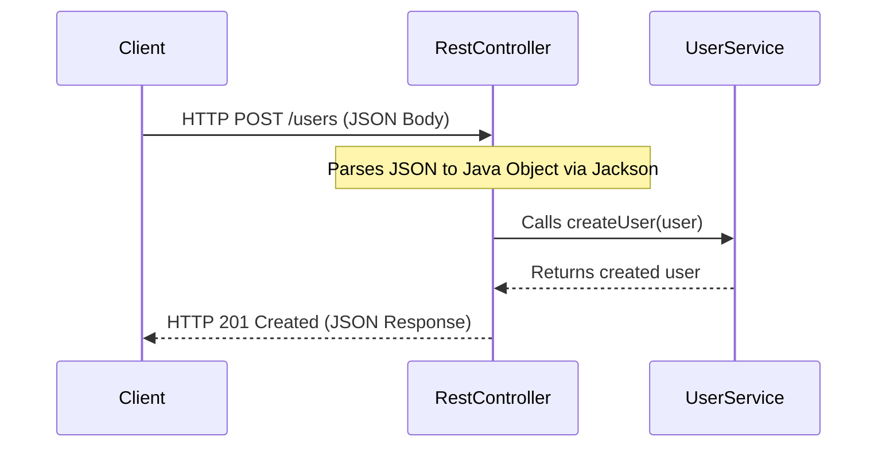

# 📡 Topic 05: Building REST APIs with MVC

Welcome, web developer! In this chapter, we will learn how to build **RESTful APIs** using Spring MVC. REST APIs are the standard way applications communicate over the internet. We will learn how to create endpoints using `@RestController`, handle HTTP requests (GET, POST, PUT, DELETE), map inputs (`@RequestBody`, `@RequestParam`, `@PathVariable`), and return custom HTTP response codes using `ResponseEntity`.

---

## 🏠 The Big Picture & Real-Life Example

### 🍽️ The Restaurant Waiter (The RestController API)
Imagine you visit a restaurant to order food:
1. **The Client**: That's you. You make a request (e.g., "Give me a pizza!").
2. **The Waiter (RestController)**: They act as the middleman between you and the kitchen. They take your order ticket, translate it, and carry it to the chef (the **Service** class).
3. **The Kitchen (Service)**: They cook the pizza (fetch/process data).
4. **The Waiter returns the Pizza (Response)**: The waiter returns the pizza to you, along with a success response status: *"Here is your food!"* (HTTP 200 OK). 
5. If the kitchen is out of cheese, the waiter comes back and says: *"Sorry, we don't have that!"* (HTTP 404 Not Found).

In Spring Boot:
* **HTTP Requests** are the orders.
* **The REST Controller** is the waiter.
* **JSON Data** is the food package.
* **HTTP Status Codes** are the waiter's status updates (200 OK, 201 Created, 400 Bad Request, 404 Not Found).

---

## 🔬 Let's Look Closer

### 1. REST Architecture & HTTP Methods
REST (Representational State Transfer) is a set of rules for designing APIs. We use HTTP methods to represent actions:
* **GET**: Retrieve data (e.g., fetch a list of books).
* **POST**: Create new data (e.g., save a new book).
* **PUT**: Update existing data completely (e.g., edit an entire book's details).
* **DELETE**: Delete data.

### 2. Spring MVC Annotations for REST APIs
* **`@RestController`**: Combined form of `@Controller` and `@ResponseBody`. It tells Spring that every method's return value should be converted automatically into JSON and sent directly into the HTTP response body.
* **`@RequestBody`**: Extracts the incoming JSON from the request and converts it into a Java object.
* **`@PathVariable`**: Extracts a variable value directly from the URL path (e.g., in `/books/5`, the `5` is a Path Variable).
* **`@RequestParam`**: Extracts query parameters from the URL (e.g., in `/books?genre=magic`, the `genre` is a Request Param).

### 3. ResponseEntity
`ResponseEntity` represents the entire HTTP response (headers, body, and status code). It gives you complete control to return custom HTTP statuses (like `201 Created` for creations, or `400 Bad Request` on invalid data).



---

## 💻 Code Sandbox

Let's build a REST Controller for managing a toy inventory.

### 1. The Model: `Toy.java`
```java
package com.example;

public class Toy {
    private int id;
    private String name;
    private double price;

    public Toy() {}

    public Toy(int id, String name, double price) {
        this.id = id;
        this.name = name;
        this.price = price;
    }

    // Getters and Setters
    public int getId() { return id; }
    public void setId(int id) { this.id = id; }
    public String getName() { return name; }
    public void setName(String name) { this.name = name; }
    public double getPrice() { return price; }
    public void setPrice(double price) { this.price = price; }
}
```

### 2. The Rest Controller: `ToyController.java`
```java
package com.example;

import org.springframework.http.HttpStatus;
import org.springframework.http.ResponseEntity;
import org.springframework.web.bind.annotation.*;

import java.util.ArrayList;
import java.util.List;

@RestController // Mark as a JSON API RestController
@RequestMapping("/api/toys") // Base URL endpoint for all methods
public class ToyController {

    private final List<Toy> toyDb = new ArrayList<>();

    // Constructor: Add dummy database entries
    public ToyController() {
        toyDb.add(new Toy(1, "Lego Set", 49.99));
        toyDb.add(new Toy(2, "Teddy Bear", 19.99));
    }

    // 1. GET: Fetch all toys (Optional filter by name)
    // URL: GET /api/toys?filter=Lego
    @GetMapping
    public ResponseEntity<List<Toy>> getAllToys(@RequestParam(value = "filter", required = false) String filter) {
        if (filter == null) {
            return ResponseEntity.ok(toyDb); // Returns HTTP 200 OK
        }
        
        List<Toy> filtered = toyDb.stream()
                .filter(t -> t.getName().toLowerCase().contains(filter.toLowerCase()))
                .toList();
        return ResponseEntity.ok(filtered);
    }

    // 2. GET: Fetch single toy by ID
    // URL: GET /api/toys/1
    @GetMapping("/{id}")
    public ResponseEntity<Toy> getToyById(@PathVariable("id") int id) {
        return toyDb.stream()
                .filter(t -> t.getId() == id)
                .findFirst()
                .map(toy -> ResponseEntity.ok(toy)) // Returns HTTP 200 OK
                .orElse(ResponseEntity.status(HttpStatus.NOT_FOUND).build()); // Returns HTTP 404
    }

    // 3. POST: Create a new toy
    // URL: POST /api/toys
    @PostMapping
    public ResponseEntity<Toy> createToy(@RequestBody Toy newToy) {
        toyDb.add(newToy);
        // Returns HTTP 201 Created along with the new toy object
        return ResponseEntity.status(HttpStatus.CREATED).body(newToy);
    }

    // 4. DELETE: Remove a toy
    // URL: DELETE /api/toys/1
    @DeleteMapping("/{id}")
    public ResponseEntity<Void> deleteToy(@PathVariable("id") int id) {
        boolean removed = toyDb.removeIf(t -> t.getId() == id);
        if (removed) {
            return ResponseEntity.noContent().build(); // Returns HTTP 244 No Content
        }
        return ResponseEntity.notFound().build(); // Returns HTTP 404
    }
}
```

---

## 🧠 Points to Remember

* `@RestController` is a convenience annotation that implicitly adds `@ResponseBody` to all controller methods.
* **Jackson Library** is automatically included by Spring Boot to serialize Java objects to JSON strings and deserialize JSON back to Java objects.
* Use `ResponseEntity<T>` to specify headers, cookies, and HTTP status codes along with your response body.
* Keep controllers thin! Business logic and database access should live inside `@Service` and `@Repository` classes, not inside `@RestController`.

---

## 📖 Key Definitions

* **RESTful API**: A web service architecture style that uses HTTP methods (GET, POST, PUT, DELETE) and structured endpoints to manipulate data representations.
* **RestController**: A specialized Spring controller class designed to handle REST APIs that returns raw serialized data (like JSON) directly to clients.
* **Jackson**: A popular Java JSON processing library integrated automatically by Spring Boot to handle JSON serialization and deserialization.
* **ResponseEntity**: A generic container class in Spring representing the complete HTTP response, including the status code, response headers, and response body.
* **Query Parameter**: Key-value pairs appended to the end of a URL after a question mark (e.g., `?genre=action`) used to filter or sort API results.

---

## ❓ Interview Questions

### 🟢 Basic Questions (1-20)

1. **What is a REST API?**
   * *Answer*: A REST API is a web service design style that uses standard HTTP requests (GET, POST, PUT, DELETE) to fetch, create, update, and delete resources.
2. **What does the `@RestController` annotation do?**
   * *Answer*: It marks a class as a web controller and automatically adds `@ResponseBody` to every method, converting return values into JSON.
3. **What is the difference between `@Controller` and `@RestController`?**
   * *Answer*: `@Controller` is used to serve traditional web pages (HTML views), while `@RestController` is designed for RESTful data APIs returning raw JSON or XML payloads.
4. **What is the purpose of `@ResponseBody`?**
   * *Answer*: It instructs Spring to write the method's return value directly into the HTTP response body, rather than looking for an HTML template.
5. **How does Spring convert Java objects to JSON automatically?**
   * *Answer*: By using the **Jackson** library, which is pre-configured and included in Spring Boot's web starter.
6. **What is `@GetMapping`?**
   * *Answer*: A shortcut annotation used to map HTTP GET requests to a specific controller method.
7. **What is `@PostMapping`?**
   * *Answer*: A shortcut annotation used to map HTTP POST requests to a handler method for creating resources.
8. **What is `@PathVariable`?**
   * *Answer*: An annotation used to extract dynamic placeholder values directly from the URL path (e.g., `/{id}`).
9. **What is `@RequestParam`?**
   * *Answer*: An annotation used to extract query parameters from the URL (e.g., `?name=toy`).
10. **What is `@RequestBody`?**
    * *Answer*: An annotation that reads the raw HTTP request body (JSON) and converts it into a Java object.
11. **What is `ResponseEntity`?**
    * *Answer*: A helper class representing the complete HTTP response, allowing developers to configure the response status, headers, and body.
12. **Name the HTTP method used to retrieve resources.**
    * *Answer*: **GET**.
13. **Name the HTTP method used to create a new resource.**
    * *Answer*: **POST**.
14. **Name the HTTP method used to delete a resource.**
    * *Answer*: **DELETE**.
15. **What is the difference between PUT and PATCH HTTP methods?**
    * *Answer*: **PUT** is used to replace or update a resource completely. **PATCH** is used to perform partial updates to a resource.
16. **What is HTTP Status Code 200?**
    * *Answer*: **200 OK** (indicates the request was successful).
17. **What is HTTP Status Code 201?**
    * *Answer*: **201 Created** (indicates the resource was successfully created).
18. **What is HTTP Status Code 404?**
    * *Answer*: **404 Not Found** (indicates the requested resource does not exist).
19. **What is HTTP Status Code 500?**
    * *Answer*: **500 Internal Server Error** (indicates a crash or unhandled exception occurred on the server side).
20. **How do you set a custom HTTP status code on a response?**
    * *Answer*: By returning `ResponseEntity.status(HttpStatus.CREATED).body(data)` or using the `@ResponseStatus` annotation on the method.

### 🟡 Intermediate Questions (21-40)

21. **Explain the difference between `@PathVariable` and `@RequestParam`.**
    * *Answer*: `@PathVariable` extracts variables embedded directly in the path template (e.g., `/users/10`), whereas `@RequestParam` extracts query parameters appended to the URL (e.g., `/users?id=10`).
22. **What does `@RequestMapping` at the class level do?**
    * *Answer*: It defines a shared base URL path prefix for all individual request mapping methods in that controller.
23. **How do you handle Optional Request Parameters?**
    * *Answer*: By setting `required = false` inside the annotation, like `@RequestParam(value = "name", required = false)`.
24. **How do you configure default values for `@RequestParam`?**
    * *Answer*: By using the `defaultValue` attribute, like `@RequestParam(defaultValue = "1")`.
25. **What is HTTP Status Code 400?**
    * *Answer*: **400 Bad Request** (indicates the client sent malformed request payload or invalid parameters).
26. **What is HTTP Status Code 204?**
    * *Answer*: **204 No Content** (indicates the request was successful, but there is no body payload to return, common in DELETE operations).
27. **What is the default media type produced by a Spring `@RestController`?**
    * *Answer*: `application/json` (JSON format).
28. **How can you configure a controller method to return XML instead of JSON?**
    * *Answer*: By setting the `produces` attribute: `@GetMapping(produces = MediaType.APPLICATION_XML_VALUE)` and adding the jackson-dataformat-xml dependency.
29. **What does the `@CrossOrigin` annotation do?**
    * *Answer*: It enables Cross-Origin Resource Sharing (CORS) on the controller, allowing web applications hosted on different domains to call your API.
30. **Explain how `@RequestHeader` annotation is used.**
    * *Answer*: It allows extracting the value of specific HTTP request headers (like `Authorization` or `User-Agent`) into a controller method parameter.
31. **What is the purpose of `@CookieValue` annotation?**
    * *Answer*: It is used to bind HTTP cookies sent in the request header directly to method arguments.
32. **Can a controller method return a String? What does Spring MVC do with it?**
    * *Answer*: In a `@RestController`, the returned String is written directly to the body response as plain text. In a `@Controller`, Spring treats the String as the name of the HTML view to render.
33. **Explain content negotiation in Spring MVC.**
    * *Answer*: The process where the server checks the client's `Accept` HTTP header (e.g. `application/json` or `application/xml`) and automatically converts the returned bean into that requested format.
34. **How do you write a custom ResponseEntity with custom headers?**
    * *Answer*: By using `ResponseEntity.ok().header("MyHeader", "Value").body(data)`.
35. **What is the role of `HttpMessageConverter` in Spring MVC?**
    * *Answer*: An interface representing converters that read incoming HTTP request payloads and write outgoing response payloads (e.g., `MappingJackson2HttpMessageConverter` handles JSON conversion).
36. **Explain the difference between `@PostMapping` and `@RequestMapping(method = RequestMethod.POST)`.**
    * *Answer*: `@PostMapping` is a shortcut meta-annotation introduced in Spring 4.3 that simplifies the syntax of `@RequestMapping(method = RequestMethod.POST)`.
37. **What is HTTP Status Code 415?**
    * *Answer*: **415 Unsupported Media Type** (occurs if the client sends a format, like plain text, to an endpoint expecting JSON).
38. **How does Spring handle date types during JSON serialization?**
    * *Answer*: By default, it serializes dates as timestamps. You can format them by adding `@JsonFormat(pattern = "yyyy-MM-dd")` on the Date fields.
39. **What is a DTO (Data Transfer Object) and why do we use it in Controllers?**
    * *Answer*: A DTO is a simple class used to group data for transfer. We use it to decouple our database entity structure from the API payload structure, avoiding exposing sensitive database columns.
40. **How can you intercept HTTP requests before they reach the controller?**
    * *Answer*: By implementing the `HandlerInterceptor` interface and registering it inside web configuration classes.

### 🔴 Advanced Questions (41-50)

41. **Explain the architecture of Spring MVC request processing.**
    * *Answer*: Request arrives at **DispatcherServlet** (Front Controller) -> consults **HandlerMapping** to find target Controller -> executes **HandlerInterceptor** -> calls target controller handler -> controller returns model or data -> **HttpMessageConverter** converts data to JSON/XML -> writes to response.
42. **How does the JIT compiler optimize DispatcherServlet request mappings?**
    * *Answer*: Mappings are stored in a HashMap (`HandlerMapping` registry) at startup. DispatcherServlet performs a constant time O(1) hash lookup to match URL routes, bypassing slow string comparisons.
43. **What is the difference between asynchronous request processing with `Callable` and `DeferredResult`?**
    * *Answer*: `Callable` executes the long-running task in a separate Spring-managed thread. `DeferredResult` allows the task to be processed by any external thread or event queue, freeing up servlet threads immediately.
44. **What is the role of `RequestResponseBodyMethodProcessor`?**
    * *Answer*: It is the internal resolver class that handles methods annotated with `@RequestBody` or `@ResponseBody` by finding and executing matching `HttpMessageConverter` plugins.
45. **How does Spring handle Cors mapping configuration globally?**
    * *Answer*: By implementing the `WebMvcConfigurer` interface and overriding `addCorsMappings(CorsRegistry)` to define global patterns, allowed methods, and domains.
46. **What is a Jackson MixIn, and when is it used?**
    * *Answer*: A technique that allows adding Jackson annotations to a third-party class without modifying its source code, by creating an abstract interface containing the annotations.
47. **How would you customize the default Jackson ObjectMapper bean in Spring Boot?**
    * *Answer*: By declaring a bean of type `Jackson2ObjectMapperBuilder` or writing a custom configuration class that overrides `ObjectMapper` settings.
48. **Explain the purpose of `@JsonView` annotation.**
    * *Answer*: It allows returning different versions or views of the same Java bean (e.g., a "Public" view containing only name, and an "Admin" view containing name, email, and password).
49. **How does Spring MVC resolve circular references during JSON serialization?**
    * *Answer*: By using `@JsonManagedReference` on the parent field and `@JsonBackReference` on the child field, or using `@JsonIdentityInfo`.
50. **How can you stream large file downloads to clients without causing OutOfMemoryError?**
    * *Answer*: By returning a `StreamingResponseBody` or `Resource` in the `ResponseEntity`, which writes the file stream in small chunks directly to the servlet output stream.

---

## ⏭️ Next Steps

* **Previous Chapter**: [👈 Topic 04: Introduction to Spring Boot](04_intro_to_spring_boot.md)
* **Next Chapter**: [👉 Topic 06: Global Exception Handling & Validation](06_exception_handling_validation.md)
* **Roadmap Index**: [🏠 Back to Roadmap](README.md)
