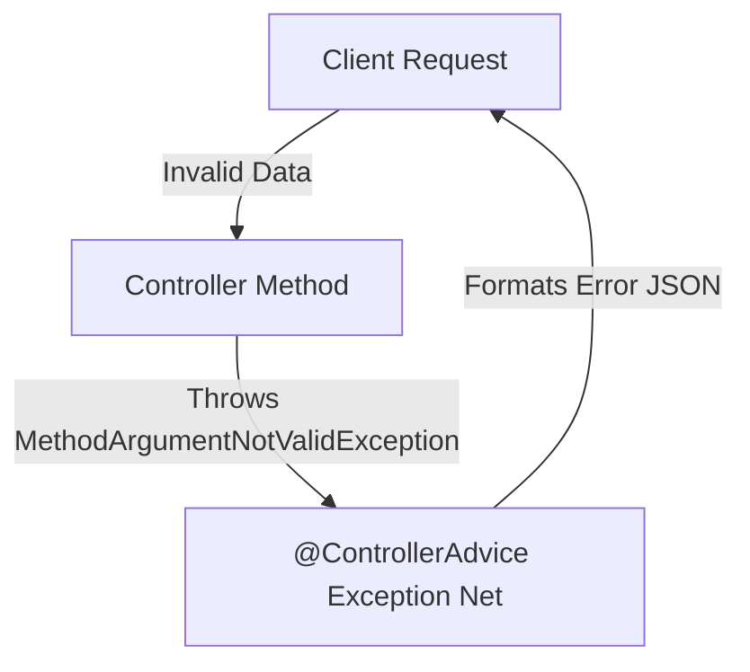

# 🛑 Topic 06: Global Exception Handling & Validation

Welcome back! In this chapter, we will learn how to handle errors and validate user input professionally. In production applications, you never want your API to crash or return a ugly system stack trace to the user. We will learn how to build an **Error Catching Net** using `@ControllerAdvice` and `@ExceptionHandler`, and how to inspect input parameters using standard validation stickers like `@NotNull` and `@Size`.

---

## 🏠 The Big Picture & Real-Life Example

### 🕵️ The Quality Inspector & The Cleanup Crew
Imagine a factory line making custom toy boxes:
1. **The Quality Inspector (Validation)**: Before a toy is shipped, an inspector reviews it. If the name is blank, or the price is a negative number, the inspector rejects it immediately and puts a warning label on it: *"Rejected! Name cannot be blank."* (This is what `@Valid` and validation annotations do).
2. **The Cleanup Crew (Global Exception Handler)**: Suppose something goes wrong in the factory and a conveyor belt breaks. Instead of letting the client see the broken gears and smoke, a cleanup crew (**`@ControllerAdvice`**) jumps in. They clean up the mess, put it in a clean box, and hand the client a polite apology card: *"Sorry, our machine broke. Please try again later."* (This is the JSON Error Response).

---

## 🔬 Let's Look Closer

### 1. Request Validation
We annotate our incoming data structures (DTOs) with validation annotations to enforce rules:
* **`@NotNull`**: Ensures the field is not null.
* **`@NotBlank`**: Ensures string fields are not null, not empty, and contain at least one non-whitespace character.
* **`@Size(min = X, max = Y)`**: Enforces length constraints on strings or lists.
* **`@Min(value)` / `@Max(value)`**: Enforces numeric boundaries.
* **`@Email`**: Validates proper email formats.

To trigger these rules, you must add the **`@Valid`** or `@Validated` annotation next to the `@RequestBody` parameter in your Controller!

### 2. Global Exception Handling
If an exception is thrown anywhere in your code (Controller, Service, or Repository), it propagates upwards. We intercept it globally:
* **`@ControllerAdvice`**: Marks a class as an interceptor for all controllers. Think of it as a global exception-handling net.
* **`@ExceptionHandler`**: Placed on top of methods inside the advice class to declare *which* specific exception that method handles (e.g., handling `ResourceNotFoundException`).



---

## 💻 Code Sandbox

Let's build a validated User registration API with custom global error mapping.

### 1. The Validated DTO: `UserDto.java`
```java
package com.example;

import javax.validation.constraints.Email;
import javax.validation.constraints.NotBlank;
import javax.validation.constraints.Size;

public class UserDto {

    @NotBlank(message = "Username must not be empty!")
    @Size(min = 3, max = 15, message = "Username must be between 3 and 15 characters.")
    private String username;

    @Email(message = "Invalid email format.")
    @NotBlank(message = "Email is required.")
    private String email;

    // Getters and Setters
    public String getUsername() { return username; }
    public void setUsername(String username) { this.username = username; }
    public String getEmail() { return email; }
    public void setEmail(String email) { this.email = email; }
}
```

### 2. The Custom Exception: `UserNotFoundException.java`
```java
package com.example;

public class UserNotFoundException extends RuntimeException {
    public UserNotFoundException(String message) {
        super(message);
    }
}
```

### 3. The Unified Error Response Model: `ErrorDetails.java`
```java
package com.example;

import java.time.LocalDateTime;

public class ErrorDetails {
    private LocalDateTime timestamp;
    private String message;
    private String details;

    public ErrorDetails(LocalDateTime timestamp, String message, String details) {
        this.timestamp = timestamp;
        this.message = message;
        this.details = details;
    }

    // Getters
    public LocalDateTime getTimestamp() { return timestamp; }
    public String getMessage() { return message; }
    public String getDetails() { return details; }
}
```

### 4. The Global Exception Handler: `GlobalExceptionHandler.java`
```java
package com.example;

import org.springframework.http.HttpStatus;
import org.springframework.http.ResponseEntity;
import org.springframework.validation.FieldError;
import org.springframework.web.bind.MethodArgumentNotValidException;
import org.springframework.web.bind.annotation.ControllerAdvice;
import org.springframework.web.bind.annotation.ExceptionHandler;
import org.springframework.web.context.request.WebRequest;

import java.time.LocalDateTime;
import java.util.HashMap;
import java.util.Map;

@ControllerAdvice // Scans globally for thrown exceptions
public class GlobalExceptionHandler {

    // 1. Handle Custom UserNotFoundException
    @ExceptionHandler(UserNotFoundException.class)
    public ResponseEntity<ErrorDetails> handleUserNotFound(UserNotFoundException ex, WebRequest request) {
        ErrorDetails error = new ErrorDetails(
                LocalDateTime.now(),
                ex.getMessage(),
                request.getDescription(false)
        );
        return new ResponseEntity<>(error, HttpStatus.NOT_FOUND); // HTTP 404
    }

    // 2. Handle Validation Failures (Validation errors throw MethodArgumentNotValidException)
    @ExceptionHandler(MethodArgumentNotValidException.class)
    public ResponseEntity<Map<String, String>> handleValidationErrors(MethodArgumentNotValidException ex) {
        Map<String, String> errors = new HashMap<>();
        
        // Loop through all field errors and extract message values
        ex.getBindingResult().getAllErrors().forEach((error) -> {
            String fieldName = ((FieldError) error).getField();
            String errorMessage = error.getDefaultMessage();
            errors.put(fieldName, errorMessage);
        });
        
        return new ResponseEntity<>(errors, HttpStatus.BAD_REQUEST); // HTTP 400
    }

    // 3. Global Fallback handler for all other exceptions
    @ExceptionHandler(Exception.class)
    public ResponseEntity<ErrorDetails> handleGlobalExceptions(Exception ex, WebRequest request) {
        ErrorDetails error = new ErrorDetails(
                LocalDateTime.now(),
                "An unexpected internal error occurred.",
                request.getDescription(false)
        );
        return new ResponseEntity<>(error, HttpStatus.INTERNAL_SERVER_ERROR); // HTTP 500
    }
}
```

### 5. The Controller: `UserController.java`
```java
package com.example;

import org.springframework.http.HttpStatus;
import org.springframework.http.ResponseEntity;
import org.springframework.web.bind.annotation.*;

import javax.validation.Valid;

@RestController
@RequestMapping("/api/users")
public class UserController {

    // POST /api/users
    @PostMapping
    public ResponseEntity<String> registerUser(@Valid @RequestBody UserDto userDto) {
        // If validation fails, Spring blocks execution before reaching this line
        return ResponseEntity.status(HttpStatus.CREATED).body("User registered successfully!");
    }

    // GET /api/users/99
    @GetMapping("/{id}")
    public ResponseEntity<UserDto> getUser(@PathVariable("id") int id) {
        if (id != 1) {
            // Trigger custom exception, which is caught by GlobalExceptionHandler
            throw new UserNotFoundException("User with ID " + id + " does not exist!");
        }
        UserDto mock = new UserDto();
        mock.setUsername("Alice");
        mock.setEmail("alice@gmail.com");
        return ResponseEntity.ok(mock);
    }
}
```

---

## 🧠 Points to Remember

* Validating data at the API controller layer (using annotations) protects your business services and database from garbage data.
* Validation annotations are part of **Jakarta Bean Validation** (formerly JSR 380). Spring Boot implements this using the **Hibernate Validator** engine.
* `@ControllerAdvice` uses AOP (Aspects) under the hood to intercept target controller return methods and wrap exceptions cleanly.
* Always return structured JSON objects (like `ErrorDetails`) on exceptions instead of raw text strings to maintain a consistent API contract.

---

## 📖 Key Definitions

* **Global Exception Handling**: An architecture pattern where all application errors are routed to a centralized controller class to format clean HTTP error responses.
* **ControllerAdvice**: A Spring component annotation used to write code that applies across all Controller classes (such as exception handlers or binding configuration).
* **ExceptionHandler**: A Spring annotation placed on a method inside a controller or advice class that registers it as a handler for specific exception types.
* **Bean Validation**: A Java standard specification defining metadata annotations to validate object constraint boundaries (like lengths, ranges, and formats).
* **Hibernate Validator**: The reference implementation of Jakarta Bean Validation, used by Spring Boot behind the scenes to process validation annotations.

---

## ❓ Interview Questions

### 🟢 Basic Questions (1-20)

1. **What is global exception handling in Spring Boot?**
   * *Answer*: It is a centralized system that intercepts exceptions thrown anywhere in your application and converts them into standardized HTTP responses.
2. **What does the `@ControllerAdvice` annotation do?**
   * *Answer*: It declares a class as a global interceptor that can intercept and process exceptions thrown by any Controller class in the application.
3. **What is the purpose of `@ExceptionHandler`?**
   * *Answer*: It specifies which exception type (like `NullPointerException` or custom exceptions) a method inside a `@ControllerAdvice` class should handle.
4. **How do you trigger bean validation on controller inputs?**
   * *Answer*: By adding the `@Valid` (or `@Validated`) annotation next to the target `@RequestBody` parameter in the controller method.
5. **Which dependency do you need for input validation in Spring Boot?**
   * *Answer*: The `spring-boot-starter-validation` dependency.
6. **What annotation ensures a string field is not null and has non-whitespace characters?**
   * *Answer*: **`@NotBlank`**.
7. **What is the difference between `@NotNull`, `@NotEmpty`, and `@NotBlank`?**
   * *Answer*: `@NotNull` validates that the field is not null. `@NotEmpty` ensures it's not null and its size/length is > 0. `@NotBlank` ensures it is not null, not empty, and contains at least one non-whitespace character.
8. **What exception is thrown when validation fails on a `@RequestBody` parameter?**
   * *Answer*: **`MethodArgumentNotValidException`**.
9. **What exception is thrown when validation fails on request parameters or path variables?**
   * *Answer*: **`ConstraintViolationException`**.
10. **How do you display custom error messages on validation failures?**
    * *Answer*: By setting the `message` attribute inside the annotation, e.g., `@Min(value = 18, message = "Must be 18 or older")`.
11. **What annotation validates that a field matches email format rules?**
    * *Answer*: **`@Email`**.
12. **What does the `@Size` annotation validate?**
    * *Answer*: It validates that the size of an annotated string, collection, array, or map is within the specified boundaries (`min` and `max`).
13. **How do you write a custom exception in Java?**
    * *Answer*: By creating a class that extends `RuntimeException` (for unchecked exceptions) or `Exception` (for checked exceptions).
14. **What is the default HTTP status returned when a controller throws an unhandled exception?**
    * *Answer*: **500 Internal Server Error**.
15. **What is the purpose of the `@ResponseStatus` annotation?**
    * *Answer*: It can be placed directly on a custom exception class to define what HTTP status code Spring should return when that exception is thrown.
16. **Why should we avoid returning raw stack traces in REST API responses?**
    * *Answer*: Because it exposes internal class names, database systems, and server structures, creating a major security risk.
17. **What does `@RestControllerAdvice` do?**
    * *Answer*: It combines `@ControllerAdvice` and `@ResponseBody`, ensuring that the exceptions handled return JSON responses directly.
18. **What does `@Pattern` validate?**
    * *Answer*: It validates that a string matches a specified Regular Expression (`regexp`).
19. **What annotation validates that a date is in the future?**
    * *Answer*: **`@Future`** (or `@FutureOrPresent`).
20. **Can you handle multiple exceptions in a single `@ExceptionHandler` method?**
    * *Answer*: Yes, by passing an array of classes: `@ExceptionHandler({NullPointerException.class, IllegalArgumentException.class})`.

### 🟡 Intermediate Questions (21-40)

21. **Explain the difference between `@Valid` and `@Validated`.**
    * *Answer*: `@Valid` is a standard JSR-303 validation trigger. `@Validated` is a Spring-specific annotation that supports validation grouping (validating specific fields in different phases) and class-level parameter validation.
22. **How does Spring handle custom error pages in MVC?**
    * *Answer*: Spring Boot looks for custom static pages (like `404.html`, `500.html`) under the `src/main/resources/templates/error/` folder to render on server errors.
23. **What is the role of `BindingResult` in validation?**
    * *Answer*: It is an object that stores the results of validation validations. If passed as a method parameter after `@Valid`, Spring will not throw an exception on validation failure; instead, you can query `BindingResult.hasErrors()` inside the method.
24. **How do you perform validation on path variables (like `@PathVariable @Min(1) Long id`)?**
    * *Answer*: You must annotate the controller class itself with `@Validated`. If validation fails, a `ConstraintViolationException` is thrown.
25. **How do you validate nested objects (e.g. User has an Address object)?**
    * *Answer*: By annotating the nested field (e.g., `private Address address;`) with `@Valid` inside the parent class, forcing the validator to walk down the nested fields.
26. **What is the purpose of custom constraint validators?**
    * *Answer*: To implement custom business-level validation logic (like verifying if a username is already taken in the database) by writing a class implementing `ConstraintValidator`.
27. **What is the difference between `@Past` and `@PastOrPresent`?**
    * *Answer*: `@Past` ensures a date is strictly in the past, while `@PastOrPresent` allows the date to be either in the past or equal to the current system date.
28. **Explain validation groups (`@Validated(OnCreate.class)`).**
    * *Answer*: A feature allowing you to group validation constraints. For example, during User creation, the password is `@NotBlank`, but during updates, the password can be null.
29. **What is `DefaultErrorAttributes` in Spring Boot?**
    * *Answer*: An internal helper bean that compiles the default key-value pairs (timestamp, status, error, path) returned inside the JSON error response on crashes.
30. **How can you customize default error fields without writing `@ControllerAdvice`?**
    * *Answer*: By declaring a bean that extends `DefaultErrorAttributes` and overriding its `getErrorAttributes` method.
31. **What is the purpose of `@AssertTrue` and `@AssertFalse`?**
    * *Answer*: They validate that a boolean field is strictly true or false (e.g., verifying if a user checked the "Terms and Conditions" box).
32. **How do you validate collection parameters (like a list of User DTOs)?**
    * *Answer*: By using `@Validated` at the controller class level, or wrapping the List in a custom wrapper object containing the List marked with `@Valid`.
33. **Explain how `MessageSource` fits with validation.**
    * *Answer*: It allows externalizing validation error messages into translation bundle files (e.g., `ValidationMessages.properties`) for internationalization (i18n).
34. **What is the difference between validation error 400 and business error 422?**
    * *Answer*: **400 Bad Request** indicates syntactically incorrect request layouts (missing fields, wrong JSON). **422 Unprocessable Entity** indicates valid JSON syntax but invalid business constraints (e.g., account balance insufficient).
35. **What does the `@Digits(integer = X, fraction = Y)` annotation validate?**
    * *Answer*: It validates that a numeric value has a maximum of `X` digits in the whole number part, and `Y` digits in the decimal part.
36. **How do you retrieve the exception class instance inside a `@ControllerAdvice` method?**
    * *Answer*: By declaring the target Exception type as a parameter in your handler method signature (e.g., `handleException(MyException ex)`).
37. **What is the order of exception matching inside `@ControllerAdvice`?**
    * *Answer*: Spring matches the closest exception type in the class hierarchy. If a method handles `UserNotFoundException` and another handles `RuntimeException`, throwing `UserNotFoundException` will trigger the specific one.
38. **Explain the purpose of `ResponseEntityExceptionHandler`.**
    * *Answer*: A convenient base class you can extend in your `@ControllerAdvice` class that provides default handlers for standard internal Spring MVC exceptions.
39. **What is the difference between `@Valid` and `@RequestBody` validation sequence?**
    * *Answer*: `@RequestBody` executes first, deserializing JSON into a Java object. If this succeeds, `@Valid` executes to check validation constraints.
40. **How can you test validation constraints in unit tests without starting Tomcat?**
    * *Answer*: By instantiating a `Validator` object manually using `Validation.buildDefaultValidatorFactory().getValidator()` and passing your DTO to it.

### 🔴 Advanced Questions (41-50)

41. **How does the JIT compiler optimize validation loop processing?**
    * *Answer*: Hibernate Validator compiles the annotation metadata into cached metadata descriptors at startup, enabling fast runtime verification loops without repeated reflection lookups.
42. **Explain the thread-safety of Validator instances in Spring Boot.**
    * *Answer*: The `LocalValidatorFactoryBean` provided by Spring is thread-safe and shared as a singleton. It delegates validations to the stateless Hibernate Validator engine, allowing simultaneous processing.
43. **How would you write a custom annotation `@UniqueUsername` that checks a database?**
    * *Answer*: (1) Create annotation `@Constraint(validatedBy = UniqueUsernameValidator.class)`. (2) Write `UniqueUsernameValidator` implementing `ConstraintValidator` and autowire your `UserRepository` inside it to execute a lookup query.
44. **What is the role of `HandlerExceptionResolver` in Spring MVC?**
    * *Answer*: An interface implemented by classes that resolve exceptions thrown during handler execution (e.g., `ExceptionHandlerExceptionResolver` handles `@ExceptionHandler` annotations).
45. **How does Spring Boot route exceptions that occur before reaching DispatcherServlet (e.g., in Filter chains)?**
    * *Answer*: Exceptions in filters bypass Spring MVC and are handled directly by the servlet container (Tomcat), which routes them to the `/error` path managed by Spring Boot's `BasicErrorController`.
46. **What is the purpose of `@JsonView` integration with validation?**
    * *Answer*: It allows validating only specific fields matching a JSON View. If a view is active, only the fields visible in that view are validated by the engine.
47. **How does `@Validated` resolve method-level parameter constraints on interfaces?**
    * *Answer*: Spring uses dynamic JDK Proxies to intercept interface method invocations, validating parameters using `MethodValidationPostProcessor` before delegating to class implementations.
48. **Explain the performance cost of throwing custom exceptions for normal flow control.**
    * *Answer*: Generating exception instances involves capturing the CPU call stack trace, which is a slow memory operation. Developers should use standard return models or Optional for anticipated flows.
49. **How would you handle `HttpMessageNotReadableException` inside `@ControllerAdvice`?**
    * *Answer*: Override it or declare `@ExceptionHandler(HttpMessageNotReadableException.class)` to return a clean error message like "Malformed JSON payload" instead of letting the default spring message print.
50. **How can you dynamically localized validation error messages based on the client's `Accept-Language` HTTP header?**
    * *Answer*: Spring's validation engine automatically reads the active `Locale` from `LocaleContextHolder` (populated from `Accept-Language`), and resolves the messages from localized properties files (e.g., `messages_es.properties`).

---

## ⏭️ Next Steps

* **Previous Chapter**: [👈 Topic 05: Building REST APIs with MVC](05_rest_api_mvc.md)
* **Next Chapter**: [👉 Topic 07: Spring Data JPA & Hibernate](07_spring_data_jpa.md)
* **Roadmap Index**: [🏠 Back to Roadmap](README.md)
