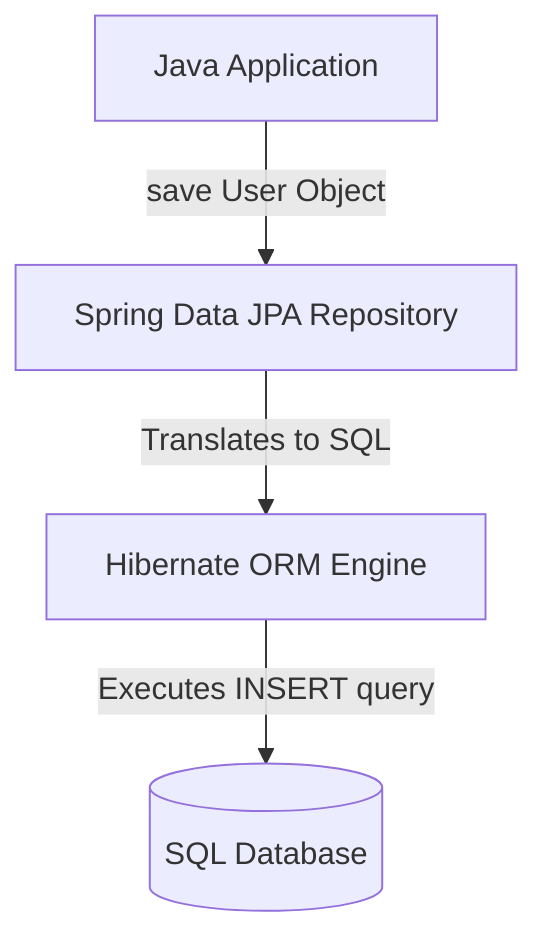

# 🗃️ Topic 07: Spring Data JPA & Hibernate

Welcome back, data architect! In this chapter, we will learn about **Object-Relational Mapping (ORM)** using **Spring Data JPA** and **Hibernate**. In enterprise systems, data is stored in SQL database tables. However, in Java, we work with objects. We will learn how Spring Data JPA acts as a dynamic translator that connects your Java classes to database tables without writing tedious SQL queries.

---

## 🏠 The Big Picture & Real-Life Example

### 🗺️ The Translator (JPA & Hibernate)
Imagine you are writing a catalog of books in English (Java Objects):
* **Your Database** is a librarian who only speaks Japanese (SQL Database Tables).
* **Without a Translator**: Every time you want to save a book, you have to find a dictionary, translate the book title, author, and price into Japanese SQL commands (`INSERT INTO books VALUES ...`), and shout it to the librarian.
* **With a Translator (ORM/Hibernate)**: You hire a bilingual assistant. You just hand them your English book object (`repository.save(book)`), and they automatically translate it and write it down in the Japanese SQL ledger. 

Spring Data JPA is the assistant, and Hibernate is the actual translating engine!

---

## 🔬 Let's Look Closer

### 1. Core Concepts
* **ORM (Object-Relational Mapping)**: The technique of mapping database tables to Java classes.
* **JPA (Jakarta Persistence API)**: The standard specification (a set of guidelines and rules) for ORM in Java.
* **Hibernate**: A framework that implements the JPA specifications (the actual engine that does the heavy translation work).
* **Spring Data JPA**: An abstraction layer on top of Hibernate. It eliminates boilerplate code by generating SQL queries automatically from method signatures (like `findByEmail`).

### 2. Entity Mapping Annotations
To mark a class as a database table, we use annotations:
* **`@Entity`**: Marks the class as a database entity table.
* **`@Table(name = "users")`**: Specifies the name of the database table.
* **`@Id`**: Marks the primary key field.
* **`@GeneratedValue`**: Configures how the primary key value is generated (e.g., auto-incrementing integers using `GenerationType.IDENTITY`).
* **`@Column`**: Maps a field to a specific database column name.

### 3. JpaRepository
By creating an interface that extends `JpaRepository<Entity, ID_Type>`, Spring automatically provides standard CRUD operations (Create, Read, Update, Delete) like `save()`, `findById()`, `findAll()`, and `deleteById()`. You don't even have to write the implementation class!



---

## 💻 Code Sandbox

Let's build a database-connected Product inventory.

### 1. The Entity Model: `Product.java`
```java
package com.example;

import javax.persistence.*;

@Entity // Registers class as a database table
@Table(name = "products") // Maps to database table "products"
public class Product {

    @Id // Primary Key
    @GeneratedValue(strategy = GenerationType.IDENTITY) // Auto-increment (1, 2, 3...)
    private Long id;

    @Column(name = "product_name", nullable = false, length = 100)
    private String name;

    private double price;

    // Constructors
    public Product() {}

    public Product(String name, double price) {
        this.name = name;
        this.price = price;
    }

    // Getters and Setters
    public Long getId() { return id; }
    public void setId(Long id) { this.id = id; }
    public String getName() { return name; }
    public void setName(String name) { this.name = name; }
    public double getPrice() { return price; }
    public void setPrice(double price) { this.price = price; }
}
```

### 2. The Repository Interface: `ProductRepository.java`
```java
package com.example;

import org.springframework.data.jpa.repository.JpaRepository;
import org.springframework.data.jpa.repository.Query;
import org.springframework.data.repository.query.Param;
import org.springframework.stereotype.Repository;

import java.util.List;

@Repository
public interface ProductRepository extends JpaRepository<Product, Long> {

    // 1. Finder Query (Spring generates SQL based on method name!)
    // SQL: SELECT * FROM products WHERE product_name = ?
    List<Product> findByName(String name);

    // 2. Custom JPQL Query (Query using Class names instead of Table names)
    @Query("SELECT p FROM Product p WHERE p.price > :minPrice")
    List<Product> findProductsExpensiverThan(@Param("minPrice") double minPrice);
}
```

### 3. The Service: `ProductService.java`
```java
package com.example;

import org.springframework.beans.factory.annotation.Autowired;
import org.springframework.stereotype.Service;

import java.util.List;

@Service
public class ProductService {

    private final ProductRepository productRepository;

    @Autowired
    public ProductService(ProductRepository productRepository) {
        this.productRepository = productRepository;
    }

    public void manageInventory() {
        // Save entities
        productRepository.save(new Product("Smartphone", 699.99));
        productRepository.save(new Product("Laptop", 1299.99));
        productRepository.save(new Product("Headphones", 99.99));

        // Find by name
        List<Product> laptops = productRepository.findByName("Laptop");
        laptops.forEach(p -> System.out.println("Found Laptop ID: " + p.getId()));

        // Run custom query
        List<Product> expensive = productRepository.findProductsExpensiverThan(500.0);
        System.out.println("Expensive Products count: " + expensive.size());
    }
}
```

---

## 🧠 Points to Remember

* **JPA** is the contract (interfaces), while **Hibernate** is the implementation (classes).
* **JPQL (Java Persistence Query Language)** queries target your Java Entity classes and properties (e.g. `Product p`), not the SQL database tables and columns (e.g. `products`).
* Always include a **no-argument constructor** in your Entity classes. Hibernate requires it to instantiate objects using reflection.
* Avoid using raw native SQL queries unless you need to execute complex database-specific optimizations. Native queries couple your code to a specific database engine (e.g., MySQL or Oracle).

---

## 📖 Key Definitions

* **Jakarta Persistence API (JPA)**: The standard Java specification that defines how to map Java objects to relational database tables and manage persistent data.
* **Hibernate**: An open-source Object-Relational Mapping (ORM) framework that implements the JPA specifications to handle SQL translation under the hood.
* **Spring Data JPA**: A framework that simplifies data persistence in Spring applications by generating repository query implementations dynamically from interface methods.
* **Entity**: A lightweight, persistent Java domain object mapped to a relational database table.
* **JPQL (Java Persistence Query Language)**: A platform-independent, object-oriented query language used to query entities in a JPA-compliant database.

---

## ❓ Interview Questions

### 🟢 Basic Questions (1-20)

1. **What is ORM?**
   * *Answer*: ORM stands for Object-Relational Mapping. It is a programming technique used to map Java classes to relational database tables, letting developers interact with databases using objects instead of raw SQL strings.
2. **What is the difference between JPA and Hibernate?**
   * *Answer*: JPA is a specification (a set of rules and interfaces), whereas Hibernate is the implementation framework that actually executes the mapping and runs SQL queries.
3. **What is Spring Data JPA?**
   * *Answer*: It is an abstraction layer that sits on top of JPA/Hibernate to provide repository interfaces, eliminating database boilerplate code.
4. **What does the `@Entity` annotation do?**
   * *Answer*: It tells the JPA provider (like Hibernate) that the annotated class represents a database table.
5. **Why do JPA entities require a no-argument constructor?**
   * *Answer*: Because Hibernate uses Java Reflection to instantiate the entity object first before setting properties, which requires a default constructor.
6. **What is the purpose of `@Table` annotation?**
   * *Answer*: It allows customization of the database table details, such as changing the table name from the default class name.
7. **What is `@Id` used for?**
   * *Answer*: It designates a specific field in the Entity class as the primary key of the database table.
8. **What does `@GeneratedValue(strategy = GenerationType.IDENTITY)` mean?**
   * *Answer*: It indicates that the database should automatically assign and increment the primary key value (e.g., using auto-increment columns).
9. **What does the `save()` method in JpaRepository do?**
   * *Answer*: It saves the entity to the database. If the entity has no ID, it executes an `INSERT` statement. If it has an ID, it executes an `UPDATE` statement.
10. **How do you delete a record using JpaRepository?**
    * *Answer*: By calling `deleteById(id)` or `delete(entity)` methods provided by the interface.
11. **What is the difference between `@Column(nullable = false)` and `@NotNull`?**
    * *Answer*: `@Column(nullable = false)` is a database DDL constraint (creates a `NOT NULL` table column). `@NotNull` is a Java bean validation check that runs before the query reaches the database.
12. **How does Spring Data JPA generate queries from method names?**
    * *Answer*: It parses query keywords in the method signature (like `find`, `by`, `And`, `Or`, `Containing`) and builds matching JPQL queries automatically.
13. **What is JPQL?**
    * *Answer*: Java Persistence Query Language. It is a query language similar to SQL, but it queries Java entities and variables instead of database tables and columns.
14. **How do you write custom native SQL queries in JpaRepository?**
    * *Answer*: By using the `@Query` annotation and setting the attribute `nativeQuery = true`.
15. **What is the primary benefit of using JpaRepository over CrudRepository?**
    * *Answer*: `JpaRepository` extends `PagingAndSortingRepository` and `QueryByExampleExecutor`, providing pagination, sorting, and batch flushing capabilities.
16. **How do you define a property as unique in an Entity?**
    * *Answer*: By annotating the field with `@Column(unique = true)`.
17. **What is the `@Transient` annotation used for?**
    * *Answer*: It tells JPA to ignore the annotated field, ensuring it is not saved or read from the database columns.
18. **How does Hibernate know which database dialect to use?**
    * *Answer*: You configure it in application properties using `spring.jpa.properties.hibernate.dialect`, which translates JPQL into the specific SQL syntax of your database (e.g., MySQL, Postgres).
19. **What does `@Temporal` do?**
    * *Answer*: It is used in older Java versions to map raw Date types to database Date, Time, or Timestamp formats (not needed if using modern Java 8 time classes like `LocalDate`).
20. **What is the default naming strategy for database tables in Spring Boot?**
    * *Answer*: Spring Boot converts camelCase Java class names to snake_case table names (e.g., `UserDetails` class maps to `user_details` table).

### 🟡 Intermediate Questions (21-40)

21. **What is the Persistence Context in JPA?**
    * *Answer*: It is an in-memory cache (First-Level Cache) managed by the EntityManager that tracks all active entities retrieved or saved during a database transaction.
22. **Explain the four states of an Entity lifecycle in JPA.**
    * *Answer*: **New (Transient)**: Created but not linked to database. **Managed**: Monitored by the persistence context. **Detached**: Class exists in code but is no longer managed. **Removed**: Marked for deletion from the database.
23. **What is the difference between `findById()` and `getById()` (or `getReferenceById()`)?**
    * *Answer*: `findById()` executes an eager database query immediately and returns an Optional. `getReferenceById()` returns a lazy proxy object without querying the database until you access the object properties, saving database load.
24. **How do you configure database pagination in Spring Data JPA?**
    * *Answer*: By passing a `Pageable` object (created using `PageRequest.of(page, size)`) into your repository query method, which returns a `Page<Entity>` response.
25. **What is the difference between JPQL and Native SQL?**
    * *Answer*: JPQL queries Java classes and fields, keeping queries database-independent. Native SQL queries raw tables and columns directly, which binds code to specific database architectures.
26. **What is the purpose of the `@Modifying` annotation?**
    * *Answer*: It is placed on top of `@Query` methods that execute updates or deletes (`UPDATE` or `DELETE` SQL commands), instructing Spring to clear the persistence cache after execution.
27. **What is Dirty Checking in Hibernate?**
    * *Answer*: An automated process where Hibernate compares managed entity states with their initial loaded states. If it detects changes, it automatically executes `UPDATE` queries during transaction commit without you calling `save()`.
28. **How do you write custom sorting in Spring Data JPA?**
    * *Answer*: By passing a `Sort` object (e.g., `Sort.by("price").descending()`) as a parameter inside your repository method.
29. **What is the role of `EntityManager` in JPA?**
    * *Answer*: It is the core interface of the JPA specification, responsible for managing the persistence context, creating queries, and persisting entity states.
30. **Explain `@Query("SELECT u FROM User u WHERE u.name = :name")` syntax.**
    * *Answer*: It is a JPQL query that binds the method parameter marked with `@Param("name")` to the `:name` placeholder in the query dynamically.
31. **What are the primary generator strategies for `@GeneratedValue`?**
    * *Answer*: `IDENTITY` (database auto-increment), `SEQUENCE` (uses database sequences), `TABLE` (uses a helper table), and `AUTO` (default selection based on database capability).
32. **What is the purpose of `@DynamicUpdate` annotation on entities?**
    * *Answer*: It instructs Hibernate to generate SQL UPDATE statements containing only modified columns, rather than updating all columns every time, improving performance on wide tables.
33. **Explain First-Level Cache in Hibernate.**
    * *Answer*: It is a built-in session-level cache. During a transaction, retrieving the same entity multiple times will return the cached object from memory instead of executing duplicate SQL database queries.
34. **What is Second-Level Cache in Hibernate?**
    * *Answer*: A shared, application-level cache that persists across multiple database sessions (often integrated with third-party providers like Ehcache or Redis).
35. **What is the difference between `flush()` and `commit()`?**
    * *Answer*: `flush()` synchronizes in-memory entity changes to the database (sends SQL commands but doesn't commit). `commit()` completes the transaction, permanently saving the database changes.
36. **Explain the purpose of the `spring.jpa.hibernate.ddl-auto` property.**
    * *Answer*: It configures database schema generation: `none` (no action), `validate` (verifies structure), `update` (updates tables), `create` (drops and rebuilds), and `create-drop` (rebuilds at start and drops at shutdown).
37. **Which values of `ddl-auto` should never be used in production?**
    * *Answer*: `create`, `create-drop`, and `update` should never be used in production because they can modify or delete real live databases. Use `validate` or `none`.
38. **How do you execute count queries using method names?**
    * *Answer*: By starting the method name with `countBy`, e.g., `long countByStatus(String status)`.
39. **What is the purpose of `@Lob` annotation?**
    * *Answer*: It designates a field to be stored as a Large Object (CLOB for long texts, BLOB for binary arrays) in database tables.
40. **How do you map custom Enum types to database columns?**
    * *Answer*: By annotating the Enum field with `@Enumerated(EnumType.STRING)` (saves Enum as string names) or `@Enumerated(EnumType.ORDINAL)` (saves Enum as numeric indexes).

### 🔴 Advanced Questions (41-50)

41. **Explain the N+1 Query Problem in ORMs and how to detect it.**
    * *Answer*: It happens when you query a list of entities (1 query) and then access a lazy-loaded relationship field for each entity, causing N additional queries to be executed. It can be detected by monitoring SQL logs.
42. **How does a Join Fetch (`JOIN FETCH` in JPQL) solve the N+1 query problem?**
    * *Answer*: By executing an inner or outer join in a single SQL query: `@Query("SELECT u FROM User u JOIN FETCH u.addresses")`. This eager-loads the related entities immediately, preventing subsequent queries.
43. **What is the difference between Optimistic Locking and Pessimistic Locking?**
    * *Answer*: **Optimistic Locking** uses a version column (`@Version`) to check if another transaction modified the data before committing. **Pessimistic Locking** uses database-level locks (`SELECT ... FOR UPDATE`) to lock rows, blocking other transactions until it finishes.
44. **How does CGLIB subclassing affect entity lazy loading?**
    * *Answer*: Hibernate uses CGLIB to generate proxy objects for lazy relations. When you call getter methods on these proxies, they intercept the call and execute database queries to load the real state.
45. **What is the role of `Session` in Hibernate architecture?**
    * *Answer*: `Session` is Hibernate's implementation of the JPA `EntityManager` interface, acting as the main interface to manage database transactions and queries.
46. **Explain Entity Graphs (`@EntityGraph`) in Spring Data JPA.**
    * *Answer*: A feature that allows configuring different eager/lazy fetching profiles for query methods dynamically, avoiding creating multiple custom JPQL fetch queries.
47. **How does Hibernate generate IDs using the `SEQUENCE` strategy efficiently?**
    * *Answer*: By using the **pooled-lo optimizer** or buying IDs in batches (allocation size), reducing network roundtrips to request new sequence numbers.
48. **Explain the purpose of `PersistenceUnit`.**
    * *Answer*: A configuration grouping that defines all entity classes, datasource properties, and Hibernate settings managed by an `EntityManagerFactory`.
49. **How would you audit database table audits (e.g. tracking created_at / updated_at)?**
    * *Answer*: By enabling Spring Data JPA auditing using `@EnableJpaAuditing` and marking entity fields with annotations like `@CreatedDate` and `@LastModifiedBy`.
50. **How do you implement soft deletes (marking as deleted instead of deleting rows) in JPA?**
    * *Answer*: By annotating the Entity class with `@SQLDelete(sql = "UPDATE my_table SET deleted = true WHERE id = ?")` and `@Where(clause = "deleted = false")`.

---

## ⏭️ Next Steps

* **Previous Chapter**: [👈 Topic 06: Global Exception Handling & Validation](06_exception_handling_validation.md)
* **Next Chapter**: [👉 Topic 08: Database Relationships & Transactions](08_relationships_transactions.md)
* **Roadmap Index**: [🏠 Back to Roadmap](README.md)
