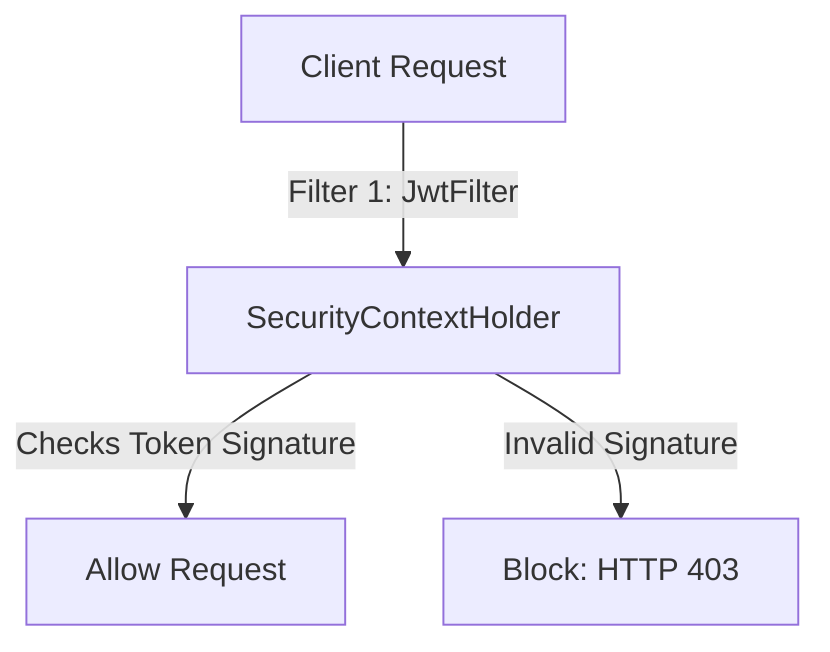

# 🔑 Topic 10: Spring Security & JWT Authentication

Welcome back, security officer! In this chapter, we will learn how to protect our applications using **Spring Security** and **JWT (JSON Web Tokens)**. In the modern web, APIs must be secure. We will learn how to set up user authentication, hash passwords using **BCrypt**, and build a **Stateless JWT Security System** so your server doesn't need to save session data in memory.

---

## 🏠 The Big Picture & Real-Life Example

### 🛂 The Secure Office Building (Stateless JWT Authentication)
Imagine you work in a high-security office building:
* **Session-Based Security (Visitor Pass)**: Every time you walk in, you log your name at the front desk. They give you a badge and write your name in a giant ledger. The security guards must keep checking the ledger to see if your session is still active. If the ledger is lost (server restart), everyone is kicked out!
* **JWT Security (The Signed Passport)**: 
  1. The first time you show up, you prove who you are (username/password).
  2. The front desk prints a special card for you containing your name and permissions, stamped with a **cryptographic seal** (signature) using a secret stamp only the building owner has.
  3. Every time you enter a room, you show the card. The guards don't check a ledger. They just inspect the seal to see if it is authentic and check the expiration date. If it is valid, you enter!

The card you carry is the **JWT Token**, and this architecture is **Stateless** because the building doesn't need a ledger (server memory) to track you!

---

## 🔬 Let's Look Closer

### 1. Spring Security Architecture
Spring Security is built on a chain of **Servlet Filters** (the Security Filter Chain). These filters intercept incoming HTTP requests, verify credentials, extract user authorities, and either allow the request or block it (returning a `401 Unauthorized` or `403 Forbidden` status).

### 2. What is a JWT (JSON Web Token)?
A JWT is a string divided into three parts separated by periods (`.`):
1. **Header**: Contains the algorithm used (e.g. HS256) and token type.
2. **Payload**: Contains the user data (called **Claims**), like username and expiration time.
3. **Signature**: A hash generated by combining the encoded header, payload, and a secret key. This prevents tampering.



---

## 💻 Code Sandbox

Let's write a simplified, complete Stateless JWT filter and configuration setup.

### 1. The JWT Utility Class: `JwtUtil.java`
```java
package com.example;

import io.jsonwebtoken.Claims;
import io.jsonwebtoken.Jwts;
import io.jsonwebtoken.SignatureAlgorithm;
import org.springframework.stereotype.Component;

import java.util.Date;

@Component
public class JwtUtil {

    private final String SECRET_KEY = "mySuperSecretKeyForSpringSecurityApplicationClassOnly";

    // 1. Generate Token
    public String generateToken(String username) {
        return Jwts.builder()
                .setSubject(username)
                .setIssuedAt(new Date(System.currentTimeMillis()))
                .setExpiration(new Date(System.currentTimeMillis() + 1000 * 60 * 60)) // 1 Hour
                .signWith(SignatureAlgorithm.HS256, SECRET_KEY)
                .compact();
    }

    // 2. Extract Username
    public String extractUsername(String token) {
        return extractClaims(token).getSubject();
    }

    // 3. Check Expiration
    public boolean isTokenExpired(String token) {
        return extractClaims(token).getExpiration().before(new Date());
    }

    private Claims extractClaims(String token) {
        return Jwts.parser()
                .setSigningKey(SECRET_KEY)
                .parseClaimsJws(token)
                .getBody();
    }
}
```

### 2. The Custom JWT Filter: `JwtFilter.java`
```java
package com.example;

import org.springframework.beans.factory.annotation.Autowired;
import org.springframework.security.authentication.UsernamePasswordAuthenticationToken;
import org.springframework.security.core.context.SecurityContextHolder;
import org.springframework.stereotype.Component;
import org.springframework.web.filter.OncePerRequestFilter;

import javax.servlet.FilterChain;
import javax.servlet.ServletException;
import javax.servlet.http.HttpServletRequest;
import javax.servlet.http.HttpServletResponse;
import java.io.IOException;
import java.util.ArrayList;

@Component
public class JwtFilter extends OncePerRequestFilter {

    private final JwtUtil jwtUtil;

    @Autowired
    public JwtFilter(JwtUtil jwtUtil) {
        this.jwtUtil = jwtUtil;
    }

    @Override
    protected void doFilterInternal(HttpServletRequest request, HttpServletResponse response, FilterChain filterChain)
            throws ServletException, IOException {

        // 1. Extract Authorization Header
        String authHeader = request.getHeader("Authorization");
        String username = null;
        String token = null;

        // JWT is always prefixed with "Bearer "
        if (authHeader != null && authHeader.startsWith("Bearer ")) {
            token = authHeader.substring(7);
            username = jwtUtil.extractUsername(token);
        }

        // 2. Validate token and set security context
        if (username != null && SecurityContextHolder.getContext().getAuthentication() == null) {
            if (!jwtUtil.isTokenExpired(token)) {
                // Token is valid! Create authentication badge
                UsernamePasswordAuthenticationToken authentication = 
                        new UsernamePasswordAuthenticationToken(username, null, new ArrayList<>());
                
                // Inject the badge into Spring Security context
                SecurityContextHolder.getContext().setAuthentication(authentication);
            }
        }

        // 3. Move to next filter in the chain
        filterChain.doFilter(request, response);
    }
}
```

### 3. Spring Security Configuration: `SecurityConfig.java`
```java
package com.example;

import org.springframework.beans.factory.annotation.Autowired;
import org.springframework.context.annotation.Bean;
import org.springframework.context.annotation.Configuration;
import org.springframework.security.config.annotation.web.builders.HttpSecurity;
import org.springframework.security.config.annotation.web.configuration.EnableWebSecurity;
import org.springframework.security.config.http.SessionCreationPolicy;
import org.springframework.security.crypto.bcrypt.BCryptPasswordEncoder;
import org.springframework.security.crypto.password.PasswordEncoder;
import org.springframework.security.web.SecurityFilterChain;
import org.springframework.security.web.authentication.UsernamePasswordAuthenticationFilter;

@Configuration
@EnableWebSecurity
public class SecurityConfig {

    private final JwtFilter jwtFilter;

    @Autowired
    public SecurityConfig(JwtFilter jwtFilter) {
        this.jwtFilter = jwtFilter;
    }

    @Bean
    public PasswordEncoder passwordEncoder() {
        return new BCryptPasswordEncoder(); // Hashing algorithm for user passwords
    }

    @Bean
    public SecurityFilterChain filterChain(HttpSecurity http) throws Exception {
        http.csrf().disable() // Disable CSRF since we use stateless JWT
            .authorizeRequests()
            .antMatchers("/api/auth/**").permitAll() // Allow public access to login/register
            .anyRequest().authenticated() // Block everything else
            .and()
            .sessionManagement()
            .sessionCreationPolicy(SessionCreationPolicy.STATELESS); // No HTTP Session!

        // Inject our custom JWT filter before the standard username/password filter
        http.addFilterBefore(jwtFilter, UsernamePasswordAuthenticationFilter.class);

        return http.build();
    }
}
```

---

## 🧠 Points to Remember

* **Spring Security** is completely based on standard servlet filters. It intercepts requests before they ever reach your `@RestController` classes.
* **BCrypt** uses a random salt internally. Even if two users use the exact same password, their resulting hashed strings will look completely different!
* A **Stateless** application scale easily because any server in a cluster can validate a JWT token without needing a shared session database.
* Keep your **JWT Secret Key** safe! Anyone who gets access to it can generate valid admin tokens and hack your application.

---

## 📖 Key Definitions

* **Spring Security**: A powerful framework that handles authentication, authorization, and protection against common exploits in Java applications.
* **JWT (JSON Web Token)**: An open standard (RFC 7519) that defines a compact, URL-safe container for carrying secure claims between parties.
* **BCrypt**: A cryptographic password hashing function based on the Blowfish cipher that incorporates salt to protect against rainbow table attacks.
* **Stateless Authentication**: An authentication pattern where no user session state is saved on the server; the client sends a token with every request.
* **SecurityContextHolder**: The central location in Spring Security where details of the currently authenticated user are stored.

---

## ❓ Interview Questions

### 🟢 Basic Questions (1-20)

1. **What is Spring Security?**
   * *Answer*: Spring Security is a framework that provides authentication, authorization, and protection against security vulnerabilities like CSRF and session hijacking.
2. **What is Authentication?**
   * *Answer*: The process of verifying *who* a user is (e.g. checking their username and password).
3. **What is Authorization?**
   * *Answer*: The process of verifying *what* a user is allowed to do (e.g. checking if they have ADMIN privileges).
4. **What does the `@EnableWebSecurity` annotation do?**
   * *Answer*: It activates Spring Security's web security support and integrates it into the application context.
5. **What is a JWT?**
   * *Answer*: A JSON Web Token. It is a compact, stateless string token used to securely transfer claims (user data) between a client and a server.
6. **Name the three components of a JWT token.**
   * *Answer*: **Header**, **Payload**, and **Signature**.
7. **What separates the three parts of a JWT token?**
   * *Answer*: Periods or dots (`.`).
8. **What is BCrypt?**
   * *Answer*: A secure, one-way password hashing algorithm used to securely store passwords in database systems.
9. **Why is `System.out.println` dangerous to use for passwords?**
   * *Answer*: Because it writes raw passwords into console log files, making them readable by system operators and hackers.
10. **What is Stateless Security?**
    * *Answer*: A design pattern where the server does not store user session data. Every incoming request must contain a validation token (like JWT).
11. **What is the default password encoder in Spring Security?**
    * *Answer*: Modern Spring Security recommends the **`BCryptPasswordEncoder`**.
12. **What is the purpose of `UserDetailsService` interface?**
    * *Answer*: It is used to load user-specific details (username, password, roles) from a database during authentication.
13. **What is the `UserDetails` interface?**
    * *Answer*: An interface that wraps a user object to provide security details to Spring Security (such as account status, password, and authorities).
14. **What does the `SecurityContextHolder` do?**
    * *Answer*: It acts as the central storage location containing the `SecurityContext` of the currently authenticated user.
15. **What is the difference between `401 Unauthorized` and `403 Forbidden`?**
    * *Answer*: **401 Unauthorized** means the user is not authenticated (their identity is unknown). **403 Forbidden** means the identity is known, but they do not have permissions to access the resource.
16. **What is CSRF (Cross-Site Request Forgery)?**
    * *Answer*: A web attack where a malicious site tricks a user's browser into performing unauthorized actions on another site where the user is logged in.
17. **Why can we safely disable CSRF in a stateless JWT application?**
    * *Answer*: Because CSRF relies on browsers automatically sending session cookies. Since JWT tokens are typically stored in local storage and sent in custom HTTP headers, they are immune to CSRF.
18. **What is the `SecurityFilterChain`?**
    * *Answer*: A collection of Servlet filters that process incoming HTTP requests to apply authentication and authorization checks.
19. **How do you authorize public endpoints in Spring Security?**
    * *Answer*: By calling `.antMatchers("/public/**").permitAll()` in the `SecurityFilterChain` bean.
20. **What is the difference between `@Secured` and `@PreAuthorize`?**
    * *Answer*: `@Secured` is a basic role-checking annotation. `@PreAuthorize` is a modern annotation that supports SpEL expressions (e.g. `@PreAuthorize("hasRole('ADMIN') or #id == principal.id")`).

### 🟡 Intermediate Questions (21-40)

21. **Explain the JWT Signature generation process.**
    * *Answer*: The signature is created by Base64Url-encoding the header and payload, joining them with a dot, and hashing them using a secret key and a specific algorithm (like HMAC SHA256).
22. **Can a client decrypt and read the payload of a JWT token?**
    * *Answer*: Yes. The header and payload are only Base64Url-encoded, not encrypted. Anyone can decode them. You should never put sensitive data (like passwords) inside the JWT payload.
23. **What is the purpose of a Salt in password hashing?**
    * *Answer*: A salt is a random string added to the password before hashing. This ensures that identical passwords yield different hashes, preventing hackers from using lookup tables (rainbow tables) to crack them.
24. **Explain how `AuthenticationManager` fits in Spring Security.**
    * *Answer*: It is the central API responsible for processing authentication requests. It delegates the actual verification to one or more `AuthenticationProvider` instances.
25. **What is the role of `DaoAuthenticationProvider`?**
    * *Answer*: An `AuthenticationProvider` implementation that retrieves user details from a `UserDetailsService` and compares passwords using a `PasswordEncoder`.
26. **What is Session Fixation protection?**
    * *Answer*: A security feature where Spring Security automatically invalidates the user's session ID and creates a new one upon login to prevent session hijacking.
27. **Explain the purpose of `OncePerRequestFilter` in JWT implementation.**
    * *Answer*: It is a base filter class guaranteeing that the filter's `doFilterInternal` method executes exactly once per HTTP request, preventing duplicate execution during dispatch routing.
28. **How do you extract the currently logged-in user's details programmatically?**
    * *Answer*: By calling `SecurityContextHolder.getContext().getAuthentication().getPrincipal()`.
29. **What are Granted Authorities in Spring Security?**
    * *Answer*: A collection of permissions or roles (e.g. `ROLE_ADMIN`) assigned to a user, which are checked during authorization filters.
30. **What is CORS, and why is it configured with Spring Security?**
    * *Answer*: Cross-Origin Resource Sharing is a browser security mechanism. It must be integrated with Spring Security to allow frontend applications on different origins to pass Authorization headers.
31. **Explain the difference between `hasRole('ADMIN')` and `hasAuthority('ROLE_ADMIN')`.**
    * *Answer*: They are functionally identical. `hasRole` automatically appends the prefix `ROLE_` to the checked string, whereas `hasAuthority` checks the exact string directly.
32. **What does `@PostAuthorize` do?**
    * *Answer*: It executes the method first, and then evaluates the authorization constraint against the method's returned value, throwing an access denied exception if false.
33. **Explain the purpose of standard `UsernamePasswordAuthenticationFilter`.**
    * *Answer*: A built-in filter that intercepts POST requests sent to `/login` and attempts to authenticate the user using the submitted username and password parameters.
34. **How do you handle AccessDeniedException globally using a ControllerAdvice?**
    * *Answer*: You cannot handle Spring Security exceptions in `@ControllerAdvice` by default because security filters run *before* the request reaches the DispatcherServlet. You must configure an `AccessDeniedHandler`.
35. **What is the role of `AuthenticationEntryPoint`?**
    * *Answer*: An interface used to send an HTTP response (typically 401 Unauthorized) when an unauthenticated user attempts to access a protected resource.
36. **Explain how to enable method security in Spring Boot.**
    * *Answer*: By adding the annotation `@EnableMethodSecurity` (or `@EnableGlobalMethodSecurity` in older versions) on a configuration class.
37. **What is a Refresh Token in JWT authentication?**
    * *Answer*: A long-lived token stored securely (often in a HttpOnly cookie) used to request new short-lived Access Tokens without making the user log in again.
38. **Explain the security risk of storing JWT tokens in local storage.**
    * *Answer*: Local storage is accessible by JavaScript. If the site is vulnerable to Cross-Site Scripting (XSS), a hacker can write code to steal the token.
39. **How do you configure password strength requirements in BCrypt?**
    * *Answer*: By passing the log rounds (cost factor) as a parameter, e.g., `new BCryptPasswordEncoder(12)`. Higher rounds make hashing slower, resisting brute-force attacks.
40. **What is the purpose of `SecurityContext` interface?**
    * *Answer*: It is an object that wraps the `Authentication` object to maintain the security details of the request thread.

### 🔴 Advanced Questions (41-50)

41. **Explain how Spring Security uses ThreadLocal to store user sessions.**
    * *Answer*: Spring Security uses a `ThreadLocal` strategy within `SecurityContextHolder`. This binds the user's `Authentication` object to the active executing CPU thread, making it accessible throughout the code.
42. **How does ThreadLocal security present risks in thread pool environments (like Web Servers)?**
    * *Answer*: Web servers reuse threads. If the security context is not cleared after a request finishes, subsequent requests running on that same thread could inherit the previous user's credentials. Spring's filter chain automatically clears it.
43. **Explain the role of `DelegatingFilterProxy` in web application configurations.**
    * *Answer*: It is a servlet filter registered in Tomcat that delegates request filtering to a Spring-managed bean implementing `Filter` (specifically the `FilterChainProxy`), connecting Tomcat to Spring.
44. **What is the difference between `WebSecurity` and `HttpSecurity` in SecurityConfig?**
    * *Answer*: `WebSecurity` is used to configure global ignores (like ignoring static assets `/images/**`). `HttpSecurity` is used to configure authentication and authorization filters for API endpoints.
45. **How does standard JWT token revocation work in a stateless architecture?**
    * *Answer*: Because JWTs are stateless, you cannot revoke them directly. To revoke tokens (e.g. on logout), you must implement a **Blacklist** in Redis, storing revoked token IDs until they expire, and checking the list in the JWT filter.
46. **Explain the vulnerability of RSA-HS256 Key Confusion attack.**
    * *Answer*: A hack where an attacker modifies a token's header to use symmetric HS256 instead of asymmetric RS256, signing the token using the server's public key (which is public) to bypass authentication.
47. **What is the role of `AuthenticationProvider` interface?**
    * *Answer*: It defines a provider that performs specific authentication checks (e.g., LDAP authentication, database authentication, or active directory checks).
48. **Explain how Spring Security supports OAuth2 Social Login.**
    * *Answer*: Using `spring-boot-starter-oauth2-client`, Spring sets up filters that redirect unauthenticated users to OAuth providers (like Google), handle authorization codes, and retrieve user profiles.
49. **How does the JIT compiler optimize BCrypt password checking?**
    * *Answer*: BCrypt is CPU-bound. JIT compiles the Blowfish decryption loops into native CPU assembly instructions, optimizing comparison execution times while maintaining safety margins.
50. **How would you implement Role-Based Access Control (RBAC) dynamically from a database?**
    * *Answer*: By writing a custom `FilterInvocationSecurityMetadataSource` that reads URL patterns and roles from database tables and matches them against incoming requests dynamically.

---

## ⏭️ Next Steps

* **Previous Chapter**: [👈 Topic 09: External Configuration & Profiles](09_external_configuration_profiles.md)
* **Next Chapter**: [👉 Topic 11: Testing in Spring Boot](11_spring_boot_testing.md)
* **Roadmap Index**: [🏠 Back to Roadmap](README.md)
