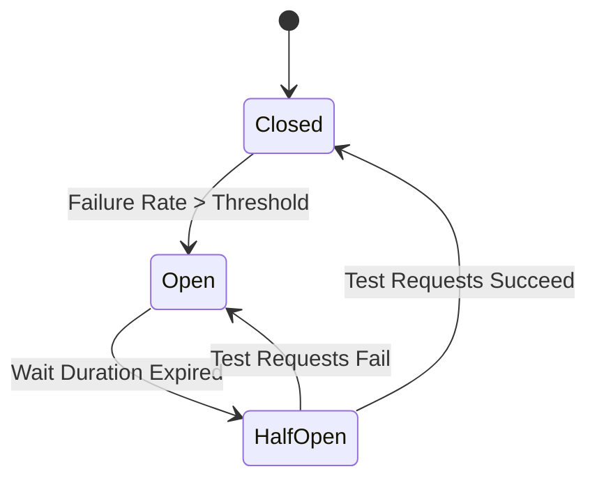

# 🌐 Topic 13: Microservices Architecture & Resilience

Welcome back, systems architect! In this chapter, we will learn about **Microservices Architecture**. As applications grow, putting all code into a single package (Monolith) becomes difficult to manage, deploy, and scale. We will learn how to divide our applications into smaller, independent services, how to make them locate each other using **Eureka**, route traffic using **API Gateway**, communicate using **Feign Clients**, prevent system collapses using **Resilience4j Circuit Breakers**, and trace requests using **Distributed Tracing**.

---

## 🏠 The Big Picture & Real-Life Example

### 🏢 The Monolith Store vs. The Shopping Mall (Microservices)
Imagine a massive retail business:
* **The Monolith Store**: You build a single giant department store. The bakery, clothing section, and checkout counters are all in one room sharing the same electricity, manager, and staff. If the bakery oven catches fire and fills the room with smoke, the entire store has to shut down!
* **The Shopping Mall (Microservices)**: You build a mall containing independent shops. The Bakery, Clothing Shop, and Bookstore are in separate buildings.
  * If the Bakery oven breaks, the Bookstore continues selling books without interruption! (Fault Isolation).
  * **Eureka (The Information Desk)**: A central directory board listing where each shop is located. When a new shop opens, it registers its address.
  * **API Gateway (The Mall Main Gate & Receptionist)**: Customers enter through one main gate. The receptionist checks their tickets and directs them: *"For books, walk to Building B. For bread, walk to Building C."*
  * **Feign Client (The Intercom Phone)**: The Bookstore clerk uses an intercom phone to call the Bakery: *"Hey, send a box of donuts to the customer at the bookstore."*
  * **Circuit Breaker (The Backup Plan)**: If the Bookstore clerk calls the Bakery and gets no answer after 3 attempts, they stop dialing (opens the circuit) to prevent phone line blockage and instantly tell the customer: *"The bakery is busy, here is a fallback cookie from our desk instead."*

---

## 🔬 Let's Look Closer

### 1. Service Discovery (Netflix Eureka)
In a cloud environment, microservice instances scale up and down, and their IP addresses change constantly. Instead of hardcoding URLs, services register themselves with the **Eureka Server**. When Service A wants to call Service B, it asks Eureka for Service B's active address dynamically.

### 2. API Gateway (Spring Cloud Gateway)
An API Gateway acts as the single entry point for all client requests. It handles security routing, load balancing, and hides the internal microservice network from public exposure.

### 3. Declarative HTTP Client (OpenFeign)
Feign is a tool that allows you to write REST client calls by simply writing a Java interface. Spring Boot implements the client code automatically at runtime.

### 4. Circuit Breakers (Resilience4j)
A circuit breaker monitors calls between microservices. It has three states:
* **Closed (Normal)**: Requests flow normally.
* **Open (Tripped)**: If the failure rate exceeds a threshold (e.g., 50% calls fail), the breaker trips. All subsequent calls fail instantly, returning a **Fallback** response without calling the broken service, giving it time to recover.
* **Half-Open (Testing)**: After a wait period, it allows a few test requests to see if the service has recovered.



### 5. Distributed Tracing (Micrometer & Zipkin)
When a request flows through multiple microservices, debugging becomes hard. Distributed tracing assigns a unique **Trace ID** to the request at the gateway, which is passed along to all internal HTTP headers, allowing you to trace the complete execution path in logs.

---

## 💻 Code Sandbox

Let's build a declarative Feign Client that communicates with an external Inventory service, protected by a Resilience4j Circuit Breaker.

### 1. Enabling Cloud: `pom.xml` Dependencies
To build these services, developers add Spring Cloud Starters:
```xml
<dependency>
    <groupId>org.springframework.cloud</groupId>
    <artifactId>spring-cloud-starter-openfeign</artifactId>
</dependency>
<dependency>
    <groupId>io.github.resilience4j</groupId>
    <artifactId>resilience4j-spring-boot2</artifactId>
</dependency>
```

### 2. The Model: `InventoryItem.java`
```java
package com.example;

public class InventoryItem {
    private Long id;
    private int quantity;

    public InventoryItem() {}
    public InventoryItem(Long id, int quantity) {
        this.id = id;
        this.quantity = quantity;
    }

    // Getters
    public Long getId() { return id; }
    public int getQuantity() { return quantity; }
}
```

### 3. The Feign Client: `InventoryClient.java`
```java
package com.example;

import org.springframework.cloud.openfeign.FeignClient;
import org.springframework.web.bind.annotation.GetMapping;
import org.springframework.web.bind.annotation.PathVariable;

// Communicates with service registered in Eureka as "INVENTORY-SERVICE"
@FeignClient(name = "INVENTORY-SERVICE") 
public interface InventoryClient {

    @GetMapping("/api/inventory/{id}")
    InventoryItem getStock(@PathVariable("id") Long id);
}
```

### 4. Service with Circuit Breaker: `OrderService.java`
```java
package com.example;

import io.github.resilience4j.circuitbreaker.annotation.CircuitBreaker;
import org.springframework.beans.factory.annotation.Autowired;
import org.springframework.stereotype.Service;

@Service
public class OrderService {

    private final InventoryClient inventoryClient;

    @Autowired
    public OrderService(InventoryClient inventoryClient) {
        this.inventoryClient = inventoryClient;
    }

    // 1. Guard method with Circuit Breaker
    @CircuitBreaker(name = "inventoryServiceBreaker", fallbackMethod = "fallbackStock")
    public String checkProductStock(Long productId) {
        // Calls the inventory service over HTTP
        InventoryItem item = inventoryClient.getStock(productId);
        return "Product stock is: " + item.getQuantity();
    }

    // 2. Fallback Method (Executed automatically if HTTP call fails or Circuit is Open)
    // Note: Signature must match the original method, plus a Throwable parameter!
    public String fallbackStock(Long productId, Throwable throwable) {
        System.out.println("--- Fallback triggered due to: " + throwable.getMessage() + " ---");
        return "Stock status: Unknown (Inventory Service is temporarily unavailable. Standard fallback: 0).";
    }
}
```

---

## 🧠 Points to Remember

* A **Monolith** is easy to develop and test early, but hard to scale. **Microservices** offer scalability and fault isolation but add network latency and complexity.
* **Service Discovery** (Eureka) eliminates hardcoded URLs, enabling elastic scaling in cloud platforms like Kubernetes or AWS.
* **Feign Client** uses dynamic proxy instantiation to implement HTTP requests. Developers only need to write interfaces, keeping code clean.
* The fallback method in Resilience4j must reside inside the same Java class and share the exact same signature (return type and parameters) as the guarded method, ending with a `Throwable` parameter.

---

## 📖 Key Definitions

* **Monolith**: A software architecture style where all application components (web, business, data layers) are compiled and deployed together as a single executable package.
* **Microservices**: A software design pattern where an application is split into a collection of small, independently deployable, and loosely coupled services.
* **Service Discovery (Eureka)**: A central directory server where active microservices register their IP addresses and ports to enable dynamic lookups.
* **API Gateway**: A reverse-proxy server that acts as the single gatekeeper entry point for all client API requests, handling routing and security.
* **Circuit Breaker**: A design pattern that monitors service calls and immediately intercepts failures to prevent cascading system-wide crashes.

---

## ❓ Interview Questions

### 🟢 Basic Questions (1-20)

1. **What is a Monolith architecture?**
   * *Answer*: An architecture where all code for the web, business logic, and database access is compiled and deployed as a single, unified application unit.
2. **What are Microservices?**
   * *Answer*: An architectural style that structures an application as a collection of small, independent services that communicate over network protocols (like HTTP or gRPC).
3. **What is Netflix Eureka?**
   * *Answer*: A Service Discovery server where microservices register their location details (IP and port) so other services can find them dynamically.
4. **Why do we need Service Discovery?**
   * *Answer*: In cloud environments, services scale up/down dynamically, changing IP addresses. Service Discovery avoids hardcoding these URLs.
5. **What is an API Gateway?**
   * *Answer*: A server that acts as a single entry point for all web clients, responsible for request routing, filtering, load balancing, and security.
6. **What is Spring Cloud OpenFeign?**
   * *Answer*: A declarative HTTP web client that allows developers to consume REST APIs by simply writing Java interfaces.
7. **What is a Circuit Breaker?**
   * *Answer*: A pattern that intercepts network calls between services. If a target service fails repeatedly, the breaker trips, stopping requests immediately to prevent system collapse.
8. **What library is recommended for Circuit Breakers in Spring Boot?**
   * *Answer*: **Resilience4j** is the standard recommended library.
9. **Name the three main states of a Circuit Breaker.**
   * *Answer*: **Closed** (normal flow), **Open** (blocked calls), and **Half-Open** (checking recovery status).
10. **What is a Fallback Method?**
    * *Answer*: A backup method executed automatically by the circuit breaker when the target service call fails or is blocked by an Open circuit.
11. **What is Distributed Tracing?**
    * *Answer*: The practice of tracking a single request flow as it travels through multiple backend microservices, using correlation IDs.
12. **What are Trace ID and Span ID?**
    * *Answer*: A Trace ID represents the entire request journey from start to finish. A Span ID represents a single segment or HTTP hop within that trace.
13. **What tool is commonly used to collect and visualize distributed traces?**
    * *Answer*: **Zipkin** (integrated with Micrometer Tracing).
14. **What is Load Balancing?**
    * *Answer*: The process of distributing incoming network traffic requests evenly across multiple active instances of a service.
15. **What is Spring Cloud Gateway?**
    * *Answer*: Spring's official API Gateway framework built on Spring WebFlux, providing non-blocking reactive routing filters.
16. **How does a service register with Eureka?**
    * *Answer*: By adding the `spring-cloud-starter-netflix-eureka-client` dependency and enabling it in properties.
17. **What is the default port for Eureka Server?**
    * *Answer*: **8761**.
18. **What does the `@EnableEurekaServer` annotation do?**
    * *Answer*: It marks a Spring Boot application as the Eureka Service Registry server.
19. **What is the difference between Synchronous and Asynchronous service communication?**
    * *Answer*: Synchronous communication blocks the caller thread waiting for a response (e.g., Feign HTTP). Asynchronous communication sends a message and returns immediately without blocking (e.g., Kafka).
20. **What is a Monolith's "Single Point of Failure" problem?**
    * *Answer*: If a single module inside a monolith crashes (like a memory leak in reporting), the entire application server collapses, taking all other modules offline.

### 🟡 Intermediate Questions (21-40)

21. **Explain the transition from Closed to Open state in a Circuit Breaker.**
    * *Answer*: The circuit breaker tracks execution metrics (e.g., past 100 calls). If the percentage of failed or slow calls exceeds a set threshold (e.g., 50%), the breaker trips to the **Open** state.
22. **What is the purpose of the Half-Open state in a Circuit Breaker?**
    * *Answer*: After a configured wait duration in the Open state, the breaker changes to **Half-Open**, permitting a limited number of test requests to verify if the failing service has recovered.
23. **What happens if test requests fail in the Half-Open state?**
    * *Answer*: The breaker instantly reverts to the **Open** state and resets the wait timer. If they succeed, it returns to the **Closed** (normal) state.
24. **How do you define a Fallback method signature in Resilience4j?**
    * *Answer*: The fallback method must have the exact same parameters and return type as the original method, with an additional `Throwable` parameter appended at the end.
25. **What is the difference between OpenFeign and WebClient?**
    * *Answer*: OpenFeign is a blocking, declarative web client. `WebClient` is a modern, reactive, non-blocking client that supports both synchronous and asynchronous calls.
26. **Explain the role of Spring Cloud Gateway Filters.**
    * *Answer*: Filters are used to intercept and modify incoming requests (e.g., adding headers, performing authentication checks) or modifying responses before returning them to clients.
27. **What is Service Registry Heartbeat?**
    * *Answer*: Active microservices send periodic ping signals (heartbeats, usually every 30 seconds) to the Eureka server to confirm they are still alive. If heartbeats stop, Eureka removes them from the registry.
28. **What is Eureka Self-Preservation Mode?**
    * *Answer*: A safety mode triggered when Eureka stops receiving heartbeats from a large percentage of services (often due to network issues). Eureka preserves all registrations instead of deleting them to prevent routing failures.
29. **How do you configure Feign Client logging levels?**
    * *Answer*: By declaring a custom `Logger.Level` bean (BASIC, HEADERS, or FULL) inside your Feign configuration class.
30. **Explain how Client-Side Load Balancing works using Spring Cloud LoadBalancer.**
    * *Answer*: Instead of calling a central load balancer hardware, the client service fetches the active instance list from Eureka, selects one instance (using Round Robin), and calls it directly.
31. **What is a cascading failure in microservices?**
    * *Answer*: An outage where the failure of one low-level service causes dependent services upstream to hang and exhaust thread pools, resulting in a system-wide collapse.
32. **How does a Circuit Breaker prevent cascading failures?**
    * *Answer*: By failing fast. It blocks calls to the failing service instantly and returns fallback responses, preventing parent services from wasting thread execution limits on dead connection pings.
33. **Explain the purpose of Rate Limiter in Resilience4j.**
    * *Answer*: An aspect that limits the number of requests a client can execute within a specific time window, protecting APIs from traffic spikes or DDoS attacks.
34. **Explain the Bulkhead pattern in Resilience4j.**
    * *Answer*: An isolation pattern that limits the number of concurrent executions allowed on a service. By allocating separate thread pools or semaphores, a failure in one service cannot exhaust JVM threads.
35. **What is a Route in Spring Cloud Gateway?**
    * *Answer*: A gateway routing definition containing a destination URI, a set of Predicates (matching conditions like path or headers), and Filters.
36. **Explain Gateway Predicates.**
    * *Answer*: Conditions evaluated against incoming HTTP request headers, paths, or cookies to determine if the route matches (e.g., `Path=/api/orders/**`).
37. **What is the difference between Spring Cloud Sleuth and Micrometer Tracing?**
    * *Answer*: Spring Cloud Sleuth was the default tracing library in Boot 2.x. Starting in Boot 3.x, Sleuth was deprecated, and tracing was moved to **Micrometer Tracing**.
38. **How does distributed tracing inject IDs into HTTP calls?**
    * *Answer*: Using HTTP Header propagation formats (like W3C Trace Context or B3 Propagation headers) to pass Trace and Span IDs inside headers.
39. **What is the difference between client-side load balancing and server-side load balancing?**
    * *Answer*: Client-side balancing selects target server instances directly from client code lists. Server-side balancing routes requests to a hardware proxy (e.g., NGINX) which routes to backends.
40. **How does Eureka Client cache active instance registries?**
    * *Answer*: Eureka clients download and cache registry details locally. They update this cache periodically, allowing them to route calls even if the Eureka server goes down temporarily.

### 🔴 Advanced Questions (41-50)

41. **Explain the bytecode generation proxy process in OpenFeign.**
    * *Answer*: During startup, Spring scans `@FeignClient` interfaces and generates dynamic proxy classes using JDK Dynamic Proxying. The proxy intercepts interface calls, converts parameters to HTTP query keys, executes requests using HttpClient, and deserializes responses.
42. **What is the performance benefit of Spring Cloud Gateway's reactive architecture?**
    * *Answer*: It runs on a non-blocking Netty server using an event-loop thread model (few threads handling many concurrent connections), which uses far less memory and scales better under heavy traffic than blocking thread-per-request models.
43. **How does Resilience4j track metrics (failures) internally?**
    * *Answer*: It uses a **sliding window** (count-based or time-based) implemented using ring buffers. It stores execution results in memory to calculate failure percentages in real-time.
44. **What is the difference between a Count-Based Sliding Window and a Time-Based Sliding Window in Resilience4j?**
    * *Answer*: A count-based window measures the last N calls (e.g. 100 calls). A time-based window measures calls that occurred during the last N seconds, evaluating failures dynamically over time.
45. **Explain the CAP Theorem in the context of Eureka Server registry.**
    * *Answer*: In CAP (Consistency, Availability, Partition Tolerance), Eureka prioritizes **Availability** and **Partition Tolerance** (AP). It allows stale registry read caches over system downtime, ensuring active service routing.
46. **What is the role of `Feign.Builder` in customizing client integrations?**
    * *Answer*: It is the programmatic builder API used to configure custom decoders, encoders, error decoders (for mapping 4xx/5xx responses to custom Java exceptions), and client interceptors.
47. **How does a Feign Interceptor work?**
    * *Answer*: It implements the `RequestInterceptor` interface. It intercepts outgoing Feign requests to add common headers (like adding OAuth2 bearer tokens) before they are sent over the wire.
48. **Explain the purpose of the Circuit Breaker "Retry" pattern.**
    * *Answer*: A pattern that automatically retries a failed operation a set number of times (with configurable backoff delays) before letting the call fail, useful for handling temporary network glitches.
49. **How would you coordinate JWT authentication across microservices?**
    * *Answer*: The API Gateway authenticates the client, validates the JWT, and extracts user details. It then forwards the request to internal microservices, propagating the validated JWT inside the `Authorization` header.
50. **What is the purpose of `ReactorLoadBalancerExchangeFilterFunction` in Spring Cloud Gateway?**
    * *Answer*: An internal filter function that intercepts routed URIs containing load balancer schemes (e.g. `lb://ORDER-SERVICE`), resolves the name to a physical IP using Eureka, and updates the request URI before forwarding.

---

## ⏭️ Next Steps

* **Previous Chapter**: [👈 Topic 12: Advanced Features & Caching](12_actuator_scheduling_async.md)
* **Next Chapter**: [👉 Topic 14: Deployment, Containers, & Messaging](14_spring_boot_deployment.md)
* **Roadmap Index**: [🏠 Back to Roadmap](README.md)
