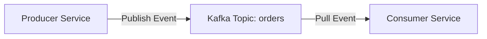

# 📦 Topic 14: Deployment, Containers, & Messaging

Welcome to the final chapter of your Spring Boot journey! In this topic, we will learn how to prepare our applications for production: packaging them into executable **JARs**, containerizing them using **Docker**, and integrating **Apache Kafka** for asynchronous, event-driven messaging.

---

## 🏠 The Big Picture & Real-Life Example

### 🚢 The Shipping Container & The Post Office (Docker & Kafka)
Imagine you have finished building a high-tech machine (your Spring Boot Application):
* **Traditional Deployment**: You ship the machine raw. The client must have the exact same workspace, matching Java versions, and matching directory layouts. If any configuration is different, the machine breaks!
* **Docker Containerization**: You put the machine inside a standardized steel **Shipping Container (Docker Container)**. The container has its own power source, matching Java runtime, and operating system settings. The container runs exactly the same way on a Mac, Windows, Linux, or Cloud platform!
* **Apache Kafka (The Central Post Office / Conveyor Belt)**: 
  * Suppose the Sales department wants to tell the Inventory department that a customer bought a product.
  * **Direct call (REST)**: Sales calls Inventory. If the Inventory clerk is sleeping or busy, Sales hangs up and fails.
  * **Kafka Way (Event-Driven)**: Sales places a "Product Sold" card onto a moving conveyor belt (a **Kafka Topic**). Sales continues its work immediately. The conveyor belt holds the card safely. When the Inventory clerk wakes up, they pick the card off the belt and update their inventory ledger.

---

## 🔬 Let's Look Closer

### 1. Executable JAR Packaging
Spring Boot compiles your Java source files and uses the **Spring Boot Maven/Gradle Plugin** to bundle everything (compiled classes, configuration properties, and all third-party libraries) into a single "Fat JAR". You launch it with: `java -jar application.jar`.

### 2. Dockerizing Spring Boot
A **Dockerfile** is a text script containing steps to build a Docker Image:
1. **Base Image**: Start with a lightweight OS containing Java (e.g. `eclipse-temurin:17-alpine`).
2. **Copy JAR**: Copy your packaged "Fat JAR" into the container's virtual filesystem.
3. **Entry Point**: Set the command to execute the JAR when the container boots.

### 3. Event-Driven Messaging with Apache Kafka
Kafka is a distributed streaming platform designed for high-performance, real-time message handling:
* **Producer**: The application sending the message event.
* **Consumer**: The application listening for and receiving the message event.
* **Topic**: The named channel/folder where messages are stored (e.g., `order-topics`).
* **Consumer Group**: A group of consumers sharing the work of reading messages from a topic.



---

## 💻 Code Sandbox

Let's write a complete Spring Boot Dockerfile, along with a Kafka Producer and Consumer service configuration.

### 1. The Deployment Blueprints: `Dockerfile`
Save this file as `Dockerfile` in your project root directory:
```dockerfile
# Step 1: Base image containing Java Runtime Environment
FROM eclipse-temurin:17-jre-alpine

# Step 2: Create working directory inside the container
WORKDIR /app

# Step 3: Copy the compiled JAR file into the container
COPY target/my-app-1.0.jar app.jar

# Step 4: Expose the application port
EXPOSE 8080

# Step 5: Command to run the application when container starts
ENTRYPOINT ["java", "-jar", "app.jar"]
```

### 2. The Kafka Producer: `KafkaProducerService.java`
```java
package com.example;

import org.springframework.beans.factory.annotation.Autowired;
import org.springframework.kafka.core.KafkaTemplate;
import org.springframework.stereotype.Service;

@Service
public class KafkaProducerService {

    private static final String TOPIC = "orders-topic";

    // Spring Boot auto-configures KafkaTemplate if starter dependency is present
    private final KafkaTemplate<String, String> kafkaTemplate;

    @Autowired
    public KafkaProducerService(KafkaTemplate<String, String> kafkaTemplate) {
        this.kafkaTemplate = kafkaTemplate;
    }

    public void publishOrderEvent(String orderId, String details) {
        System.out.println("Publishing order event to Kafka topic [" + TOPIC + "]...");
        // Sends message: key = orderId, value = details
        kafkaTemplate.send(TOPIC, orderId, details);
    }
}
```

### 3. The Kafka Consumer: `KafkaConsumerService.java`
```java
package com.example;

import org.springframework.kafka.annotation.KafkaListener;
import org.springframework.stereotype.Service;

@Service
public class KafkaConsumerService {

    // Listens to the orders-topic constantly in the background
    @KafkaListener(topics = "orders-topic", groupId = "inventory-group")
    public void consumeOrderEvent(String message) {
        System.out.println("--- Kafka Consumer Received Event ---");
        System.out.println("Event Message: " + message);
        System.out.println("Updating inventory database...");
    }
}
```

---

## 🧠 Points to Remember

* The **Fat JAR** compiled by Spring Boot contains a nested layout. Your compiled code is in `BOOT-INF/classes/` and dependencies are stored in `BOOT-INF/lib/`.
* Docker containerization guarantees **"It runs on my machine, and it runs in production."** It isolates the application configuration from OS host details.
* Kafka stores messages durably on disk. If a consumer service crashes, Kafka preserves the events, allowing the consumer to resume reading from where it left off (Offset tracking).

---

## 📖 Key Definitions

* **Fat JAR**: A single executable archive file containing the application's compiled code along with all its runtime dependency libraries.
* **Docker Image**: A read-only blueprint containing the application code, runtime environment, libraries, and configurations required to run an application.
* **Docker Container**: A running instance of a Docker Image executing in an isolated runtime environment on the host OS.
* **Apache Kafka**: An open-source distributed event-streaming platform used for high-performance data pipelines and event-driven messaging.
* **Kafka Topic**: A named category or log channel in a Kafka cluster where records are published and stored durably.

---

## ❓ Interview Questions

### 🟢 Basic Questions (1-20)

1. **What is a "Fat" JAR in Spring Boot?**
   * *Answer*: A single executable archive file containing the compiled application classes along with all nested runtime dependency JARs.
2. **What command is used to execute a packaged Spring Boot JAR?**
   * *Answer*: `java -jar application-name.jar`.
3. **What is Docker?**
   * *Answer*: An open-source platform used to pack, ship, and run applications in isolated, lightweight software containers.
4. **What is the difference between a Docker Image and a Docker Container?**
   * *Answer*: A Docker Image is a read-only template (the blueprint). A Docker Container is the active, running instance created from that image.
5. **What is a Dockerfile?**
   * *Answer*: A text configuration script containing a sequential list of commands used to assemble a Docker Image automatically.
6. **What does the `FROM` instruction do in a Dockerfile?**
   * *Answer*: It defines the base parent image (e.g., operating system and Java runtime version) to build your custom image on top of.
7. **What does `EXPOSE 8080` do in a Dockerfile?**
   * *Answer*: It serves as documentation indicating that the application inside the container listens on port 8080. It does not actually open the port.
8. **What is Apache Kafka?**
   * *Answer*: An open-source, distributed event-streaming platform designed for high-throughput, real-time asynchronous message handling.
9. **What is a Kafka Producer?**
   * *Answer*: An application or service that publishes (sends) message events to one or more Kafka topics.
10. **What is a Kafka Consumer?**
    * *Answer*: An application or service that subscribes to (reads) message events from one or more Kafka topics.
11. **What is a Kafka Topic?**
    * *Answer*: A named log channel in a Kafka cluster where messages are stored in a partitioned, append-only commit ledger.
12. **How does Spring Boot auto-configure Kafka templates?**
    * *Answer*: By adding the `spring-kafka` dependency and configuring broker addresses in the properties file.
13. **What is a Consumer Group in Kafka?**
    * *Answer*: A collection of consumers that cooperate to read messages from a set of partitions in a topic, ensuring load balancing.
14. **What is the default port for Apache Kafka broker?**
    * *Answer*: **9092**.
15. **What is the purpose of the `COPY` command in a Dockerfile?**
    * *Answer*: It copies files or directories from your local host machine into the container's virtual filesystem.
16. **What is the purpose of `ENTRYPOINT` in a Dockerfile?**
    * *Answer*: It configures the default executable command that will run automatically when the container boots.
17. **What is the difference between `CMD` and `ENTRYPOINT` in a Dockerfile?**
    * *Answer*: `ENTRYPOINT` sets the core command that cannot be easily overridden during container start. `CMD` provides default arguments that can be overridden by user input commands.
18. **Why is alpine-based images (e.g., `openjdk:17-alpine`) preferred in Dockerfiles?**
    * *Answer*: Alpine is a minimal security-focused Linux distribution. Using it makes the resulting Docker Image size much smaller, saving disk space.
19. **What is the purpose of the `@KafkaListener` annotation?**
    * *Answer*: A Spring annotation placed on a method to declare it as a message consumer listener for specific Kafka topics.
20. **What is an Offset in Apache Kafka?**
    * *Answer*: A unique sequential integer assigned to each message inside a partition that tracks the message's position in the log.

### 🟡 Intermediate Questions (21-40)

21. **How does Spring Boot package class loaders inside a Fat JAR?**
    * *Answer*: Spring Boot places a custom class loader class (`JarLauncher`) in the root. When run, it reads compiled classes in `BOOT-INF/classes/` and classpath dependencies in `BOOT-INF/lib/` directly.
22. **Explain the layered JAR feature in Spring Boot 2.3+.**
    * *Answer*: It allows dividing the fat JAR into separate layers (dependencies, spring-loader, snapshot-dependencies, application code). This optimizes Docker build caching by only rebuilding modified application layers.
23. **How does Docker build caching optimize image build times?**
    * *Answer*: Docker executes commands sequentially. If a step (like downloading dependencies) hasn't changed, it reuses the cached layer, bypassing execution, speeding up builds.
24. **Explain how to pass environment variables into a Docker container.**
    * *Answer*: By using the `-e` flag during run: `docker run -e SPRING_PROFILES_ACTIVE=prod -p 8080:8080 my-image`.
25. **What is the difference between Docker port publishing (`-p 8080:8080`) and exposing?**
    * *Answer*: Exposing is metadata documentation inside the image. Publishing (`-p host:container`) opens a physical port on the host machine and routes its traffic to the container.
26. **What is Docker Compose?**
    * *Answer*: A tool used to define and run multi-container applications (e.g., booting a Spring Boot app, a MySQL database, and a Redis server together) using a single YAML configuration file.
27. **How does Kafka guarantee message ordering?**
    * *Answer*: Kafka only guarantees message ordering **within a single partition**. Messages sent to a topic with multiple partitions are not guaranteed to be ordered globally.
28. **What is a Partition in Kafka?**
    * *Answer*: A topic is split into multiple partitions. Partitions allow topics to scale by spreading message storage and throughput across different Kafka servers (brokers).
29. **What is the purpose of ZooKeeper in a Kafka cluster?**
    * *Answer*: ZooKeeper manages the cluster state, coordinates the brokers, detects failures, and elects the controller broker. (Modern Kafka versions are moving away from ZooKeeper using KRaft).
30. **Explain how a Consumer commits offsets in Kafka.**
    * *Answer*: A consumer reports the highest offset number it has successfully processed back to Kafka (either automatically or manually). This ensures that if the consumer crashes, it can resume reading from the last committed offset.
31. **What is the difference between Auto-Commit and Manual Commit in Kafka?**
    * *Answer*: Auto-commit commits offsets periodically in the background (risk of data loss or duplicate reads on crashes). Manual commit gives the developer programmatic control to commit only after processing succeeds.
32. **Explain how Kafka partitions map to Consumers in a group.**
    * *Answer*: Each partition can be read by exactly one consumer instance in a group. If you have 3 partitions and 4 consumers, the 4th consumer will sit idle.
33. **What is a Rebalance in a Kafka consumer group?**
    * *Answer*: A process where Kafka redistributes partition assignments among active consumers in a group, triggered when a consumer joins, leaves, or crashes.
34. **What is the purpose of `KafkaTemplate`?**
    * *Answer*: A Spring utility class that wraps low-level Kafka producer APIs, providing simple methods to send messages to topics.
35. **How do you handle JSON serialization in Spring Kafka?**
    * *Answer*: By configuring `JsonSerializer` for the producer and `JsonDeserializer` for the consumer in properties, allowing Java objects to be automatically converted to JSON strings.
36. **Explain the purpose of a Dead Letter Topic (DLT) in Kafka.**
    * *Answer*: A fallback topic where messages that fail to be processed repeatedly (e.g., due to serialization errors or business exceptions) are sent for manual inspection.
37. **What is a Docker Volume?**
    * *Answer*: A mechanism to persist database data or files generated inside a container by mapping a directory inside the container to the host machine.
38. **How does Spring Boot support health checks inside Docker?**
    * *Answer*: By exposing the Actuator `/actuator/health` endpoint, which Docker can poll periodically using the `HEALTHCHECK` instruction to determine container status.
39. **What is the purpose of `.dockerignore` file?**
    * *Answer*: A file listing local directories (like `target`, `.git`, `.idea`) that should be ignored when building a Docker Image, preventing unnecessary files from slowing down the build.
40. **How do you build a Docker image using Maven without writing a Dockerfile?**
    * *Answer*: By using **Cloud Native Buildpacks** via the Spring Boot Maven Plugin command: `mvn spring-boot:build-image`.

### 🔴 Advanced Questions (41-50)

41. **Explain the internal structure of a Spring Boot Fat JAR.**
    * *Answer*: The layout is: `META-INF/` (manifest listing `JarLauncher` as main class), `BOOT-INF/classes/` (compiled application code), `BOOT-INF/lib/` (project dependency JAR files), and `org/springframework/boot/loader/` (compiled classloader code).
42. **How does JIT compiler compilation optimize Kafka serialization throughput?**
    * *Answer*: Serialization requires converting Java fields into byte arrays. JIT compiles the serializer schema checks into vectorized CPU copy instructions, maximizing network message output speeds.
43. **Explain the difference between At-Least-Once, At-Most-Once, and Exactly-Once delivery semantics in Kafka.**
    * *Answer*: **At-Least-Once**: Messages are guaranteed to be processed, but duplicates may occur (offsets committed after processing). **At-Most-Once**: Messages are never processed twice, but data loss can occur (offsets committed before processing). **Exactly-Once**: Transactions ensure messages are processed exactly once.
44. **How does Kafka achieve Exactly-Once Semantics (EOS)?**
    * *Answer*: By combining an idempotent producer (assigns sequence IDs to messages to detect duplicates) and transaction coordination across topics, ensuring message publish and offset commits succeed together.
45. **What is Multi-Stage Docker Build and why is it used?**
    * *Answer*: A technique using multiple `FROM` blocks in a single Dockerfile. Stage 1 compiles the Java code using a Maven image. Stage 2 copies only the compiled JAR into a lightweight JRE image, keeping the final Docker Image small and secure.
46. **Explain the difference between a Kafka Partition Leader and Partition Replicas.**
    * *Answer*: Each partition has one **Leader** broker (handles all read and write queries) and multiple **Replicas** (replicate data for backup). If the leader crashes, Kafka elects one replica to become the new leader.
47. **What is ISR (In-Sync Replicas) list in Kafka?**
    * *Answer*: A subset of partition replicas that are fully caught up with the partition leader's data log. Only ISR replicas are eligible to be elected as new leaders.
48. **How does the `acks` configuration parameter affect Kafka producer durability?**
    * *Answer*: `acks=0`: Producer returns success immediately (fast, potential data loss). `acks=1`: Producer waits for the leader to save message. `acks=all`: Producer waits for all ISR replicas to save message (highest durability, slower).
49. **Explain how to run Spring Boot with a read-only Docker container filesystem.**
    * *Answer*: By configuring the container with `--read-only` and mounting a temporary in-memory volume (`tmpfs`) to `/tmp` and `/var/log` so the JVM can write temp logs and thread dumps.
50. **How would you customize Kafka's consumer partition assignment strategy?**
    * *Answer*: By implementing `PartitionAssignor` and registering it in properties, allowing custom strategies (like sticky or cooperative-sticky) instead of default range assignors.

---

## ⏭️ Next Steps

* **Previous Chapter**: [👈 Topic 13: Microservices Architecture & Resilience](13_microservices_basics.md)
* **Roadmap Index**: [🏠 Back to Roadmap](README.md)
